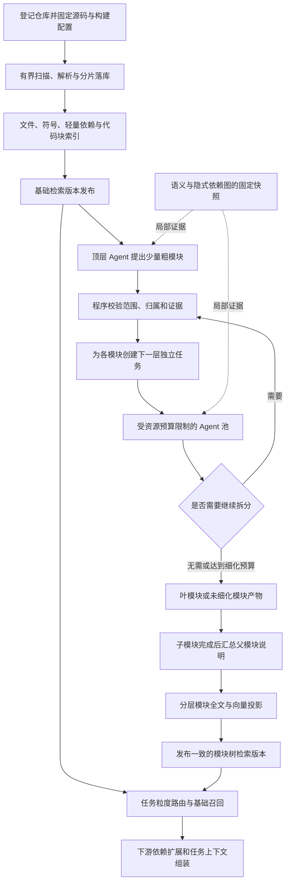

# 超大规模代码仓库分层模块化与并行索引构建技术报告

本文介绍面向百万至千万行代码工程的索引构建方案，覆盖源码快照、流式解析、依赖约束下的分层模块划分、Agent 并行调度、多粒度检索表示、增量更新、故障恢复和规模验收，并说明如何向检索侧提供自然语言任务的粒度路由能力。

**版本说明：分层并行索引构建方案审核稿，2026-09-08。**

本文承接《多语言工程建库与模块检索技术报告》的关系图谱融合稿，沿用“总览 → 编号技术步骤 → 实施顺序”的组织形式。两份文档分工不同：关系图谱方案负责恢复显式、跨语言和隐式工程关系；本文重点解决如何在超大仓库上组织有界、可恢复、可增量的建库工作，并用分层模块表示支撑不同粒度的检索。

本文技术路线已在讨论中获准作为设计方向，**尚未因方案审核或文档编写而实现、部署或通过性能验收**。文中“拟新增”“计划”“（待实现）”均表示设计；“现有基础”仅指已阅读代码中的能力，不代表本次执行了构建或测试。所有并发数、分片大小、模型预算、模块划分阈值和路由阈值均需通过实验确定。本文不修改队友方案原有的检索公式、模型配置及验收结论。

用最简单的话理解本方案：先把工程变成可局部查询的文件、符号和依赖事实，再让一个 Agent 划分少量粗模块；每个已确定模块产生独立的下一层分析任务，由有限数量的 Agent 并行细化，最终形成一棵可追溯的模块树。代码块索引先可用，模块说明随后逐步补齐，更新时只重做受影响的部分。

## 总览

华为赛题面向超大工程的 AI Coding 场景，开发者需要根据新增、删除、修改或迁移任务找到当前工程中的代码位置和必要依赖。索引构建层为此提供可持续更新的事实和多粒度表示。历史代码库仍可以作为参考实现来源，但不再是唯一检索范围。

本方案保留现有“源码事实 → 模块理解 → 检索表示”三层架构，将原整项目模块分析扩展为依赖约束下的分层任务树。建库由三条相互衔接的流水线组成：基础流水线流式扫描并持久化文件、符号、依赖和代码块；理解流水线通过 Agent 自顶向下划分、自底向上汇总模块；表示流水线按变化内容生成代码块、叶模块和上层模块的全文与向量索引。

模块树表达“代码归谁管理、属于哪个职责层次”，依赖图表达“代码与哪些其他代码有关”。同一模块可以依赖其他分支中的多个模块，不能为了得到一棵树而删除跨模块边。HNSW 的近邻图则只服务于向量召回，与上述两种结构分别管理。



同层模块可以并行，分支之间不设置全层同步屏障。一个分支通过归属校验后即可继续细化；其他分支仍可处理较大模块。逻辑任务数量随着树展开而增加，实际执行数量始终受 CPU、内存、模型吞吐、连接池和总成本约束。

本方案分别记录基础索引可用时间、首个模块版本可用时间和完整建库时间。基础符号与源码检索不依赖全仓 Agent 分析完成；尚未细化的模块和未就绪能力明确标识。部分可用不意味着以未校验的 building 数据响应查询。

## 技术细节

**01．明确建库边界、技术栈和与其他成员的接口。**

主体继续使用 TypeScript、Node.js 和 npm workspaces，复用现有 `packages/contracts`、`packages/workflow-core`、`services/code-indexer`、`services/code-intelligence-service`、Agent 工具运行时和 VS Code Host。存储继续采用 SeekDB 与 `mysql2`，全文、HNSW 及 embedding 内容缓存沿用现有机制。

| 层次 | 拟采用技术 | 本方案中的职责 |
| --- | --- | --- |
| 文件与结构分析 | 现有 Tree-sitter、固定大小的 Node 子进程池 | 并行解析、原生解析器隔离、分片事实输出 |
| 纯 JavaScript CPU 任务 | 按需使用 `worker_threads` 池 | 聚合、归一化等经测量确认的 CPU 热点 |
| 模块分析 Agent | 复用现有模型客户端和工具调用运行时 | 独立上下文、受限查询、结构化模块划分和摘要 |
| 持久任务调度 | BullMQ + Redis | 并发执行、重试、等待依赖与任务唤醒 |
| 权威数据与状态 | SeekDB、`IndexStore` 及新增层次存储端口 | 文件归属、任务结果、版本、发布指针和 outbox |
| 检索投影 | SeekDB 全文、HNSW、现有 embedding provider | 代码块、叶模块、上层模块多粒度表示 |
| 测试与评估 | Vitest、规模基准 CLI、操作系统资源采样 | 正确性、恢复、资源和增量验证 |

队友负责的 `GraphStore`、构建上下文和语义 provider 提供带证据的关系；本方案消费这些关系进行划分和失效传播，不自行将模块语义相似度转换为调用边。检索成员消费多粒度文档及路由输出；最小上下文成员决定最终源码、契约、配置和测试的选择。

Redis 是拟新增部署依赖，只承担执行调度。SeekDB 保留权威业务状态，队列显示完成不等于索引已发布。首版不引入额外图数据库，也不以新增语言的完整语义支持作为流式建库改造的前提。

**02．固定源码快照、构建配置和本轮输入身份。**

所有任务从同一份不可变源码清单读取。优先使用固定 Git tree；需要包含未提交内容时，由 Host 固定暂存、未暂存和未跟踪文件的实际字节内容，并检测采集期间的并发变化。编译器和 Agent 源码查询读取快照或其受控镜像，不能再次打开已经变化的工作目录。

沿用 `repositoryId`、`analysisRevision`、`analysisHash` 和文件内容哈希。消费关系图时额外固定 `graphRevision` 与 `buildProfileId`，具体编译单元使用 `buildContextId`。图谱尚未完成时允许结构事实驱动的初始划分，但产物必须记录未使用图谱以及当前能力缺口。

| 身份 | 含义 |
| --- | --- |
| `sourceRevision` | Git 来源信息，不能替代实际内容身份 |
| `analysisRevision` | 一次已隔离的结构分析版本 |
| `graphRevision` | 队友方案发布的关系图版本，可独立于源码变化 |
| `treeRevision`（拟新增） | 一次不可变的模块树发布版本 |
| `treeInputHash`（拟新增） | 结构、所消费图证据、构建 profile、划分策略及模型身份的内容摘要 |
| `projectionRevision`（拟新增） | 某套分层检索投影的版本，绑定树和编码配置 |

模型身份至少保存模型标识、服务配置身份、提示词版本和生成参数，不把密钥写入哈希记录或日志。远端服务若不提供可固定权重版本，记录这一复现限制；固定模型名称和随机参数不承诺输出逐字相同。

**03．先生成文件清单，再以背压控制源码读取。**

现有扫描路径会收集源码文本后交给完整结构构建器。新增生产路径先流式输出清单，记录相对路径、大小、内容引用、文件角色、项目归属和处理状态。路径、目录、语言和构建配置过滤规则统一由既有注册表及构建 provider 提供。

流水线设置有限容量：目录枚举队列、待读文件队列、待解析队列、待落库批次。下游达到行数或字节高水位时暂停上游，避免靠无限并发缩短表面耗时。跨进程任务传文件 ID 与内容引用，大文件不随每个任务反复序列化。

文件状态分别保存发现、纳入、排除、不支持、部分解析、失败和完成。超大小限制、二进制、不支持语言、生成代码排除等均保留原因。工程清单和已确认的桥接生成产物按队友的构建 provider 规则纳入；覆盖统计不只统计成功生成符号的文件。

取消传播至目录枚举、读取、解析子进程、批次写入和待入队任务。进程被强制终止后，已提交分片保留在 building 作用域内，尚未提交内容不计入完成水位。

**04．在受控解析池中提取符号与待解析引用。**

每个解析 worker 拥有自己的 parser 生命周期，按文件或编译单元读取固定内容，输出声明、import/export、待解析引用、范围和诊断。AST 在事实提取后释放，不将全仓 AST 返回主进程。

结构解析采用固定子进程池作为初始实现，便于隔离原生解析器故障并测量子进程 RSS。纯 JavaScript 热点若适合共享进程内调度，再采用线程池。Node 官方将 `worker_threads` 定位于 CPU 密集的 JavaScript 工作，并建议池化复用；网络模型调用通过异步 I/O 与限流完成，不为每次请求创建线程。[Node.js Worker threads 文档](https://nodejs.org/api/worker_threads.html)

单个任务具有输入字节上限、运行期限和内存监测。大文件或大编译单元不能无限切断语义边界；超预算时转入独立受限任务或报告能力缺口。切成源码检索块与切成可独立语义分析的单元是不同操作。

先完成一批声明的落库，再按符号键、路径及构建上下文索引处理引用。尚未见到目标时保存待解析引用，后续绑定阶段再处理，避免把读取顺序导致的前向引用误判为真正不存在。

**05．分片持久化基础事实，发布最早可用的基础索引。**

新增分片接口逐批写入文件、源码引用、符号、引用和诊断，保留已有整包接口用于小型 fixture 及兼容测试。分片限制同时考虑行数和字节数；每批使用有界事务，不为千万行仓库维持一个覆盖所有源码的大事务。

每个分片保存输入内容摘要、解析器版本、状态和完成水位。协调器校验清单覆盖、分片完整性、符号及引用作用域，完成基本全文/向量投影的可见性检查后才激活基础版本。失败构建不替换前一可用版本。

基础索引保存源代码、符号和代码块，因此可以在 Agent 树构建前提供定位。此处“提前可用”表示基础事实阶段先完成，不表示已经取得模块理解或跨语言语义的完整能力。

百万至千万行路径不再调用返回全量数组的存储接口完成发布检查。覆盖数量、孤立记录、归属和分片完成情况通过索引查询、分批核对与持久清单验证。索引写入成功与 ANN 可见性分别验证，沿用队友方案的发布屏障要求。

**06．从局部事实构建轻量依赖概览。**

Agent 划分之前必须有可查询的工程依据。首次概览由项目引用、目录、包、文件声明及基础依赖聚合形成；语义图完成后可以补充精确调用、绑定与框架关系。未具备语义图时不阻塞基础划分，但不宣称基于完整工程依赖。

聚合节点优先采用项目、目录和包，边记录关系类型、原始边数量、解析状态、证据句柄和适用构建条件。只取路径长度、连接数或字符串同名不能确定业务模块。

聚合图按父模块范围和构建 profile 查询。高扇出公共库保留独立摘要和边界接口，不把所有使用者展开成两两关系。跨模块引用仍写入依赖图，划分过程只决定归属，不删除这些关系。

为避免再次构造全仓内存大图，统计按数据库分组及分片聚合完成，Agent 获取有界摘要和续查句柄。窗口未覆盖的边附截断信息；聚合后的计数也不能替代逐边证据。

**07．定义模块树、聚合节点和文件归属约束。**

顶层是仓库根节点，其下可以是跨项目子系统聚合节点，再进入保持构建边界的项目模块和局部职责模块。项目是构建边界，模块是职责边界，两者不要求一一对应。

例如前端与后端可以是两个粗模块，也可能出现共享 SDK、协议、工具链等独立分支。树形结构由实际事实决定，不预设所有工程必然存在前后端。

| 约束 | 具体规则 |
| --- | --- |
| 单一父节点 | 除根外，每个树节点只有一个父节点，禁止环 |
| 文件唯一归属 | 每个纳入文件最终属于一个叶节点，或属于一条带原因的待归属记录 |
| 子集约束 | 子模块文件不得超出父模块范围；兄弟归属互斥 |
| 覆盖约束 | 子模块集合与待归属集合共同覆盖父模块输入清单 |
| 公共代码 | 归属明确的公共节点，使用者通过依赖引用 |
| 项目兼容 | 跨项目上层节点引用项目模块，不向现有单项目提案塞入外项目文件 |
| 自适应深度 | 允许各分支在不同深度终止；不要求每个节点拆分 |

层数表示结构深度，不直接表示语义粒度。某分支第 2 层已是具体算法，另一个分支第 4 层仍可能是大型业务模块，因此额外保存节点类型、规模和职责标签供检索选择。

树的每一层只在发生有效拆分的分支增加节点，不承诺总节点数逐层严格递增。为保持“每层都更多”而制造空节点或单子节点没有索引价值。

**08．为顶层 Agent 构造有界工程上下文。**

顶层 Agent 只负责少量粗模块。Host 提供已排序、已截断且可续查的工程概览，包含项目清单、目录聚合、文件数、代码规模、语言分布、公开入口、跨项目依赖和代表性证据。

代表性代码由程序按入口、公开接口、依赖边界及覆盖分布选择，不只取文件头部或按名称排列的前几个文件。Agent 可以通过工具进一步查询，但仍受读取字节、token、工具次数和时间预算约束。

输入中包含稳定的候选组 ID。目录主要用于解释和导航；Agent 优先返回候选组引用及拆合建议，不要求它在输出中枚举十万个文件名。Host 持有完整清单，负责将候选组展开为精确文件集合。

顶层提示要求输出模块名称、职责说明、所属候选组、关键接口、证据 ID、边界风险和未归属原因。`前端/后端` 只是示例，不硬编码为输出模板。模块数量设置可配置上限而非固定必须生成的数量。

**09．结合确定性预分组与 Agent 语义判断生成子模块。**

首版预分组使用已识别的项目、目录和包，并以依赖统计辅助拆分或合并。Agent 解释职责、确认边界并输出提案。大模块内部仍按相同方法递归处理，但查询限定在该父模块范围。

程序记录分组的文件数量、源码字节、符号数量、内部依赖和跨组依赖。边界指标可以采用“跨子组依赖权重 / 所考察依赖总权重”，同时报告证据覆盖；没有边时记录无数据，不能因分母为零获得虚假的优质划分。

低跨组依赖是参考指标，不能作为唯一目标。公共工具模块可能有很多外部消费者，业务接口层也可能天然跨多个实现。候选规模平衡、构建边界、职责一致性和边界稳定性共同参与评估，初版不宣称这些指标组成了已训练的最优划分算法。

预留 `PartitionerPort`。若基准表明目录候选组不足，再把聚合依赖图输入 METIS 等图划分基线，明确边权、方向处理、硬约束和内存上限。METIS 支持递归及多路划分，但该能力本身不保证恢复业务职责；采用前需要验证与 Agent 方案的收益。[METIS 官方手册](https://papers.karypis.org/glaros/files/sw/metis/manual.pdf)

强连通分量用于提示循环和紧耦合，不强制把可能很大的整个分量永远视为不可拆单元。拆分后保留循环边及相关风险。

**10．用 Host 校验替代模型对文件归属的自我确认。**

Agent 提供的目录和候选组选择器只能在固定父模块清单上解析，禁止任意磁盘路径读取。选择器协议明确前缀匹配、排除项、大小写和嵌套目录语义；解析结果变成持久的文件 ID 归属，后续不依赖重新匹配可变工作目录。

校验包括节点 ID 唯一、父节点存在、范围正确、文件不重复、无遗漏或有明确待归属原因、符号属于声明文件、证据存在且曾提供给模型。引用了正确 ID 仍不等于描述语义正确；描述质量另通过评测核查。

跨项目聚合节点使用新的层次契约。现有 `validateProjectResult` 的单项目文件覆盖约束继续保留，不能为兼容新树而放宽已有单项目接口。

归属校验通过后冻结父节点本次拆分决定，再创建子任务。校验失败时向 Agent 返回结构化问题，修正轮数有上限。超限后保留上一有效节点和失败原因，不发布重叠或缺失的子树。

**11．为每个已确定父模块创建独立 Agent 任务。**

一个逻辑 Agent 任务对应一次固定模块范围的划分或摘要操作，不对应一条永久占用资源的进程。每个任务使用独立模型会话，不继承其他 Agent 的完整对话。

| 输入 | 作用 |
| --- | --- |
| 父模块 ID、职责和固定范围句柄 | 限定本任务可划分的代码 |
| 项目、目录、接口与内部依赖摘要 | 提供结构与语义线索 |
| 边界依赖、接口和兄弟简述 | 防止局部视野忽略外部约束 |
| 版本、profile 与证据身份 | 防止混用不同源码或平台 |
| 工具与模型预算 | 限定源码读取、调用和成本 |

工具返回值在 Host 侧再检查作用域，不能只靠提示词约束。边界读取允许取得外部接口和关系证据，但不授权修改其他分支归属。子任务不访问 Redis 或数据库凭据，使用局部只读查询接口。

兄弟模块之间若出现归属争议，任务提交边界调整建议，由共同父节点在下一次分区修订中统一裁决。已经派生的旧子任务取消或作废，不能让两个 Agent 同时移动同一个文件。

**12．采用异步树调度，避免整层等待。**

顶层提案通过校验后，子任务可以并行执行。某个子模块完成拆分校验后立即派发自己的后代，不等待同层其他模块结束；其最终父摘要则等待直接子模块的有效产物。

BullMQ 支持 Worker 并发与父子任务依赖，但其 Flow 的依赖语义是父任务等待子任务完成。本方案将“父模块拆分”和“父模块最终汇总”建模为不同任务：前者先执行，动态产生子任务；后者等待子产物。不能将产品树的父子关系未经转换直接当作执行顺序。[BullMQ Flows 文档](https://docs.bullmq.io/guide/flows/)

拟定任务种类包括 `scan-partition`、`parse-partition`、`bind-references`、`partition-module`、`summarize-module`、`embed-batch` 和 `publish-revision`。依赖状态由权威任务表记录，队列仅执行已满足条件的任务。

调度根据估算工作量、剩余预算和等待时间分配优先级。大任务不能独占所有模型容量，小任务也不能因持续到达而让关键大分支饥饿。分布式运行时任务只能分配到有权访问相应不可变内容的 worker，不能把某台机器的本地路径当作通用输入。

**13．分别限制解析、Agent 和向量编码资源。**

三个资源池独立配置并发和队列容量。解析池由 CPU 和子进程峰值内存约束；Agent 池由模型并发、请求数和 token 速率约束；向量池由批量上限、模型吞吐和写入能力约束。BullMQ Worker 的并发能力用于执行上限，模型配额仍需要独立的全局限流和预算账本。[BullMQ Concurrency 文档](https://docs.bullmq.io/guide/workers/concurrency)

| 预算 | 控制内容 |
| --- | --- |
| 全局 | 总耗时、总模型成本、在途任务和最大驻留字节 |
| 每个仓库 | 公平份额、剩余构建预算、取消状态 |
| 每个 Agent | 输入/输出 token、工具次数、读取字节、修正轮数 |
| 每个解析单元 | 文件大小、运行期限、内存与失败重试 |
| 每个数据库批次 | 行数、字节、连接等待和执行期限 |

并发初值作为环境配置，不在方案中承诺固定最优值。基准分别扫描解析池、Agent 池和 embedding 池的并发，观察吞吐、尾延迟、429、重试和成本，选择资源允许范围内的有效组合。

粗略建库耗时受扫描/解析/写入、模型吞吐、树任务关键路径和投影阶段共同限制。并行不能突破服务端 token 吞吐，也不会减少必须处理的源码字节。加速比仅在固定语料、硬件、模型和质量条件下实测。

**14．用明确条件停止递归，并保留未细化状态。**

停止判断同时考虑职责、规模、依赖边界、最大深度和剩余预算，避免仅按文件数或层数划分。以下参数均待实验标定。

| 条件 | 处理方式 |
| --- | --- |
| 职责已足够单一且规模可管理 | 发布叶模块 |
| 存在多个明确职责或表示规模过大 | 生成下一层候选划分 |
| 拆分无法形成有效边界或只产生一个相同子组 | 停止无效递归并记录原因 |
| 最大深度或模型预算到达 | 保存未细化模块，不标记完整细化 |
| 证据不足或语言能力缺失 | 标记缺口，保留可用结构与基础检索 |
| 校验反复失败 | 保留上一有效模块并标记任务失败 |

叶模块可以很小，也可以包含多个文件。超大单文件仍只有一个叶模块文件归属，但它内部的多个符号和代码块可以独立检索；是否扩展为符号级所有权属于后续独立设计，不能与首版文件唯一归属混用。

完成状态与细化状态分开：任务完成可以是“有效停止但未完全细化”。文件覆盖率、模块细化率和语义证据覆盖率分别展示。

**15．自底向上汇总父模块，降低重复源码阅读。**

自顶向下阶段产生用于调度的粗说明，子模块完成后再生成父模块最终说明。父摘要主要消费子摘要、边界接口、聚合依赖、缺口和必要证据，不重新把所有后代源码发送给模型。

父摘要记录核心职责、子模块组成、跨子模块协作、公开接口及未知部分。关键事实仍可追踪到子产物和原始 evidence ID。摘要只能支持职责说明，不能替代队友维护的依赖事实。

避免每层重复读完整源码，是控制总 token 成本的核心措施。若每个层级都全量读取同一批源码，总阅读量可能随树深增加；采用局部读取、已见证据缓存及自底向上汇总后，再测实际输入 token 降幅。

父子摘要分别保存内容哈希。父摘要输入中相关子摘要、接口或图事实未变时可以复用；证据引用跨版本需重新绑定，不能仅复制旧 ID。摘要发生语义漂移时由质量评估和周期性重新分析发现。

**16．增加模块树存储，避免整项目大 JSON 成为热点。**

现有项目产物将多个模块放入同一 JSON。分层生产路径将节点、归属、任务和证据拆为独立记录，保留旧格式供兼容入口使用。以下为拟新增逻辑表名，正式实现沿用现有前缀和 schema 迁移规范。

| 逻辑表 | 关键内容 |
| --- | --- |
| `module_tree_revisions` | 输入身份、构建状态、能力阶段、树哈希与发布信息 |
| `module_nodes` | 节点 ID、父 ID、类型、深度、描述、规模、细化状态、内容哈希 |
| `module_file_memberships` | 树版本、叶节点、文件 ID；对文件归属建立唯一约束 |
| `module_unassigned_files` | 父范围、文件 ID、未归属原因 |
| `module_analysis_jobs` | 任务类型、输入哈希、尝试、租约、预算、结果和错误 |
| `module_evidence_refs` | 节点/任务消费的结构、图及子摘要证据 |
| `module_projection_revisions` | 树版本、表示策略、模型身份及投影发布状态 |
| `index_job_outbox` | 待投递调度事件及发送状态 |

父节点不重复保存后代全部文件列表。通过叶归属和树路径查询后代文件，索引按作用域加 `parentNodeId`、`moduleNodeId` 和文件 ID 建立。后代遍历分页、有深度限制；如后续采用物化路径或闭包辅助索引，应计入其写入和空间成本，不能无界生成全部祖先后代组合。

节点 ID 是版本内身份，跨版本另保存可核验的沿袭关系。名称相同不能证明节点相同，文件重命名或重新分组可能产生新身份。

**17．为 Agent 和下游提供局部层次查询接口。**

新增 `ModuleHierarchyQueryPort` 与现有 `SemanticQueryPort`、队友的 `CodeGraphQueryPort` 并存。输入固定仓库、结构版本、树构建或发布句柄及 profile；内部 Agent 的 building 读取仅限同一次受控构建，外部检索只读已发布版本。

| 拟新增操作 | 返回内容 |
| --- | --- |
| `getModuleOverview` | 职责、规模、状态和证据概况 |
| `listChildModules` | 直接子模块及稳定分页游标 |
| `listModuleFiles` | 按归属取得文件页，支持受限后代查询 |
| `getModuleBoundary` | 入边、出边、接口摘要和图缺口 |
| `getPartitionCandidates` | 当前范围候选组及聚合统计 |
| `readModuleEvidence` | 已授权结构/图/源码证据的有界内容 |

游标绑定作用域、过滤和排序位置，数据库条件下推，接口不调用 `getStructuralIndex()` 重新加载整个仓库。统计结果可以预聚合，但必须包含内容版本和是否完整。

读取同时限制记录数、字节、节点、边和期限。总数很大的父模块只返回范围句柄及分页，不把完整文件清单放入每次 Agent 提示或候选卡片。

**18．建立 AST 代码块、叶模块和上层模块三类检索表示。**

基础层按 AST 声明边界生成代码块，保存父符号、源码范围和内容哈希。长函数再按 tokenizer 预算切分，保留连续关系和必要声明上下文；未支持 AST 的文件可使用明确标注的文本分块，不能伪装成已解析函数。

| 粒度 | 编码内容 | 主要用途 |
| --- | --- | --- |
| 代码块/符号 | 签名、实现片段、路径和局部上下文 | 算法复用、错误定位、具体函数修改 |
| 叶模块 | 职责、接口、文件组成、边界依赖与缺口 | 功能检索和模块适配 |
| 上层模块 | 子模块职责汇总、主要接口、架构连接 | 子系统定位、较大迁移范围分析 |

叶模块和上层模块继续采用职责、接口、依赖多视图，但各层只编码自身相关说明，不重复拼接全部后代源码。代码块可独立召回，再关联所属模块树节点。

`search_documents` 拟增加粒度、树节点、树版本、代码块范围及适用 profile 等字段。接口层区分 `nodeKind` 与 `depth`，检索不能把固定层号直接当作固定粒度。

生产投影按节点/文件分批生成，限制单文档字节及 token。模型允许的 HTTP 字符长度不等于实际编码长度，必须在送入模型前检查 tokenizer 截断。

**19．按内容复用向量，独立发布分层投影。**

复用现有模型身份校验和 embedding 缓存。编码键反映真正送入模型的文本、前缀、模型及表示策略；版本和 evidence ID 等不参与语义编码的追踪字段单独保存，避免仅换版本就导致文本变化和缓存失效。

同批重复输入合并，跨任务相同输入由进行中请求合并及持久缓存减少重复推理。输出仍需检查数量、维度、有限数值和非零条件。向量写入和模型调用分别受预算约束。

基础投影与层次投影拥有各自发布状态。新树对应的新投影完成并确认可查询后，通过事务切换活动指针；不能先公布新树再用旧向量解释结果。模型更换时使用符合现有模型身份约束的新投影空间或新库，不在同一受绑定向量空间混写。

“基础已可用”“树已发布但投影未就绪”“层次检索就绪”分别报告。只有完整绑定了树、profile 和投影身份的结果才宣称层次检索可用。

**20．显式选择检索粒度，自动路由作为默认选项。**

需求输入框下方提供“检索粒度”选择，默认“自动”，用户可切换为“函数/方法、类/接口、模块、子系统”。它控制本次检索主要结果的组织单位；底层仍建立文件、符号、依赖和模块表示，切换选项不改变离线解析深度，也不触发重新建库。

| 界面选项 | 请求值 | 主要结果 |
| --- | --- | --- |
| 自动 | `auto` | 根据任务与锚点选择一种或多种粒度，并返回选择依据 |
| 函数/方法 | `function` | 函数或方法及其实现源码范围 |
| 类/接口 | `class` | 类、接口及相应类型声明，具体映射受语言能力约束 |
| 模块 | `module` | 职责明确的功能模块及其代码成员 |
| 子系统 | `subsystem` | 聚合多个模块的职责单元；按节点类型识别，不用固定树深度代替 |

手动选择优先于选中代码和模型判断。用户已选函数却指定“模块”时，函数作为定位锚点，主要结果仍组织为相关模块。只有 `auto` 模式才结合需求、锚点和已发布能力决定粒度；自动判断不确定时采用多粒度召回，不能因低置信度阻止检索。

| 字段 | 拟定语义 |
| --- | --- |
| `intent` | 定位、复用、新增、修改、删除、迁移等任务类型 |
| `granularity` | 请求字段：`auto`、`function`、`class`、`module`、`subsystem`；省略按 `auto` 处理，非法值拒绝 |
| `routing.requestedGranularity` | 响应回显请求粒度，省略请求值时回显 `auto` |
| `routing.resolvedGranularities` | 响应中的具体粒度数组，不包含 `auto`；手动模式可用时为所选的一项，不可用时为空；自动模式可为多项；已检索但无命中仍回显实际采用的粒度 |
| `routing.source` / `routing.reason` | 决策来源为 `user` 或 `automatic`，同时记录选择原因 |
| `anchors` | 已选代码、文件、函数、模块和诊断位置 |
| `targetScope` | 当前工程的固定版本和 profile |
| `referenceScopes` | 明确允许查询的历史工程，可为空 |
| `routing.confidence` | 可选，仅自动模式且经标注集校准后提供数值，未知时为 `null`；不能覆盖手动选择 |
| `budget` | 候选、文件、token、时间及图扩展预算 |

例如自动模式下，“复用这个算法”且已选中函数时优先函数/代码块；“迁移上传和鉴权模块”优先模块；“上传失败后无法取消”可以采用多粒度召回。用户若显式选择“函数/方法”，主要结果保留为函数，必要的类、模块职责、事件注册、配置和测试仍作为上下文证据补充。

粒度约束主要结果，不禁止内部跨粒度召回，也不限制必要依赖扩展。跨粒度命中须关联到用户选择的结果单位，无法关联的线索作为补充证据或缺口呈现，不能把其他粒度的对象冒充主结果。所选粒度在当前范围尚不可用时，界面禁用对应选项并显示索引状态；API 返回能力缺口，不自动换粒度。部分工程可用时，明确报告已检索与未就绪范围；具备能力但没有命中时返回空结果。

以上为待实现协议。当前旧复用流程仍由选中的 `ModuleTarget.kind` 决定候选粒度，新任务检索页尚无该控件或请求字段；新增任务接口承载显式选择，旧复用与适配契约保持兼容。

**21．以模块树辅助下钻，同时保留全局细粒度召回。**

明确模块锚点时，可限定对应后代范围搜索；没有可靠锚点时，先召回上层模块并向相关分支下钻，同时为全局符号和代码块通道保留预算，防止顶层描述错误造成不可恢复的漏召回。

细粒度检索返回代码片段后可以上溯到叶模块取得职责和边界，再交给图查询扩展必要关系。模块检索则先返回有限卡片，完整文件与源码通过句柄继续读取。不同通道返回的同一符号或模块按带版本的身份归并。

本方案交付多粒度索引、范围选择和路由元数据，不擅自更改原 RRF、模块 0.8/0.2 初排或重排失败语义。新增通道的融合方式由检索实验定义，并分别评估纯树下钻与保留全局通道的召回差异。

在线检索期限从用户请求进入开始统一计量，记录路由、召回、下钻和可选图读取。后台首次建库与在线请求分开测量；等待所有项目分析结束不能隐藏在“检索 10 秒”之外。

**22．依据文件、边界和证据变化进行局部增量。**

变更先触发基础事实分片更新，再根据文件归属及 `module_evidence_refs` 找到受影响叶节点。正文变化通常更新局部代码块和说明；公开接口、构建配置、注册及跨模块依赖变化可能扩大到相邻模块和共同父节点。

| 变化 | 拟更新范围 |
| --- | --- |
| 文件内容但职责与边界未变 | 代码块、相关叶说明及必要祖先摘要 |
| 新文件 | 按既有规则提出归属，歧义时交父节点重新判断 |
| 删除、重命名 | 撤回旧归属和证据，检查使用者及分区边界 |
| 公共接口或跨模块依赖变化 | 消费该证据的模块、邻接边界及必要父范围 |
| 注册、宏、SDK、源集变化 | 队友图失效结果命中的节点与表示 |
| Agent 模型、提示词或划分策略变化 | 相关理解缓存失效；基础语法缓存可独立复用 |

跨版本复用以不可变分片和内容键实现。新版本清单引用未变分片，变化分片写新结果；外部读取按版本清单解析，不能把旧 evidence ID 直接贴到新版本。与现有按 revision 存整包事实的兼容层需要显式迁移，不假定只减少 Agent 调用就实现了存储增量。

局部重划设置有界调整窗口及稳定性策略，避免微小变化重排整个模块树。对共享接口变化不能为追求稳定而漏掉真实影响。内容哈希、已消费证据和边界摘要共同决定复用。

结构和图增量对照相同输入的全量结果。LLM 文本存在非确定性，模块理解比较覆盖约束、证据有效性、边界质量、变更影响及检索效果，不要求两次描述逐字一致；周期性全量重分析用于检查累积漂移。

**23．用幂等任务、租约和 outbox 支持故障恢复。**

任务键由输入 scope、父范围哈希、任务类型、策略/模型身份构成，不只依靠队列随机 ID 去重。任务状态拟采用 `pending/queued/running/succeeded/failed/cancelled`，发布状态另外维护。

在 SeekDB 中提交任务与 outbox 事件后，由投递器发送到 Redis。重复发送和 worker 重试均允许；worker 提交结果前核验当前租约及尝试令牌，通过唯一输入身份与事务确保只有一个有效结果被接受。跨 Redis 与 SeekDB 不宣称天然具备 exactly-once 事务。

租约到期后可重派任务；旧 worker 后到的结果不能覆盖新尝试。定期核对未完成权威任务以补偿队列丢失或调度进程中断。外部模型请求在不确定失败后重试可能产生额外费用，成本账本记录每次尝试，不能只统计最终成功请求。

取消停止新任务派发，传播到模型 HTTP、解析进程、向量和数据库等待。已到达外部服务的请求未必能停止计费，但迟到结果不得激活已取消构建。失败分支重用有效分片与父划分，避免重跑全仓。

**24．以不可变发布和版本租约治理历史数据。**

building 树只供本次受控构建使用。可以在粗划分或部分细化完成后发布一个完整自洽的树快照，明确尚未细化的叶节点；后续细化产生新树版本，不原地修改已有任务正在读取的树。

基础结构、关系图、树和投影通过兼容身份检查组合。发布事务比较当前输入与目标活动指针，旧源码上的慢任务不得将当前仓库退回旧版本。旧树可以在明确的历史查询入口中保留，默认新请求使用当前一致的发布组合。

版本租约保护源码内容、结构分片、图证据、模块节点及检索投影。清理按活动引用、进行中任务、近期成功版本和失败诊断保留期执行；共享分片只有在所有引用解除后才能回收。

容量统计包含原始源码或内容存储、符号、图、树节点、归属、任务记录、模型输入/结果缓存、向量、全文索引、Redis 和原生工具临时文件。父节点重复文件清单、全版本复制和无回收向量缓存都会放大磁盘，必须分别计量。

**25．分开验证正确性、划分质量、规模和下游效果。**

对照组依次为现有实现、流式基础索引、分层串行 Agent、分层受控并行 Agent。固定代码提交、语料、模型、提示词、工具预算、硬件和缓存条件，才能把收益归因于流式、分层或并行，而不是换模型或减少分析内容。

| 维度 | 验收内容 |
| --- | --- |
| 基础正确性 | 文件覆盖、符号与源码一致、待解析引用、失败和不支持可见 |
| 树约束 | 无环、单父、兄弟不重叠、父范围完整覆盖、证据有效 |
| 划分质量 | 人工审查职责、边界、公共模块、跨项目聚合和变更稳定性 |
| 调度恢复 | 重复投递、租约过期、乱序完成、模型限流、取消、Redis 重启及进程崩溃 |
| 发布一致性 | 不读取半成品、不混版本、旧任务不覆盖新版本 |
| 增量 | 无变化、正文、接口、配置、新增、删除、重命名、图规则更新 |
| 规模 | 基础可用时间、模块可用时间、完整耗时、文件/秒、总进程峰值 RSS、磁盘与临时空间 |
| 模型成本 | 输入/输出 token、工具读取、缓存命中、重试、费用及重复阅读比例 |
| 检索影响 | 各粒度 Recall@K、自动路由误选率、手动选择遵从、跨粒度证据保留、能力缺失与空结果区分、全局召回收益、端到端延迟 |

使用固定提交的真实十万、百万、千万行工程逐级测试，报告物理行数、纳入文件/字节、生成及第三方代码比例、语言和构建复杂度。无法取得相应真实规模时明确记为未测试；复制文件只用于容量压力，不能证明真实工程划分质量。

资源采样包含 Node 主进程、解析子进程、模型进程和数据库，区分同机与远端成本。并发实验报告失败率、尾延迟和总成本，不能用大量快速失败换取较低平均耗时。

本方案不预先宣称千万行建库时长或加速倍数。赛题检索准确率、平均时延和功能完备度属于联合验收；本部分提供相同模型、相同 Spec 下的索引与路由对照，不以文件归属 100% 代替检索准确率或功能覆盖率。

**26．用一次分层建库和一次局部更新贯通全流程。**

以包含客户端、服务端、Native 编码和公共协议的上传工程为说明性示例，不代表现有仓库已包含完整示例工程。

```text
上传工程
├── 客户端子系统（聚合节点）
│   ├── 页面交互
│   └── 上传业务
│       ├── 任务管理
│       └── 失败重试
├── 服务端子系统（聚合节点）
│   ├── 上传接口
│   └── 存储管理
├── Native 编码项目
│   └── 分片编码
└── 公共协议项目
    └── 消息与错误类型
```

入库时固定源码和 profile，流式解析文件并发布基础代码块索引。顶层 Agent 根据构建和依赖概览提出上述粗模块，经 Host 校验后各分支并行细化。客户端上传模块通过队友提供的 N-API 和事件关系读取边界证据，但 Native 文件仍归其项目，跨分支关系保留在图中。

某个较小分支先成为有效叶模块，较大服务端分支继续拆分；调度器不等待全层完成才推进。子模块结果向上汇总，节点说明和多粒度投影以一致版本发布。

用户提出“复用这个分片编码算法”并选择“函数/方法”时，主要返回函数实现，再补充所属模块与必要边界；选择“模块”并提出“迁移上传模块”时，返回模块结果并把跨语言、协议和测试线索交给下游上下文服务。选择“自动”时由任务和锚点建议粒度；没有可靠锚点时保留全局细粒度召回。

修改公共错误类型后，结构索引更新相关分片，依赖和证据反向查询确定受影响消费者；必要叶模块及祖先摘要重新生成，未变向量复用。若该次变化导致接口职责边界改变，再扩大父范围重判。验收核查变化是否完整传播、无关部分是否复用、取消恢复是否正确以及检索结果是否仍来自一致快照。

## 实施顺序

以下是经讨论确定的后续实施清单，**本次仅生成文档，不执行代码、依赖或数据库修改**。路径以当前仓库为基准，新文件名在实现时可按现有命名规范调整。

| 阶段 | 对应位置 | 完成标志 |
| --- | --- | --- |
| 1．流式基础索引 | 扩展 `services/code-indexer` 的扫描、结构构建和引用绑定；扩展 `IndexStore` 分片接口 | 有界读取、解析和落库；基础索引提前可用；旧小型测试路径保留 |
| 2．层次契约与局部查询 | 拟新增 `packages/contracts/src/module-hierarchy.ts`；workflow-core 层次端口；代码智能服务层次存储与查询 | 父子、归属、版本与证据可校验；局部查询不加载全仓 |
| 3．Agent 与任务调度 | 复用 Agent 运行时；拟新增层次协调器、BullMQ worker、outbox 和预算控制 | 顶层少量划分、分支异步并行、重试幂等和有界成本 |
| 4．分层表示与路由 | 扩展 `seekdb-projection.ts`；新增代码块投影、显式粒度请求及路由响应契约 | 多粒度可检索；手动选择决定主结果、自动模式允许混合；全局通道与必要依赖保留 |
| 5．增量与恢复 | 新增证据失效、树版本发布、分片复用和回收逻辑 | 文件/图变化正确传播；中断可恢复；旧任务无法覆盖新版本 |
| 6．产品与规模验收 | 扩展 VS Code 建库状态、树展示及需求区粒度选择；新增真实规模与质量基准脚本 | 显示粒度可用性和部分可用范围；切换粒度取消旧请求且不重建索引；报告实际资源、成本和检索影响 |

首个可演示里程碑包含四个可核查结果：基础检索在全树分析前可用；至少两个分支并行细化且能显示精确归属；取消并恢复后不重复发布结果；一次局部修改只重建有证据关联的部分。随后再扩展到真实百万和千万行工程，判断方案能否满足时间、资源和检索质量要求。

本方案的主要交付边界是流式基础索引、可恢复的分层 Agent 建库、多粒度表示以及增量维护。关系真值由语义与隐式依赖分析提供，最终排序和最小上下文由下游负责；各部分通过共同的版本、范围、证据和预算协议衔接。
