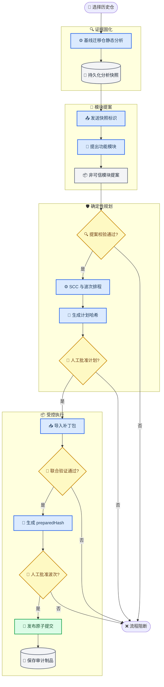

# 历史代码仓功能模块划分能力汇总

_ForeXplore 模块迁移规划与受控执行说明，基于当前代码基线 `031dd84`，更新于 2026-08-31_

---

> **文档边界：** 本文保留的是既有“模块迁移规划与执行”链路的 Java/C# 基线说明，
> 不再代表代码仓初始化层的语言能力。开放 `LanguageId`、运行时分析适配器、四阶段
> 入库生命周期和 LLMwiki 风格模块知识制品，请以
> [《语言无关的代码仓入库与模块知识架构》](./language-neutral-repository-ingestion.md) 为准。
> 分析支持也不等于迁移支持；真实迁移能力仍按独立语言对授权。

## 📋 定位与结论

本文将用户选择的、需要理解或迁移的既有仓库称为“历史仓”，并保留原 Java/C# 迁移执行基线的说明。它不是一个直接重构历史仓的自动编码 Agent，而是一条由静态证据、模型提案、确定性校验、人工审批和隔离 Git 事务组成的受控工作流。

它已经完成的核心闭环是：

1. 对历史仓生成可校验的静态分析快照
2. 让只读 `ArchitectAgent` 根据快照提出功能模块边界、模块依赖和风险
3. 由 `workflow-core` 独立校验模型提案并确定性生成 SCC、执行组和波次
4. 由人工审批绑定当前快照和计划哈希的模块计划
5. 导入本地 patch-only 补丁包，在隔离 worktree 中重新检查范围并执行联合验证
6. 由人工审批绑定精确 `preparedHash` 的波次补丁
7. 将代码和审计制品作为一个 Git 提交发布到受管迁移分支

> 📌 **准确能力名称：** Agent 辅助的历史仓功能模块划分、迁移计划生成与受控波次执行。

### 完成情况总览

| 能力 | 当前状态 | 准确说明 |
| --- | --- | --- |
| 原基线 Java/C# 仓库静态分析 | 已实现 | 采集文件、符号、依赖、诊断和 Git revision；当前入库层的开放语言能力见文档边界链接 |
| 不可变分析快照 | 已实现 | 使用 `contentHash`、`snapshotId` 和边 ID 校验完整性 |
| Agent 功能模块提案 | 已实现 | 模型输出非可信 `ModuleMigrationProposal` |
| 提案机械校验 | 已实现 | 校验文件归属、写集、证据和硬依赖 |
| SCC 与波次排程 | 已实现 | Tarjan SCC、冲突串行化和有限并行准备 |
| 计划与波次审批 | 已实现 | 分别绑定 `planHash` 和 `preparedHash` |
| 补丁范围与联合验证 | 已实现 | 隔离 worktree、必需验证门禁、原始哈希检查 |
| 原子 Git 发布与恢复 | 已实现 | 受管分支、单次提交、journal 和 commit trailer |
| 自动生成多模块补丁 | 未接通 | 当前 VS Code 流程要求人工导入本地补丁包 |
| 业务语义正确性证明 | 未实现 | 编译或配置测试命令通过不能证明完整业务行为 |

## 🎯 端到端工作流



这条链路有三个明确的信任分界：

- `ArchitectAgent` 只能提出模块划分，不能决定排程、审批、验证或写入
- HTTP/MCP 只能读取服务端持有的快照并返回提案，不能上传源码或执行回填
- 只有本地 VS Code 宿主能够组织人工审批、联合验证和受管 Git 发布

## 🔍 历史仓静态分析与快照

### 文件发现与角色分类

静态分析入口是 [`analyzeRepository()`](../../services/code-indexer/src/repository-analysis.ts)。它递归扫描仓库，但当前只把以下文件纳入分析快照：

| 类型 | 纳入范围 |
| --- | --- |
| Java 源码 | `*.java` |
| C# 源码 | `*.cs` |
| Java 工程配置 | `pom.xml`、Gradle build/settings 文件 |
| C# 工程配置 | `*.csproj`、`*.sln` |

文件会被分类为 `source`、`test`、`generated` 或 `configuration`。测试文件通过目录名和 `*Test`、`*Tests`、`*.spec` 等命名识别；生成文件通过 generated/autogen 目录以及 `.g.cs`、`.generated.cs`、`.designer.cs` 等命名识别。

分析器会跳过 `.git`、`.forexplore`、IDE 目录、`node_modules`、`bin`、`obj`、`build`、`target`、`dist` 等目录，并跳过符号链接。不可读文件和目录不会静默消失，而是形成 `warn` 诊断。

> ⚠️ **范围边界：** README、YAML、SQL、脚本、资源文件等普通非 Java/C# 文件当前不会进入快照。因此“所有快照文件都有归属”不等于“历史仓中的每个物理文件都已被理解”。

### 符号采集

分析器先掩蔽注释和字符串，同时保留字符偏移和换行位置，再以保守语法规则采集符号：

- Java 的 package、import、class、interface、annotation interface、enum 和 record
- C# 的 block/file-scoped namespace、using、class、interface、struct、enum 和 record
- 两种语言中的方法、构造函数、字段、C# auto-property、签名和源码范围

每个符号包含稳定 ID、限定名、种类、语言、工程归属、文件路径、签名和源码范围。工程归属通过同语言、最近祖先构建配置推断。

分析器不是完整编译器前端。遇到花括号不平衡等情况时，会保留诊断和可能不完整的语法证据，而不是把不确定结果伪装成完整分析。

### 依赖图与证据等级

当前依赖图覆盖：

| 依赖类型 | 说明 |
| --- | --- |
| `import` | Java import、C# using |
| `project-reference` | C# 项目引用 |
| `inheritance` | 类型继承 |
| `implementation` | 接口实现 |
| `type-reference` | 参数、返回值、字段等类型引用 |
| `invocation` | 方法或构造调用 |
| `member-access` | 字段、属性或成员访问 |
| `test-reference` | 测试文件指向生产代码的引用 |

每条依赖同时记录解析状态和证据等级：

| 字段 | 取值 | 含义 |
| --- | --- | --- |
| `resolution` | `resolved` | 唯一定位到目标 |
| `resolution` | `ambiguous` | 存在多个候选，不擅自选择 |
| `resolution` | `unresolved` | 看似内部引用但无法绑定 |
| `evidence` | `syntactic` | 由确定性语法规则得到 |
| `evidence` | `semantic` | 由可信编译器探针精确确认 |
| `evidence` | `ambiguous` / `unresolved` | 保留不确定性供后续保守处理 |

测试文件产生的普通代码依赖统一记为 `test-reference`。内部 `ambiguous` 或 `unresolved` 引用会形成明确诊断，并在后续调度中阻止不安全并行。

### 可选编译器语义增强

[`semantic-compiler-probe.ts`](../../services/code-indexer/src/semantic-compiler-probe.ts) 实现了 Java JDK Compiler API 和 C# Roslyn/MSBuildWorkspace 探针。它们遵守“只能提升、不能创造”的规则：

1. 主分析器先产生已唯一解析的 `syntactic` 边
2. 探针只接收这些候选边
3. 探针返回的文件、符号、依赖类型和源码范围必须精确匹配原边
4. 只有唯一精确匹配的边才能提升为 `semantic`

工具链缺失、超时、协议错误或绑定不匹配时，分析仍可完成，原证据保持 `syntactic`、`ambiguous` 或 `unresolved`。语义探针不会补全完整调用图，也不会解决所有第三方依赖和构建配置。

### 内容寻址与不可变快照

共享结构定义在 [`module-migration.ts`](../../packages/contracts/src/module-migration.ts) 中。`RepositoryStaticAnalysis` 至少包含：

- 仓库 revision 和可选 remote
- 文件相对路径、SHA-256、角色、语言和工程归属
- 符号、源码范围和签名
- 依赖边、解析状态、证据等级和证据范围
- 分析诊断、分析器版本和创建时间

`contentHash` 对规范化后的文件、符号、依赖和诊断整体计算 SHA-256；`snapshotId` 再绑定 schema、分析器版本、仓库 revision/remote 和 `contentHash`。`createdAt` 和本机 checkout 根目录不参与内容地址，所以同一证据可跨采集时间和 clone 路径保持同一身份。

快照默认写入：

```text
.forexplore/analysis/<snapshotId>.json
```

写入使用临时文件和 create-only hard link，已存在的同 ID 不同内容会被拒绝。读取时会重新计算 `contentHash`、`snapshotId` 和每条边 ID，防止局部篡改。

默认分析会拒绝 tracked-dirty Git 工作区。VS Code 的规划入口允许显式使用 dirty planning，并记录警告；真正进入波次准备和提交时仍要求 tracked-clean 基线。

## 🧠 模块提案与服务边界

### 服务端持有快照

适配服务使用 [`FileStaticAnalysisSnapshotStore`](../../services/adaptation-service/src/analysis-snapshot-store.ts) 从管理员配置的 `ADAPTATION_ANALYSIS_ROOT` 读取快照。客户端不能提供任意本机路径；快照 ID 经过安全字符和目录包含关系检查，读取后还会重新校验制品身份。

`POST /v1/module-plan` 只允许以下字段：

```json
{
  "snapshotId": "snapshot-...",
  "objective": "将历史仓按可迁移业务职责划分模块",
  "immutableConstraints": ["保持公开接口", "不得修改构建配置"]
}
```

接口拒绝调用方提交 `analysis`、源码、文件列表或路径。`objective` 上限为 16,000 字符；约束最多 64 条，每条最多 2,000 字符。MCP 工具 `forexplore_propose_module_plan` 使用同样的只读边界。

### ArchitectAgent 的职责

[`ArchitectAgent`](../../services/adaptation-service/src/architect-agent.ts) 接收已校验的完整静态快照、迁移目标和可选约束，调用模型生成一个严格 JSON 的 `ModuleMigrationProposal`。

每个 `FunctionalModule` 包含：

| 字段 | 用途 |
| --- | --- |
| `id`、`name`、`kind` | 稳定标识和模块类别 |
| `description` | 模块职责说明 |
| `sourceFiles` | 模块独占的生产源码 |
| `testFiles`、`generatedFiles` | 关联测试和生成文件 |
| `symbolIds` | 支撑模块边界的静态符号 |
| `dependsOn` | 前置模块列表 |
| `writeSet` | 后续允许修改的文件范围 |
| `resourceLocks` | 公共契约、项目文件等逻辑互斥资源 |
| `evidenceIds` | 支撑划分的边或符号证据 |

模块类别包括 `feature`、`shared-contract`、`infrastructure`、`integration`、`test-support` 和 `other`。

提案还必须给出 `fileAssignments`，对快照中的每个文件恰好记账一次：归属模块、测试、生成文件或显式排除。生产源码最多属于一个模块；被排除不代表系统已证明该文件无关，排除理由仍需要人工审阅。

### 模型权限和输出约束

模型被明确禁止输出：

- execution group、wave 或并行度
- 审批状态、验证结论或风险接受
- 源码、补丁、命令或文件系统操作
- Git 分支、commit 或回滚动作

主机对模型输出执行严格白名单校验：schema、快照、目标、模块 ID、文件、符号、证据、依赖端点、写集和文件角色必须匹配当前快照。首次响应无效时最多进行两次修复请求；仍无效则终止规划。

这里没有确定性的“自动聚类算法”。模块边界本身由模型提出，确定性代码负责限定输入、拒绝虚构证据并验证后续计划，不能把提案表述为模块边界正确性的证明。

## ⚙️ 计划校验与波次调度

### 不信任模型提案的机械校验

[`module-plan-validator.ts`](../../packages/workflow-core/src/module-plan-validator.ts) 对提案执行以下检查：

1. schema、`snapshotId` 和分析证据必须匹配
2. 模块 ID 必须安全、唯一，模块必须有名称和生产源码
3. 生产文件和符号不得跨模块重复归属
4. 快照中的每个文件必须恰好有一个 assignment
5. source/test/generated 文件角色必须与快照一致
6. 模块引用的符号必须实际位于该模块拥有的源码中
7. `writeSet` 只能覆盖模块明确拥有的 source/test/generated 文件
8. 已解析的内部静态依赖必须映射为显式模块依赖
9. 模块依赖端点、证据边和边所属快照必须有效

配置文件只有在以下条件同时满足时才能进入模块写集：

- 模块类型为 `shared-contract`
- 配置文件以 `excluded` assignment 显式绑定该模块
- assignment 提供非空理由
- 模块声明至少一个 `resourceLock`

`semantic` 或已解析 `syntactic` 内部边被视为硬依赖。若硬依赖无法明确映射到两个模块，或者提案漏掉对应模块依赖，计划直接无效。`ambiguous`、`unresolved` 内部边会保留为 warning，并交由调度器保守串行化。

### SCC、执行组与 wave

[`module-scheduler.ts`](../../packages/workflow-core/src/module-scheduler.ts) 使用 Tarjan 算法将循环依赖收缩为强连通分量。执行组的规则是：

- SCC 是不可拆分、原子、串行的执行组
- `shared-contract` 模块是原子、串行的执行组
- 普通独立模块形成普通执行组
- 模块级依赖转换为执行组依赖

同一 wave 只允许互相独立的普通执行组并行准备。下列任一情况会阻止并行：

- 前置依赖尚未完成
- 写集重叠
- 资源锁重叠
- 存在关联的 `ambiguous` 或 `unresolved` 内部边
- 存在无法定位端点的全局不确定内部边
- 达到最大准备并行度

默认 `maxParallelism` 为 4。并行仅适用于补丁准备，不代表模块可以独立发布；整个 wave 仍需要一次人工审批并作为一个事务提交。不能并行的具体原因记录在 `parallelismBlockedBy`。

### 确定性计划和 planHash

[`buildModuleMigrationPlan()`](../../packages/workflow-core/src/module-migration-workflow.ts) 先校验提案、生成排程，再构造 `validated` 状态的 `ModuleMigrationPlan`。`planHash` 覆盖：

- 快照 ID 和分析哈希
- 迁移目标
- 规范化模块、文件 assignment 和依赖
- execution groups 和 execution waves
- 风险列表

计划状态、时间戳和人工决策不改变计划审阅对象。计划构造后还会独立检查执行组和 wave 是否对全部模块恰好覆盖一次，并从提案重新计算排程；因此篡改 wave 后只重算 `planHash` 也不能绕过依赖顺序或 SCC 原子性。

计划审批必须绑定 `snapshotId + planHash`。重新分析后只要快照变化，旧计划和旧审批立即失效。

## 👤 审阅、验证与受控执行

### VS Code 的六个用户命令

主入口位于 [`module-migration-host.ts`](../../apps/vscode-extension/src/module-migration-host.ts)。扩展注册了六个模块迁移命令：

| 命令 | 实际行为 |
| --- | --- |
| `ForeXplore: 索引模块迁移仓库` | 保存语言无关静态快照，并自动启动模块知识初始化；本文后续仍聚焦原迁移执行链 |
| `ForeXplore: 审阅模块迁移计划` | 请求 Agent 提案、本地校验排程并审批计划 |
| `ForeXplore: 审阅下一迁移波次` | 只读展示依赖已提交的下一 wave |
| `ForeXplore: 导入并准备下一迁移波次` | 导入本地补丁包并在隔离 worktree 验证 |
| `ForeXplore: 审批并提交已准备迁移波次` | 审批精确 `preparedHash` 并发布 Git 提交 |
| `ForeXplore: 恢复模块迁移审阅状态` | 对照 Git 事务恢复或放弃中断波次 |

计划、波次、补丁和验证证据通过扩展私有只读 URI 打开。Webview 不接收模块计划控制消息，也不能提交源码、补丁或写入路径。

每次关键操作前，宿主会重新分析仓库并比较 `snapshotId`。仓库证据发生变化时，计划进入 `invalidated`，必须重新索引、重新规划和重新审批。

### Patch-only 补丁包

补丁包解析由 [`module-wave-patch-bundle.ts`](../../apps/vscode-extension/src/module-wave-patch-bundle.ts) 完成。v1 顶层只允许：

```json
{
  "schemaVersion": "forexplore-module-wave-patch-bundle/v1",
  "snapshotId": "snapshot-...",
  "planId": "module-plan:...",
  "planHash": "sha256:...",
  "waveId": "wave:001",
  "modules": []
}
```

主要约束包括：

- 只能通过本地文件选择器导入，文件上限 10 MiB
- 顶层和各层使用严格字段白名单
- 支持 `modified` 和 `created`，不支持删除或重命名
- `modified` 必须提供 `expectedOriginalSha256`
- `created` 必须提供 `expectedAbsent: true`
- additions/deletions 必须与 hunk 行数机械一致
- 路径必须是 POSIX 风格仓库相对路径，禁止绝对路径、盘符、反斜杠、`.` 和 `..`
- 模块 ID和文件路径不得重复
- 补丁包不能携带 validation、命令、独立源码字段或受管 `.forexplore` 制品

宿主还会验证补丁包精确绑定当前 `snapshotId`、`planId`、`planHash` 和下一 wave，覆盖 wave 的全部模块，并确保每个文件位于相应模块批准的写集内。

### 隔离准备和联合验证

[`ModuleWaveExecutionCoordinator`](../../services/adaptation-service/src/module-wave-execution.ts) 强制执行 `prepare → 人工审批 → commit` 两段式流程，不提供跳过实际补丁审阅的一键提交入口。

准备阶段会：

1. 验证计划、运行清单、波次和前置提交
2. 在 disposable detached worktree 中合并整个 wave 的补丁
3. 重新检查原文件哈希、创建文件前置条件和严格 hunk
4. 运行模块级及整 wave 联合验证
5. 确认验证过程没有改写已审阅源码
6. 汇总补丁和验证证据，计算 `preparedHash`
7. 将 wave 置为 `awaiting-approval`

验证命令由本机用户级 `forexplore.moduleWaveValidationCommands` 配置，工作区设置不能提供或覆盖该值。命令通过 `execFile`、`shell: false` 在隔离 worktree 内执行；cwd 不能越界，绝对 executable 被拒绝。最多配置 32 条，默认每条为 required，默认超时 10 分钟、最大 30 分钟。

没有配置验证命令时，宿主产生 required `unverified`；任一 required `fail` 或 `unverified` 都会阻止波次进入审批。

### preparedHash 与人工审批

`preparedHash` 绑定：

- run、wave、snapshot 和 plan
- 受管分支和基线 commit
- 原始文件哈希或文件不存在前置条件
- 精确补丁内容
- 模块级和整 wave 验证记录
- checkpoint 和准备时间

人工 wave approval 必须引用相同的 `preparedHash`。准备后补丁、验证证据或 Git baseline 任一变化，都需要重新准备、重新验证和重新审批。

扩展不会持久化可在重启后直接复用的完整 prepared bundle。重启后，如果 Git 尚未发布该事务，旧 prepared 状态会被放弃，必须重新执行完整流程。

### 原子 Git 发布和恢复

[`GitWaveTransaction`](../../services/adaptation-service/src/git-wave-transaction.ts) 要求源仓是 Git 仓库且没有 tracked changes，然后：

1. 从精确 base commit 创建 detached worktree
2. 重新应用已审批补丁并复核 base、补丁和审批绑定
3. 再次确认验证和 finalization 未改写已审批源码
4. 只 stage 预期代码路径及 ForeXplore 受管制品
5. 创建包含 transaction trailer 的单个 commit
6. 使用 `git update-ref` 的 expected-old 语义发布受管分支

受管分支固定为：

```text
codex/forexplore-migration/<runId>
```

当前开发者工作区不会被直接部分写入。失败时删除临时 worktree，并保持受管分支不动。

事务 journal 存放在 Git metadata 中，并采用临时文件、同步和原子 rename。崩溃恢复通过受管分支 ancestry、直接父提交和 transaction trailer 判断提交是否已发布：已发布则恢复为 committed；未发布则清理临时 worktree 并记录 rolled-back。

已提交事务是终态。当前实现不会自动撤销已发布 commit，也不会自动把受管分支 merge 回开发者当前分支。

## 📦 正式制品与接口

### 核心制品

| 制品 | 生成方 | 保存位置或用途 |
| --- | --- | --- |
| `RepositoryStaticAnalysis` | code-indexer | `.forexplore/analysis/<snapshotId>.json` |
| `ModuleMigrationProposal` | ArchitectAgent | 非可信临时提案，后续嵌入计划字段 |
| `ModuleMigrationPlan` | workflow-core | VS Code 可信审阅状态，带 `planHash` |
| `PlanDecision` | 人工/VS Code | 绑定计划或精确 prepared bundle |
| `PreparedModuleWave` | 执行协调器 | 内存中的补丁、验证和 `preparedHash` |
| `WaveTransaction` | 执行协调器 | 记录 base、分支、hash、状态和 commit |
| `ModuleSummary` | Git 事务 | `.forexplore/module-summary.json` |
| `MigrationRunManifest` | Git 事务 | `.forexplore/runs/<runId>.json` |
| Git transaction journal | GitWaveTransaction | Git metadata 中的恢复证据 |

`MigrationRunManifest` 将快照、计划、人工决策、验证记录、波次事务和制品路径串联起来。代码、不可变分析快照、模块摘要和运行清单会在同一波次 Git commit 中发布。

### 接口边界

| 入口 | 权限 | 输出 |
| --- | --- | --- |
| `analyze-repository` CLI | 读取本地仓 | 静态快照 JSON |
| `POST /v1/module-plan` | 读取服务端快照、调用模型 | 非可信模块提案 |
| `forexplore_propose_module_plan` MCP | 同 HTTP 只读边界 | 非可信模块提案 |
| VS Code 计划命令 | 校验、只读审阅、记录审批 | 可信计划状态 |
| VS Code 波次命令 | 导入、验证、审批、发布 | 受管分支 Git commit |

HTTP `/v1/module-plan` 和 MCP 都没有写回工具。模块计划服务需要把 `ADAPTATION_ANALYSIS_ROOT` 指向 VS Code 生成的 `.forexplore/analysis` 目录，当前属于本地或共享挂载的 MVP。

## 🧪 测试覆盖与典型拒绝场景

本节列出代码中已有的静态测试覆盖，不代表本次文档生成时重新运行了全仓测试。

### 测试矩阵

| 领域 | 关键测试文件 | 覆盖重点 |
| --- | --- | --- |
| 静态分析 | [`repository-analysis.test.ts`](../../services/code-indexer/src/repository-analysis.test.ts) | Java/C# 符号、依赖、快照、探针降级 |
| 快照存储 | [`analysis-snapshot-store.test.ts`](../../services/adaptation-service/src/analysis-snapshot-store.test.ts) | 路径包含、身份和篡改校验 |
| Agent 提案 | [`architect-agent.test.ts`](../../services/adaptation-service/src/architect-agent.test.ts) | schema、证据、修复次数和越权字段 |
| HTTP/MCP | [`http-server.test.ts`](../../services/adaptation-service/src/http-server.test.ts) | 只允许 snapshot ID、目标和约束 |
| 计划与调度 | [`module-migration.test.ts`](../../packages/workflow-core/src/module-migration.test.ts) | 归属、硬依赖、SCC、wave、审批和 hash |
| 补丁格式 | [`module-wave-patch-bundle.test.ts`](../../apps/vscode-extension/src/module-wave-patch-bundle.test.ts) | 严格字段、路径、hunk 和重复写 |
| 联合验证 | [`module-wave-validation.test.ts`](../../apps/vscode-extension/src/module-wave-validation.test.ts) | 用户级命令、shell 禁用和 fail-closed |
| 波次协调 | [`module-wave-execution.test.ts`](../../services/adaptation-service/src/module-wave-execution.test.ts) | `preparedHash`、写集、前置波次和 manifest |
| Git 事务 | [`git-wave-transaction.test.ts`](../../services/adaptation-service/src/git-wave-transaction.test.ts) | worktree、原子发布、baseline 和恢复 |
| VS Code 恢复 | [`module-migration-recovery.test.ts`](../../apps/vscode-extension/src/module-migration-recovery.test.ts) | 中断事务委托恢复 |

### 典型拒绝场景

当前代码明确拒绝：

- 模型引用快照中不存在的文件、符号或依赖边
- 同一个生产文件或符号被多个模块占有
- 硬内部依赖没有映射为模块依赖
- 普通模块把其他模块文件加入 `writeSet`
- 不确定内部依赖被当作“没有依赖”并行执行
- 客户端通过 HTTP/MCP 上传源码、分析对象或本机路径
- 补丁包携带 validation、命令、未知字段或路径穿越
- 补丁不精确覆盖当前 wave 或写入 `.forexplore`
- 没有计划审批、没有联合验证或 `preparedHash` 不匹配
- 前置 wave 尚未 committed 就准备后续 wave
- 准备后 Git baseline、快照、计划或运行清单发生变化
- 验证或 finalization 偷偷修改已审阅源码
- Git 提交 stage 了未批准路径

## ⚠️ 当前边界与未完成项

### 不能据此宣称的能力

1. **不是完整源码语义理解。** Agent 读取静态快照元数据，不读取全部源码正文、测试正文、运行轨迹或业务行为。
2. **不是自动多模块代码生成。** 仓库有 `ModulePatchPreparer` 和自动 preparation runner 抽象，但没有生产实现 Agent，也没有接入 VS Code 命令；当前用户链路只导入本地 patch bundle。
3. **不是业务正确性证明。** 管理员配置的编译和测试命令通过，不能自动证明并发、顺序、超时、取消、幂等、错误语义和业务结果正确。
4. **不是通用语言迁移执行。** 本文记录的 `031dd84` 迁移基线只覆盖 Java/C#；当前仓库入库分析已经开放，但不能据此推导任意语言迁移可用。
5. **不是认证审批系统。** `actor` 是本地文本输入，没有外部身份认证、签名、租户 ACL 或不可抵赖保证。
6. **不是远程制品平台。** 快照通过本地/共享目录供服务读取，没有自动上传、远程分发和跨租户隔离协议。
7. **不是自动合并或自动回滚。** 系统发布到受管分支，不自动合并到当前开发分支；已发布 commit 不由当前工作流自动撤销。
8. **补丁格式仍有限。** patch bundle v1 只支持 created/modified，不支持 delete、rename 或 move。

### 当前重要缺口

`immutableConstraints` 当前会进入 `ArchitectAgent` 提示词，但没有进入 `ModuleMigrationPlan`、`planHash` 或 `MigrationRunManifest`，也没有独立的机械策略执行器。因此它仍是规划提示，不能表述为端到端强制门禁。

`PlanDecision` 契约支持 `risk-acceptance` 和 `note`，但当前 VS Code 宿主只提供计划审批和波次审批的显式 UI，没有独立的风险接受或备注工作流。

本机联合验证命令在 `prepare` 阶段运行。当前生产协调器在 `commit` 阶段会重新核对相同 base、补丁、`preparedHash` 和人工审批，并重新应用补丁，但不会再次执行配置的联合验证命令；对具有时效性或外部状态依赖的验证，后续仍需要重验或证据有效期策略。

模块划分质量目前主要由合成图、Mock 模型和临时 Git 仓测试约束。尚缺真实历史迁移任务的模块边界黄金集、人工接受率、大仓性能、复杂 SCC 和模块粒度一致性评估。

### 建议的后续优先级

1. 将不可变约束和风险接受纳入计划哈希及运行清单
2. 引入完整源码、测试和调用关系的受控模块证据包
3. 接入独立、无网络、无凭据、无宿主工作区挂载的行为验证执行器
4. 实现并接线真正的 `ModulePatchPreparer`，但保留现有审批和验证门禁
5. 建立真实历史仓 holdout，评估模块边界接受率、依赖漏检率和人工修改成本
6. 增加审批身份、仓库 ACL、制品分发和审计签名能力

## 🔗 关键代码索引

| 代码入口 | 职责 |
| --- | --- |
| [`packages/contracts/src/module-migration.ts`](../../packages/contracts/src/module-migration.ts) | 快照、模块、计划、波次和运行清单契约 |
| [`services/code-indexer/src/repository-analysis.ts`](../../services/code-indexer/src/repository-analysis.ts) | 开放语言 registry、baseline inventory、静态分析和不可变快照 |
| [`services/code-indexer/src/semantic-compiler-probe.ts`](../../services/code-indexer/src/semantic-compiler-probe.ts) | JDK/Roslyn 语义边确认 |
| [`services/adaptation-service/src/analysis-snapshot-store.ts`](../../services/adaptation-service/src/analysis-snapshot-store.ts) | 服务端只读快照存储 |
| [`services/adaptation-service/src/architect-agent.ts`](../../services/adaptation-service/src/architect-agent.ts) | 只读模块提案 Agent |
| [`services/adaptation-service/src/http-server.ts`](../../services/adaptation-service/src/http-server.ts) | `/v1/module-plan` 服务边界 |
| [`packages/workflow-core/src/module-plan-validator.ts`](../../packages/workflow-core/src/module-plan-validator.ts) | 文件、依赖、写集和计划校验 |
| [`packages/workflow-core/src/module-scheduler.ts`](../../packages/workflow-core/src/module-scheduler.ts) | SCC、冲突和波次排程 |
| [`packages/workflow-core/src/module-migration-workflow.ts`](../../packages/workflow-core/src/module-migration-workflow.ts) | 计划构造、哈希和审批决策 |
| [`packages/workflow-core/src/module-wave-lifecycle.ts`](../../packages/workflow-core/src/module-wave-lifecycle.ts) | wave 和 transaction 状态机 |
| [`apps/vscode-extension/src/module-migration-host.ts`](../../apps/vscode-extension/src/module-migration-host.ts) | VS Code 审阅、审批和恢复编排 |
| [`apps/vscode-extension/src/module-wave-patch-bundle.ts`](../../apps/vscode-extension/src/module-wave-patch-bundle.ts) | patch-only 补丁包校验 |
| [`apps/vscode-extension/src/module-wave-validation.ts`](../../apps/vscode-extension/src/module-wave-validation.ts) | 本地联合验证命令执行 |
| [`services/adaptation-service/src/module-wave-execution.ts`](../../services/adaptation-service/src/module-wave-execution.ts) | 准备、`preparedHash` 和提交门禁 |
| [`services/adaptation-service/src/git-wave-transaction.ts`](../../services/adaptation-service/src/git-wave-transaction.ts) | 隔离 worktree、原子 Git 发布和恢复 |

### 相关运行命令

```powershell
# 直接生成历史仓静态分析快照
npm run analyze-repository --workspace @forexplore/code-indexer -- <repositoryRoot> --write-artifact --semantic-enrichment

# 启动模块规划所依赖的适配服务
npm run dev:adaptation

# 启动主产品入口
npm run dev:extension
```

适配服务需要把 `ADAPTATION_ANALYSIS_ROOT` 配置为所选工作区的 `.forexplore/analysis` 目录，并在本机用户级 VS Code 设置中配置 `forexplore.moduleWaveValidationCommands`。没有可信验证命令时，波次准备会以 required `unverified` 状态被阻断。
