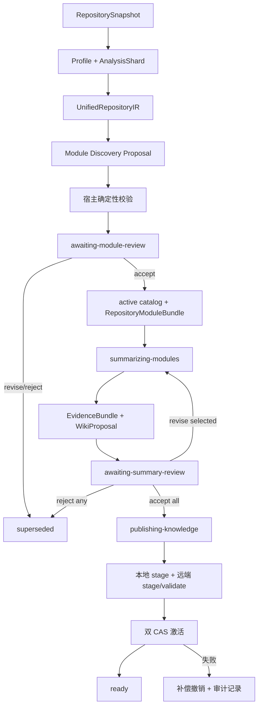

# 存量代码仓模块划分与知识发布：工程边界

> 范围：只讨论固定代码仓快照如何形成可追溯、经双重人工审阅、可撤销的模块知识。目标匹配、符号/模块融合排序、迁移生成和回填属于下一层。
>
> 当前实现基线日期：2026-09-01。测试数字必须以交付时重新执行的结果为准，本文不把历史数字当作当前证明。

## 1. 本阶段的完成定义

本阶段不是让 Agent 根据目录生成一份 `summary.json`，而是把静态仓库执行一次有生命周期的入库运行：

```text
固定仓库快照
  → 语言适配器静态分析
  → UnifiedRepositoryIR
  → Module Discovery Agent 提案
  → 宿主验证模块证据闭包
  → 第一道人工门禁：模块边界
  → 每模块 EvidenceBundle
  → Summary Agent WikiProposal
  → 第二道人审：摘要叙述
  → 本地不可变发布 + SQLite 控制面
  → 独立 SeekDB 模块表 stage / validate
  → 本地与远端 CAS 激活
  → ready，正式模块检索可见
```

只有最后一步完成才是 `ready`。边界被接受、摘要生成成功、本地文件写完、索引文档写入，任何单独一步都不能宣称“已正式发布”。

本阶段采用以下决策：

- 知识正文保存为仓库内不可变文件；当前发布代、代际关系和 CAS 头保存在仓库内 SQLite registry。
- 模块知识使用独立 SeekDB 文档/代/头表，不改写也不清空原符号索引表。
- 两道人审分离：先批准模块边界，再批准 Summary Agent 的叙述。
- 只有 `reviewed + active` 的当前发布代可被正式模块检索召回。
- 激活作用域固定为 `(repositoryId, channel)`，例如 `(acme/orders, branch:main)`。
- `ready` 的提交与对外判定以单仓闭包为边界；底层不是跨 SQLite/SeekDB 的 ACID 分布式事务，而是双 CAS、补偿和可重放恢复。多仓批次允许部分成功，但必须逐仓报告结果，不能把批次部分成功伪装成全成功。

## 2. 生命周期和双重门禁



第二轮审阅按模块独立处理：

- `accept`：保存对当前 proposal ID/hash 的不可变接受记录，后续修订轮复用，不再次调用 Agent。
- `revise`：必须给出修订意见；只为该模块构造带 predecessor/review lineage 的新 proposal。
- `reject`：关闭整个 ingestion，不发布部分模块集合。
- 新一轮事件引用“完整的当前 proposal 集”和“已保留的接受记录”，历史 proposal/review 不删除。

这使同一批次中一个模块修订时，其他已接受模块不会被无意义地重新生成，同时仍能重放每一轮的输入、决定和结果。

## 3. 已实现的工程工作包

| 工作包 | 已做 | 怎么做 | 完成/停止点 |
| --- | --- | --- | --- |
| 固定输入与统一事实 | 快照、profile、shard、IR 均有稳定 ID/hash、coverage、diagnostics | 宿主收集仓库；注册语言 adapter 产出统一文件、实体、API、依赖和证据 | 不做 watcher、后台扫描调度和自动增量重跑 |
| 模块边界提案 | Agent 只产生 `ModuleDiscoveryProposal` | 模型调用前检查必需能力；宿主验证文件归属、实体/API/依赖端点、证据 ID 和覆盖闭包 | 自动流程停在第一道人审；不默认接受第一份提案 |
| 边界发布 | 形成 active catalog 与 `RepositoryModuleBundle` | 人审绑定 proposal/IR ID/hash；确定性物化 raw facts | 只证明模块边界被接受，不等于叙述通过或可检索 |
| EvidenceBundle | 每模块收集有界、内容寻址的生成证据 | owned 文件、同仓一跳协作证据、相关文档/配置；限制文件/模块字节数和项目数；记录 omissions | 高风险密钥文件默认排除；不是完整 DLP/秘密扫描器 |
| Summary Agent | 生成严格 JSON Wiki proposal，并把每项声明绑定 evidence ref | HTTP 边界验证请求/响应；有限修复；响应大小限制；修订时带不可变前序 proposal 和 revise review | Agent 无审批、发布、检索激活或源码写入权限 |
| 独立摘要审阅 | 每个当前模块明确 accept/revise/reject | review 绑定 EvidenceBundle 与 WikiProposal ID/hash；修订意见进入下一轮签名输入 | 任何拒绝关闭本次发布；任何待审/修订都不可正式检索 |
| 本地发布控制 | 不可变正文、发布状态修订、代际和当前头 | `.forexplore/publications` 保存不可变 bytes；`.forexplore/control-plane/registry.sqlite` 保存 publication/head；锁、事务和 CAS | current projection 可重建；不是远程对象存储或组织级控制面 |
| 模块索引 | 与符号索引物理分离的 docs/generations/heads | stage → validate → CAS activate；文档携带 publication、generation、证据哈希、ACL、索引器身份 | 不实现符号/模块的目标匹配融合 |
| 可见性与撤销 | 查询只 join active head；失败激活做逻辑补偿撤销并恢复前代 | staged/withdrawn/tombstoned 不可检索；撤销留审计与不可变状态修订 | 物理清理、保留期和法规删除另行设计 |
| 批次模型 | 逐仓结果可记录 ready/partial/failed 等状态 | 批次制品保留每个 ingestion 的结果；提交判定边界是单仓单 scope，底层依赖 CAS/saga 恢复 | 尚无跨仓或跨存储分布式事务；也不需要为了一个失败回滚其他成功仓 |

## 4. 语言无关性的准确口径

代码仓处理主链已经从 Java/C# 枚举白名单，演进为开放的 `LanguageId + RepositoryLanguageRegistry + adapter capability`。因此，新增语言不需要修改一个中央语言联合类型才能进入 inventory 和统一 IR。

但“可注册”不等于“语义质量相同”，更不等于“任意语言迁移已实现”：

| 场景 | 入库/模块处理行为 |
| --- | --- |
| Java、C# 深分析 adapter | 提供较完整的实体、结构 API 和依赖证据 |
| TypeScript、Python、Rust、Go 通用 adapter | 提供可靠的 inventory/声明/API exposure；缺失语义如实反映在 capability/coverage |
| 第三方语言 adapter | 只要注册且满足宿主契约，就通过同一门禁产出 IR |
| 未注册或证据不足 | 保留文件 inventory，状态为 `partial`，不允许 Agent 猜测完整模块 |
| 迁移执行 | 仍是独立能力边界；当前真实适配能力仍按项目说明保持 Java → C# MVP |

“语言无关”在本模块的证明是扩展机制、失败关闭和统一契约，不是声称所有语言已有同等解析器、编译器或行为验证。

## 5. 存储、追溯和分批导入

### 5.1 一次 ingestion 能追溯什么

manifest 是追加事件账本，并引用不可变制品。可以从一个 `ready` 模块命中追溯到：

```text
search hit
→ active publication ID / generation / payload hash
→ reviewed knowledge page
→ KnowledgeReview
→ WikiProposal（含修订前序）
→ EvidenceBundle
→ RepositoryModuleBundle / active catalog
→ boundary Review / discovery Proposal
→ UnifiedRepositoryIR / AnalysisShard / RepositorySnapshot
```

每一层使用 ID、SHA-256 和 producer/version 绑定。索引回执额外记录非秘密的投影/embedding 配置身份，避免配置变化后静默复用旧代。

### 5.2 多批导入

- 每次仓库快照生成独立 ingestion，旧运行和旧制品不原地覆盖。
- 相同 `(repositoryId, channel)` 的新发布代通过 CAS 替换 active head，并记录 `previousPublicationId`。
- 不同仓库或不同 channel 拥有独立头，可以分批完成。
- 同内容重试走幂等路径；并发写入若观察到不同 head 则失败关闭，而不是 last-write-wins。
- 批次只是逐仓结果聚合：一个仓失败不会污染另一个仓已经完成闭包提交的发布。

### 5.3 撤销

撤销是逻辑状态迁移，不删除历史：远端模块索引取消当前代并恢复可用前代；本地 registry 同步把 publication/receipt 记为 withdrawn 并重建 current projection；manifest 追加撤销事件。这样可以回答“哪一批在何时因何原因被撤下、恢复了哪一代”。

若双端步骤之间失败，系统保留恢复所需的状态，不会把未同步状态标记为 `ready`。物理删除、保留期限和合规擦除不是本阶段能力。

## 6. 两个投影如何包装给下一层

本阶段保留两种互补投影，不在入库阶段提前混合：

| 投影 | 检索单位 | 适合回答 |
| --- | --- | --- |
| 原 SeekDB 符号索引 | class / method / function | “哪个具体实现或 API 与目标符号相似？” |
| 新 SeekDB 模块索引 | reviewed module Wiki document | “哪个业务/技术模块整体覆盖目标职责？” |

模块层公开独立的 `RepositoryModuleKnowledgeSearchRequest/Result`：调用方必须给出 repository、channel、ACL scopes、query 和 Top-K；响应返回 active publication/generation 及每个命中的证据/内容哈希。符号检索接口保持原样。

下一层应负责：

1. 用目标需求/目标模块召回模块候选。
2. 在命中模块范围内做符号召回或实现切片组装。
3. 将模块相关度、符号相关度、证据覆盖和风险作为不同特征进行融合/rerank。
4. 输出可解释的候选证据，再由人明确选择。

本层不定义两个分数的加权、不把排序分包装成正确率，也不构造 `SourceImplementationBundle`。这避免基础仓库知识被某一次目标任务的偏好污染。

## 7. 安全与失败关闭规则

- Agent 输出始终是不可信 proposal；事实 ID、引用和哈希由宿主重验。
- Summary 只能引用 EvidenceBundle；遗漏项必须可见，不允许用模型常识补成仓库事实。
- Evidence collector 限制字节、项目和一跳范围，拒绝逃逸仓库根的路径/符号链接，并过滤高风险凭据文件。
- 模块 index mutation 默认关闭；检索服务需要 `RETRIEVAL_MODULE_INDEX_TOKEN`，扩展需要同值的 `FOREXPLORE_MODULE_INDEX_WRITER_TOKEN`。
- ACL 同时绑定不可变 publication、stage envelope 和每个 index document；三者不一致就拒绝。
- 正式搜索还受部署端 `RETRIEVAL_ALLOWED_REPOSITORIES` 限制，客户端不能自行扩大授权。
- staged、未审、修订中、撤销或 tombstoned 的代均不会出现在正式查询中。
- 本地和远端激活都通过预期 head/generation CAS；发生竞争必须显式恢复或重试。

## 8. 如何证明做到

交付验证至少包含：

| 层 | 必须覆盖的证明 |
| --- | --- |
| contracts/workflow | 双门禁状态、当前轮选择、修订 lineage、完整闭包、publication/head/receipt 哈希与 ACL 校验 |
| code-indexer | 开放语言 adapter、unknown/partial、IR/API/依赖证据闭包 |
| adaptation-service | Summary 请求/响应限制、伪造引用拒绝、修订上下文、有限修复 |
| VS Code host/store | 明确边界审批、明确逐模块摘要审批、本地不可变写、SQLite CAS、幂等重放、并发冲突、补偿审计 |
| retrieval-service | 符号表不受影响、模块表 stage/validate/activate/withdraw/tombstone、active-head/ACL 查询门禁、HTTP auth/大小限制 |
| 全仓回归 | 旧符号检索、既有迁移流程、Web、MCP 和验证器不因新契约破坏 |

推荐复现命令：

```powershell
npm test
npm run build --workspace @forexplore/code-indexer
npm run build --workspace @forexplore/retrieval-service
npm run build --workspace @forexplore/adaptation-service
npm run build --workspace @forexplore/adaptation-mcp-server
npm run build --workspace @forexplore/workflow-web
npm run typecheck --workspace forexplore-vscode
npm run build --workspace forexplore-vscode
npm run build --workspace @forexplore/translation-verifier
git diff --check
```

这些测试证明的是契约、机械门禁和失败路径，不证明 Agent 在所有真实企业仓都能划出业务正确的模块。生产声明仍需未参与调参的真实/匿名历史仓黄金集、人工一致性评审、模块检索 Recall@K/MRR/nDCG、延迟和成本评估。当前单元测试也不能替代真实 SeekDB 容器的集成验证。

2026-09-01 本次交付实际执行结果：全仓 112 个测试文件，1054 项通过、10 项按既有环境条件跳过；`code-indexer`、`retrieval-service`、`adaptation-service`、`adaptation-mcp-server`、Web、VS Code 扩展和 `translation-verifier` 均构建通过，扩展 TypeScript 检查与 `git diff --check` 通过。跳过项不计为通过。

## 9. 明确不做和尚未讨论

本阶段明确不做：

- 目标模块与存量模块的最终匹配、符号/模块融合召回和 rerank 权重。
- 模块命中后的最小可迁移实现切片、完整 `SourceImplementationBundle`。
- translate/bridge/wrap/reuse 策略选择、代码生成、行为验证、修复和回填。
- 自动接受最高分模块、自动批准 Agent 叙述或用模型自评代替人审。

尚未形成完整产品方案：

- 组织级模块粒度规范、嵌套/共享/重叠模块政策。
- reviewer 身份认证、RBAC、电子签名、租户与审计留存期。
- 大仓队列、取消、跨进程任务调度、对象存储和远端控制面。
- Git watcher、增量 impact set 自动执行、旧知识 stale 传播策略。
- 完整 secret/DLP 扫描和合规物理删除。
- 真实 SeekDB 环境的故障注入、性能容量和恢复演练。
- 模块 Wiki 的人工长期维护、verified 等级和独立事实核验。

## 10. 关键入口

| 责任 | 代码入口 |
| --- | --- |
| 入库、Evidence、Wiki、Review、Publication 契约 | `packages/contracts/src/repository-ingestion.ts`、`repository-knowledge.ts` |
| 状态机、当前轮和内容寻址校验 | `packages/workflow-core/src/repository-ingestion.ts`、`repository-knowledge*.ts` |
| 语言 registry 与统一 IR | `services/code-indexer/src/repository-analysis.ts`、`repository-ingestion-bridge.ts` |
| Module Discovery / Summary Agent | `services/adaptation-service/src/module-discovery-agent.ts`、`module-summary-agent.ts` |
| Evidence 收集和两道人审宿主 | `apps/vscode-extension/src/repository-module-evidence.ts`、`module-migration-host.ts` |
| 本地 SQLite publication 控制面 | `apps/vscode-extension/src/repository-knowledge-publication-registry.ts`、`repository-knowledge-publication-store.ts` |
| 双端发布协调 | `apps/vscode-extension/src/repository-module-knowledge-publication.ts` |
| 独立模块索引与搜索 | `services/retrieval-service/src/module-knowledge-*.ts`、`seekdb-module-knowledge-store.ts` |
