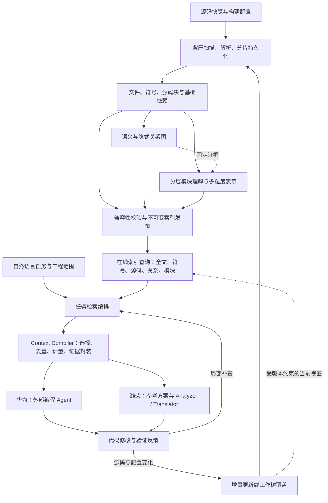

# 面向超大工程的任务驱动代码检索：技术主线与实施计划

编写日期：2026-09-08。本文整合分层并行建库、关系图谱、在线索引与通信三份设计，并对照当前项目确定实施边界。方案面向华为的 AI Coding 检索需求，同时作为潍柴复用迁移流程的公共技术底座。

## 1. 对外讲清楚的一条主线

系统面向百万至千万行、多语言、持续变化的工程，将开发者“修改或迁移某项功能”的自然语言需求，转化为编程 Agent 可以直接使用的代码上下文。后台以有界、可恢复的流水线建立文件、符号、代码块和模块索引；通过构建语义与框架规则连接显式调用、跨语言绑定和隐式依赖；在线根据任务定位实现，再补齐必要的接口、调用链、配置与验证依据，按模型输入预算形成带版本和源码证据的上下文包。Agent 修改代码后，系统更新受影响的索引与关系，并用编译或行为验证反馈驱动下一轮局部检索。

这条主线交付的是：**让 Agent 更快获得完成任务所需的代码依据，并在工程变化后继续取得一致、可追溯的上下文。** 检索结果的数量、模块树的完整程度和图谱边数是过程指标，最终检验的是任务所需证据是否充分、交付是否及时，以及是否改善 Agent 的任务完成效果。

三个痛点在同一条链路中各有明确位置：

| 痛点 | 用户实际遇到的问题 | 对应技术 | 可交付结果 |
| --- | --- | --- | --- |
| 自然语言任务到代码的定位 | 知道要改什么，却不知道实现在哪里；搜到同名代码仍需反复阅读 | 任务意图与锚点解析、多粒度混合召回、任务相关重排、预算化上下文组装 | 定位入口、实现与约束，输出可继续补取的上下文包 |
| 超大工程解析与维护 | 全仓扫描、结构驻留和整项目分析耗时大；一次修改引发大量重算 | 不可变源码清单、背压解析、分片持久化、分层模块分析、证据驱动增量更新 | 基础索引先可用，增强层逐步发布，资源和重建范围有界 |
| 隐式依赖与跨语言关系 | 入口找到了，但事件、注入、Native 绑定和平台实现没有连上 | 构建上下文、调用点模型、有作用域的绑定规则、关系证据与失效传播 | 能解释必要链路，也能指出缺失端点和未确认关系 |

在线服务、版本协议和 Agent 接口贯穿上述三个痛点，负责把它们组合成交付链路。第三份通信文档在总体设计中承担这一连接职责。

## 2. 用一个任务贯穿整个系统

示例任务：**“将上传功能迁移到新平台，保留总请求和单文件大小限制，并保证取消时释放资源。”**

现有 FileUpload 样例可用于验证上传入口、流读取、文件项接口和异常处理的检索。涉及 ArkTS、N-API、C++、事件总线的链路是下一阶段需要新增的工程样例，不应把现有 FileUpload 样例描述成已经覆盖这些场景。

| 步骤 | 系统处理 | 返回或保留的证据 |
| --- | --- | --- |
| 1. 接收任务 | Host 确定目标工程、允许检索的参考工程和代码版本；用户可只输入需求 | 任务 Spec、固定检索范围、可选入口锚点、平台约束 |
| 2. 定位主体 | 同时搜索标识符、实现代码块和模块职责；找到上传入口及大小校验逻辑 | `parseRequest` 等实现位置、完整源码范围、选择原因 |
| 3. 恢复链路 | 沿调用与接口关系补充流读取、文件项工厂和异常类型；存在 Native 或事件调用时查找绑定证据 | 入口到实现的关系路径，注册端、使用端和实际实现的证据 |
| 4. 补齐约束 | 读取决定当前平台行为的构建配置、接口及已有相关测试 | 大小阈值、资源生命周期、可用依赖、验收条件 |
| 5. 组装上下文 | 合并重复片段，保留必要接口和链路，在 token 预算内选择实现细节 | `ContextPacket`：源码、关系、配置、缺口、续查句柄 |
| 6. 执行修改 | 外部 Agent 或内置 Analyzer/Translator 使用同一包；需要更多证据时继续局部查询 | 修改方案、文件改动和对应的输入版本 |
| 7. 验证与更新 | 将编译错误、行为失败和已修改文件转为下一轮查询；发布新索引或工作树覆盖版本 | 新的证据包、验证结果、任务耗时和工具/token 成本 |

首版将需求拆成“总请求限制、单文件限制、取消释放资源”等约束项，为每项关联已找到的实现、接口或测试证据。只有总请求限制的证据时，单文件限制仍标为未确认，并在剩余查询预算内补取。若取消经过未知事件回调，结果应返回这一断点及注册位置线索。需求拆解与证据关联可以由规则和模型辅助完成；模型判断不能替代行为验证，在线流程也不依赖评测集的人工答案。这里的“上下文完整”指固定任务、支持能力和预算范围内的必要证据覆盖；无法静态判定的路径以缺口交付。

## 3. 一个引擎，两条业务工作流



图中的发布节点允许先发布基础层，然后组合已完成的图谱、模块树和投影发布新代次。它不要求全部增强层完成后才允许第一次查询。

**华为的独立交付物**是可部署的索引与检索服务、Agent 查询入口、版本化上下文包和真实任务评测结果。编程 Agent 的修改与测试用于验证引擎的业务价值；检索服务本身不承担任意代码写入。

**潍柴的交付物**是在该引擎之上完成参考实现选择、适配规划、翻译、编译和审阅回填。保留现有模块到模块匹配入口，通过上下文包补齐跨文件实现与依赖。

“目标工程 / 参考工程”表示任务角色。工程注册与索引身份应独立于角色，同一份索引可以在不同任务中承担不同用途。当前 `RepositoryRecord.role` 是单值，第一版用兼容映射维持原迁移流程，新增任务请求显式携带角色；不通过重复登记相同目录创建两份索引。

模块树、关系图和向量近邻图分别保留：模块树表达职责归属，关系图表达跨文件与跨模块连接，HNSW 支持向量召回。模块边界不应删除跨模块关系，模块摘要也不作为确定调用边的证据。

## 4. 当前项目可以复用到哪里

以下是当前工作树的代码核对结果。实现存在、流程接通、企业规模与效果验收是三个不同状态。

| 能力 | 当前状态与可复用内容 | 本计划需要补齐 |
| --- | --- | --- |
| 多语言结构分析 | 语言注册、Tree-sitter、项目发现、文件/符号/依赖/诊断及内容哈希已实现 | 流式读取、原生解析故障隔离、完整处理清单、新语言与构建语义 |
| 基础索引发布 | 结构事实和基础投影先发布，项目 Agent 在之后独立分析 | 保留已有阶段边界，增加分片恢复与组合发布；解除在线请求对全项目分析完成的等待 |
| SeekDB 存储 | 已有按行/字节的批量 INSERT、事务发布、全文/HNSW、向量身份和持久缓存 | 将整仓大事务改为可恢复分片；查询过滤下推；独立模块/代码块记录 |
| 增量处理 | 未变文件的结构事实和相同输入向量可复用 | 存储分片、语义关系、模块树及投影的增量更新，避免仅减少解析却仍全量读写 |
| 模块理解 | 单项目 Agent、归属与证据校验、职责/接口/依赖三视图已实现 | 候选组、树节点与叶归属、局部证据查询、异步分支任务 |
| 模块检索 | 模块主路径有界召回、版本复核、可选重排和取消已实现 | 纯需求定位当前工程；实现级代码块召回；跨粒度融合；能力缺口与上下文选择 |
| 语义与依赖 | 有结构依赖、Java/C# 专用证据适配和 LSP 接口 | 持久的构建上下文、调用点与多证据关系、跨语言和框架绑定 |
| HTTP/MCP | 已有 11 类版本绑定的只读语义查询及对应传输入口 | 扩展任务检索、图扩展和上下文接口；增加独立服务宿主，支持脱离 VS Code 使用 |
| 前端 | 已有“任务检索 / 复用迁移”、工程导航、证据预览、字符预算和导出 | 任务检索 provider 尚未接真实 Host；增加显式检索粒度、token 计量、版本、新鲜度、缺口和续查 |
| 翻译执行 | 新工作区后端可接收 Context＋Spec，执行规划、多文件修改和编译修复 | `ContextPacket` 适配、前端连接及失败补查；当前验收仍为 compilation-only |

### 必须先处理的具体问题

1. `repository-scan.ts` 收集源码数组，`structural-index.ts` 再构造全仓 Map。即使解析事实能复用，读取和驻留成本仍随仓库增长。
2. 扫描器会跳过超大小限制的文件。需要留下发现与排除记录，避免把未处理文件从覆盖率分母中抹掉。
3. `replaceStructuralIndex()` 虽有批量 INSERT，所有批次仍放在一个结构事务中；大仓路径需要分片事务与统一发布。
4. `SemanticQueryService.#scope()` 每次加载完整 `StructuralIndex`。返回结果分页不等于底层读取有界，11 类查询必须分别改为局部数据库查询。
5. 基础源码检索投影目前仅保留每文件前 12,000 字符，符号投影主要是签名。需要 AST 实现块覆盖文件中部和尾部。
6. 原类/函数检索路径仍会加载全量结构与产物，并存在空结果后列举文档的回退。任务检索应建立独立候选通路，不能直接包装这条执行路径。
7. 扩展主检索入口先调用 `waitForProjects()`。任务检索必须按已发布能力响应，等待时间纳入统一期限。

用户反馈的 `FileUploadBase.java`、`MultipartStream.java` 解析失败应纳入第一批回归样例，先确认 grammar、输入和运行环境的具体失败原因。`pom.xml` 即使不归功能模块，也应作为构建上下文输入。该排查属于基础质量修复，不作为隐式图谱算法成果。

代码依据集中列于第 12 节，便于开发时定位。

## 5. 三项技术如何落地并证明价值

### 5.1 有界建库与渐进式模块理解

基础流水线采用“文件清单 → 固定内容引用 → 受控解析池 → 事实分片 → 基础投影 → 发布”。目录枚举、源码读取、解析与写入分别设置字节/条数高水位，下游饱和时暂停上游；任务传文件身份与内容引用，避免在进程间反复传全仓源码。原生 parser 优先在固定子进程池中运行，每个任务有超时和资源记录。

声明先落库，引用随后绑定；读取顺序造成的暂时缺失保存为待绑定项，不直接定性为外部缺依赖。分片使用输入哈希和分析器身份去重，重启后核对清单与已提交分片水位。发布校验通过后切换活动指针，失败构建保留上一有效版本。

模块理解复用现有 Agent：先按项目、目录、包和局部依赖生成候选组，Agent 提出职责与拆合建议，Host 将组句柄展开并核验精确归属。先实现串行分层基线，再增加有界分支并行。每个文件归一个叶节点或一条明确的待归属记录；父节点范围由子节点与待归属项完整覆盖。跨项目职责通过上层聚合节点表达，保留现有单项目校验。

解析、Agent 和 embedding 使用独立资源池。分支细化不等待整个层级，父摘要汇总等待直接子产物。按照原分层方案，在需要持久多 worker 调度时引入 BullMQ＋Redis，SeekDB 保存权威任务、outbox、结果及租约。队列成功仅代表执行完成，发布仍由协调器校验。

**证明价值：**分别测基础可用时间、首个模块可用时间、完整构建时间、全链路峰值内存、模型输入量和局部更新范围；对比原整仓流程、流式基础索引、串行分层与并行分层。分层树必须带来检索或更新收益，不能只展示更细的树。

### 5.2 以构建与注册证据恢复必要依赖

在现有事实模型上新增独立 `CodeGraph`，首版以 SeekDB 关系表和正反邻接索引存储。节点涵盖符号、调用点、外部端点和绑定键；边区分调用、可能调用、接口实现、绑定、事件发布/订阅、平台声明对应和配置约束。

跨语言和框架关系采用“注册端 → 有作用域的绑定键 → 使用端”规则。例如 Native 绑定键包含库、导出名、签名与构建 profile；事件键包含总线身份和主题，不能把两个总线里的同名事件相连。中间绑定实体避免把所有发布者与订阅者展开成两两边。

每条关系保留产生方法、解析状态、分派性质和多处证据。编译器确认接口引用不等于确认唯一运行时实现；规则分数不等于概率。无法确认的目标保留候选集合或缺口，LLM 可建议规则和解释结果，但确定边须由实际语义、注册或观测证据支持。

关系必须绑定构建上下文。Maven/Gradle 的项目发现不等于已经解析 classpath，ArkTS 也不能仅按 TypeScript 文件处理，KMP 需要源集和平台对应，C/C++ 需要编译单元及参数。首版先跑通现有语言中的显式关系，再按企业样例选定一个平台 profile，完成 ArkTS—N-API—C++ 及一种事件或路由规则。

新增证据反向依赖索引，记录派生边消费了哪些源码、配置、类型、工具和规则版本。删除注册点时撤回依赖该证据的旧边；公共签名、头文件、SDK 或源集变化时，按消费关系扩展重分析范围。

**证明价值：**按语言、关系类型和 profile 分别报告边精确率、召回率、必要链路恢复率及增量撤边正确性。再比较开启/关闭图扩展时的上下文必要证据覆盖和 Agent 任务完成率。

### 5.3 从“候选列表”到“任务上下文”

在线任务检索流程为：

```text
需求、工程范围、检索粒度和可选锚点
  → 固定读取版本，识别本次意图与硬约束，按用户选择确定主要结果粒度
  → 路径/符号、词法、代码块向量、模块多视图并行召回
  → 合并去重，有限候选重排，形成入口种子
  → 按任务角色展开必要关系、配置和验证依据
  → 合并源码范围，计量 token，选择证据与续查边界
  → ContextPacket
```

意图区分定位、修改、影响分析、寻找参考和迁移。明确路径/符号时优先使用锚点；纯自然语言不能被 `name.includes(query)` 限制。任务规划首版采用规则和有界查询改写，需要模型时限制到期限内的少量调用，不在在线请求中递归创建 Agent 树。

需求输入框下方显式提供“检索粒度”：**自动 / 函数或方法 / 类或接口 / 模块 / 子系统**，请求值依次为 `auto`、`function`、`class`、`module`、`subsystem`，默认 `auto`。手动选择优先于锚点和模型判断；自动模式才由任务与锚点决定一种或多种粒度，判断不确定时采用混合召回。所选粒度决定主要结果的组织单位，必要的接口、调用关系、配置和测试仍可跨粒度补齐。

底层保持多粒度索引，切换选项不改变解析深度、不触发重新建库。粒度在当前范围不可用时，界面显示索引状态并禁用该项；API 返回能力缺口，不能悄悄改成其他粒度。部分工程就绪时按请求策略报告实际覆盖范围；已就绪但没有命中时返回空结果。切换粒度取消旧请求并清理旧结果，HTTP/MCP 与前端传递同一字段，响应回显用户选择、实际粒度及决策来源。

这项交互和协议尚待实现：当前旧复用检索由 `ModuleTarget.kind` 决定候选粒度，任务检索页尚无粒度字段，也没有自然语言置信度门禁。新增字段用于任务检索，旧复用与适配路径继续按原契约运行。

模块树提供范围建议与高层摘要。没有可靠锚点时，给全局符号和代码块通道保留候选预算，避免一次粗模块误判导致后续永久漏召回。现有模块三视图、RRF、初排及可选重排保留为对照基线；新通道通过消融决定权重与启用条件。

图扩展首版采用带优先级的有界邻接遍历，按方向、关系类型、解析状态、深度、节点/边数和期限控制；种子及邻居使用版本化身份去重。命中高扇出公共库时优先返回接口与必要边界，保留未展开项，不遍历全图。

`Context Compiler` 指上下文组装器，区别于目标语言编译器。它按“目标实现、接口类型、必要连接、配置、验证依据、参考实现”选择内容，合并同文件重叠范围，剔除已提供且内容未变的片段。需求约束清单记录每项的关联证据、冲突或未知状态；未确认项交回任务检索进行有限轮次的局部补查，耗尽统一期限或预算后保留缺口。使用指定 tokenizer 对实际交付文本计量；必要内容装不下时返回 `partial`、缺口及补取句柄。JSON 与 Markdown 共享同一个包，分别记录各自的序列化成本。

**证明价值：**同一任务、同一模型、相同执行预算下，对比 Agent 原有 grep/读文件流程与引擎接入流程。同时测有效定位率、上下文证据覆盖、无关内容比例、总工具调用、总 token、耗时和任务完成率。减少工具调用不能以漏掉必要上下文为代价。

## 6. 统一协议与发布规则

### 6.1 首版冻结三份共同契约

新增协议放在 `packages/contracts`，采用同一运行时 schema 派生类型与传输校验，可复用现有 MCP 的 Zod 技术栈。旧协议继续兼容；不同时手写 TypeScript、JSON Schema 和 Protobuf 三套定义。

| 契约 | 首版核心字段 | 所有者 |
| --- | --- | --- |
| `IndexManifest` | 工程、`indexGeneration`、不可变源码清单身份、`analysisRevision`、构建 profile 集合/上下文清单引用、各层状态与输入版本、质量计数、产物引用 | 索引发布协调器 |
| `TaskSearchRequest` | `requestId`、需求/意图/约束、`granularity`、允许范围、目标与参考快照集合及各自的 `buildProfileIds`、可选锚点、已知证据、时间和内容预算 | 在线检索层；Host 解析并核验范围 |
| `ContextPacket` | `packetId`、固定快照集合、`routing` 粒度决策、角色化源码/关系/配置证据、约束与证据对应、选择原因、范围与内容哈希、能力缺口、截断、实际用量、补取句柄及 `expiresAt` | 上下文组装器 |

首版依次增加 `TaskRetrievalPort.search`、`ContextQueryPort.fetch`、`GraphQueryPort.expand/trace`。已有 `SemanticQueryPort` 保持基础局部查询职责，HTTP/MCP 在现有服务中包装这些端口。

`granularity` 省略时按 `auto` 处理，非法枚举拒绝。响应 `routing` 包含 `requestedGranularity`、`resolvedGranularities`、`source`（`user` / `automatic`）和 `reason`；手动模式可用时实际粒度数组为所选的一项，不可用时为空，已检索但无命中仍回显所选粒度；自动模式可包含多个具体粒度。`confidence` 可选，仅自动决策且经标注集校准后给数值，未知为 `null`；它不参与覆盖手动选择。续查沿用原粒度决策，重新选择粒度产生新请求。

源码范围沿用现有从 1 起始、结束位置不包含的约定；首版明确列单位为固定源码文本的 UTF-16 code unit。各 parser 与 LSP 适配器显式转换原生坐标，验证中文、非 BMP 字符和 CRLF，避免返回正确文件却截取错误代码。内容哈希与范围必须指向同一份固定源码。

外部 Agent 可一次调用任务检索获得首包，再按句柄补取具体源码或关系。SDK/CLI 如有需要只封装同一协议，避免复制检索逻辑。任务检索、数据发布和文件写回使用不同入口，查询接口不接受任意磁盘根目录。

### 6.2 版本身份在服务端组合

调用方首次可以选择“当前已发布版本”，服务端解析成固定的 `ReadView` 并在响应中返回。后续查询、分页和补取沿用该视图。

```text
TaskReadView
  snapshots[]
    repositoryId + indexGeneration + taskRole
    selectedBuildProfileIds[]
    workingTreeRevision?                 // 后续覆盖层

IndexManifest
  immutableSourceManifest + analysisRevision
  graphRevision? + graphInputHash?
  treeRevision? + treeInputHash?
  projectionRevision? + embeddingIdentity?
  buildProfiles[] + buildContextsManifest?
  layerCapabilities + quality + artifactReferences
```

各 revision 表达不同身份，但无需所有请求手填全部字段。基础先可用时图、树、向量层可以缺省，能力状态须明确。一个工程可能有多个语言和编译单元，`buildContextId` 应位于具体语义产物或上下文清单中，不能是覆盖整个多语言仓库的单值。

首版一个 generation 组合该源码版本下兼容的 profile 清单，各 profile 分别声明语义能力与产物引用。请求按工程选择 `buildProfileIds`，缺省时服务端解析已配置的默认 profile 并写入读视图；无可用 profile 时按策略返回基础能力或缺口。语法事实可共享，语义边及消费它们的摘要按所选 profile 过滤。补齐某个平台时保留其他仍兼容的平台产物，不能以最后完成的平台覆盖其他平台；跨 profile 分析必须由任务显式指定。

Git 分支名保留为 `requestedRef` 来源信息；发布绑定解析后的 commit/tree 或实际源码清单哈希。Git HEAD 不能代表未提交文件的内容。跨工程任务固定的是一组明确版本，不自动获得跨仓事务意义上的源码一致性。

发布步骤固定为：校验分片及层间输入身份 → 持久化不可变 manifest → 以比较并交换或等价事务切换活动 generation。图或向量后续补齐时生成新的 manifest，不能原地补写旧 generation。已经开始的查询在租约内继续读原视图；写回前再检查目标基线。

图变化时，只保留输入证据仍兼容的树和投影。消费旧图事实的派生摘要要重算，或者在新 generation 中明确不可用；不能任意组合“最新图＋最新树＋最新向量”。

补取句柄和读视图包含租约到期时间，Host 可在规定的最长保留期内续期，任务结束时释放。到期补取返回 `SNAPSHOT_EXPIRED`，由调用方重新检索取得新视图；服务端不能悄悄切到最新版本。仅导出一个上下文包不产生永久保留索引的义务。

### 6.3 消除三份文档的协议歧义

| 歧义 | 统一决定 |
| --- | --- |
| 在线索引混指建库、查询和工作树更新 | 分为后台构建、不可变发布、在线查询、工作树覆盖四个职责 |
| `CALLS`、`INCOMING_CALLS` 与 `calls` 并存 | 统一关系种类；入向/出向由 `direction` 表达。异常处理等新关系按 provider 能力声明 |
| 示例数字 `evidenceLevel: 1` 与现有枚举冲突 | 兼容现有结构/语义等级，新增独立解析状态、分派性质和 provider 版本；排序分数单独保存 |
| 单条边只有一个源码范围 | 证据数组各自绑定文件、范围、哈希和构建上下文，支持调用、注册、目标多处证据 |
| `complete` 被解释成“功能已完整恢复” | 仅表示本次请求按约定执行完成；质量与未知项由覆盖、能力和缺口字段表达 |
| 解析粒度与检索路由混称“门禁” | 统一为显式“检索粒度”；手动控制主结果，自动模式辅助决策；离线解析与必要依赖补充不受该选择裁剪 |
| `ready` 同时表示任务与发布成功 | 任务、发布、能力分开：任务成功后还需发布校验，能力可部分具备 |
| 游标只有 offset | 绑定快照、归一化查询、过滤条件、排序版本和续查位置；禁止换范围续用 |
| 单仓请求无法表示目标＋参考工程 | 底层局部查询保持单仓，任务层持有多个授权快照及任务角色 |
| 3 秒、4,000 tokens 等示例数字被当成 SLA | 作为配置示例；验收预算以第 9 节冻结口径为准 |

缺少能力时的降级由请求策略显式选择，并报告已使用与跳过能力。已有迁移重排的失败语义保持兼容；不能为了平均耗时让服务默默跳过用户要求的能力。

## 7. 实施顺序与里程碑

计划采用三条研发线加一条贯穿的验收线：A 负责索引/存储/发布，B 负责语义/关系/构建上下文，C 负责检索/上下文/Agent 与前端，D 负责数据与评测。它们是职责，不预设实际人员名单。

下表给出 **3 名核心研发＋1 名可分担集成评测的成员** 条件下的 10～12 周参考安排。P0 要按实际人员、企业数据和 SDK 获取情况重新估算；前两周开始报告实测吞吐与工作量。全语言、全框架支持不包含在这一固定周期承诺内。

| 阶段 | 参考窗口/负责人 | 具体交付物 | 进入下一阶段的检查 |
| --- | --- | --- | --- |
| P0 契约与基线 | 第 1 周，A/B/C/D | 三份首版契约、索引/任务真值集、范围与指标定义；两个 Java 解析失败的复现和修复结论 | 范围可表达目标与参考工程；基线结果可复现；缺失 SDK/数据有明确获取任务 |
| P1 有界基础索引与查询 | 第 1～3 周，A 主责，C 协同 | 固定内容清单、背压解析、分片事务、AST 代码块、局部存储查询、基础 manifest；独立服务宿主骨架 | 已发布基础索引不等待模块树；在线关键路径不读取全量结构；文件尾部实现可查；中断不覆盖有效版本 |
| P2 任务到上下文首个闭环 | 第 3～5 周，C 主责，D 协同 | 自然语言候选融合、显式粒度选择、依赖扩展、ContextPacket/token 计量、现有 MCP/HTTP 扩展、真实 TaskSearch 连接 | 不预选模块完成检索；手动粒度生效、必要依赖保留；前端和 Agent 返回同源证据；一次真实 Agent 修改在冻结 Spec 下完成验证 |
| P3 隐式关系首个闭环 | 第 2～7 周，B 主责，C 协同 | BuildContext、CodeGraph/证据表、正反邻接、规则注册与失效；先显式关系，再一个 Native profile 与一种事件/路由规则；图查询接入上下文 | 成功链、歧义/缺端点链、删除注册后的撤边均正确；图增强确实补入任务必要证据 |
| P4 分层理解与并行维护 | 第 4～8 周，A 主责 | 树契约、候选组、串行分层基线、再接持久任务与有限并行；节点独立存储和多粒度投影 | 基础仍可独立服务；至少两个分支并行；无重复文件归属；取消恢复后不重复发布；保留全局细粒度召回 |
| P5 编辑中的连续检索 | 第 7～9 周，A/B/C | working-tree revision、变更文件覆盖、旧边失效、已有上下文去重、验证诊断驱动补查 | 新增/修改/删除及撤销后读视图一致；旧边不与新源码拼接；后续索引发布可替代覆盖层 |
| P6 规模与业务验收 | 基线贯穿，集中第 9～12 周，D 主责 | 十万/百万/千万行逐级规模报告，冻结任务盲测，Agent 对照和消融，部署与运行手册 | 达成约定范围内指标；失败有原始记录与明确归属；企业语料和指定平台独立报告 |

**第一演示里程碑是 P2，第一企业候选版本是 P3～P6 在约定范围内共同通过。** P2 消费已有显式依赖，允许图和树后台继续增强。B 线可在 P0 契约后并行推进，不等待完整建库调度；C 线可在 P1 逐步交付的查询接口上开发，不等待完整分层分析。

当前潍柴翻译后端的 compilation-only 里程碑保持原口径。第 9 节的行为测试属于后续华为业务效果验收与完整迁移验收，不能用本次已有编译通过记录替代。

## 8. 可直接拆分的开发任务

下列新增文件名为建议落点，实际实现时按已有模块边界调整。每项独立提交，带兼容开关与对应验证记录；数据库表采用新增/版本化迁移，避免破坏已有索引。

| 任务 | 主要落点 | 工作与完成条件 | 依赖 |
| --- | --- | --- | --- |
| T01 公共契约 | `packages/contracts/src/index-manifest.ts`、`task-retrieval.ts`；`packages/workflow-core/src/task-retrieval-port.ts`（新增） | 请求/响应/能力/快照/预算/游标及粒度枚举校验；省略粒度默认自动、回显实际决策；兼容旧协议；确认源码范围坐标 | P0 |
| T02 质量与性能基线 | 既有 `scripts/verify-indexing-performance.ts`、`verify-module-matching.ts`；`tests/fixtures/task-retrieval/`（新增） | 冻结任务、源码和必要证据；覆盖大文件尾部、无命中、解析失败、配置文件；保存原始基线 | T01 可并行 |
| T03 固定源码与分片构建 | `services/code-indexer/src/repository-scan.ts`、`structural-index.ts`；`repository-scanner.ts` | 全量数组改有界生产通路；进程池、内容引用、处理清单、前向引用绑定；原小样例 API 兼容 | T01 |
| T04 分片存储与 manifest | `index-store.ts`、`seekdb-index-store.ts`、`analysis-coordinator.ts`；`index-publication.ts`（新增） | 分片幂等提交、水位和恢复；层兼容校验及 generation 发布；失败保留上一代 | T01、T03 |
| T05 有界查询 | `semantic-query-service.ts`、`index-store.ts`、`seekdb-index-store.ts` | 替换 `#scope()` 全量装载，按键查符号/范围/邻接；计数不装载全集；游标和统一取消 | T01，与 T03 并行 |
| T06 实现级投影 | `seekdb-projection.ts`；`services/code-indexer/src/code-chunker.ts`（新增） | 按声明/函数生成代码块，超长块保持父声明与连续关系；索引完整范围和内容哈希，模型输入检查截断 | T03、T04 |
| T07 任务检索编排 | `services/code-intelligence-service/src/task-retrieval.ts`（新增）；复用 embedding、`module-reranker.ts` | 手动粒度优先、自动模式路由；需求约束、锚点、工程范围、多通道融合、有限种子与缺口补查；粒度不可用不静默替换；在线无全仓等待 | T05、T06 |
| T08 上下文组装 | `context-compiler.ts`（新增） | 源码范围合并、约束与证据关联、未知/冲突项、token 计量、known-evidence 去重、partial 与补取租约；JSON/Markdown 同源 | T01、T07 |
| T09 服务与前端连接 | `semantic-query-http-server.ts`、`services/semantic-index-mcp-server/src/`、`apps/vscode-extension/src/protocol/messages.ts`、`extension.ts`、`TaskSearch.tsx` | 独立服务、现有 MCP/HTTP 扩展、真实 provider；需求区粒度选择与可用状态；切换取消旧请求；请求 ID/粒度/错误/版本/用量贯通 | T07、T08 |
| T10 构建与图基础 | `services/code-indexer/src/semantic-compiler-probe.ts`；`build-context.ts`、`code-graph.ts`、`graph-store.ts`（新增） | profile 与编译单元、持久语义、调用点、多证据边、外部端点、未知项和按能力查询 | T01、T05 |
| T11 隐式绑定与撤回 | `services/code-indexer/src/binding-rules/`、`fact-dependencies.ts`（新增） | 一个跨语言 profile＋一种框架规则；按有作用域键绑定，记录消费证据；变更后撤回派生边 | T10 |
| T12 图接入在线上下文 | C 主责；`graph-expansion.ts`（新增），扩展任务检索、上下文组装及 HTTP/MCP | 实现 GraphQueryPort 的有界 expand/trace；种子、profile、关系预算、断点与多处证据进入同一包；开关图扩展做对照 | T08、T09、T10；隐式关系消费 T11 |
| T13 分层模块树 | 扩展 `project-analysis.ts` 与现有工具型 Architect；`module-hierarchy.ts`、`hierarchy-store.ts`（新增） | 候选组句柄、父子范围/叶归属校验、单节点产物、串行划分、局部查询；不要复制整项目 JSON | T05、T06；图可选 |
| T14 持久并行与树投影 | `hierarchy-coordinator.ts`、`hierarchy-worker.ts`（新增）；扩展投影 | BullMQ/outbox/租约/预算账本；失效任务不发布；逐分支细化；输入证据驱动摘要复用 | T13，消费 T10/T11 |
| T15 当前工作树与反馈 | Host、`working-tree-overlay.ts`、`retrieval-session.ts`（新增） | 新/改/删文件遮蔽旧记录，失效旧图证据，固定覆盖版本；编译反馈局部补查；覆盖层并入新索引 | T04、T08、T10 |
| T16 双业务消费与验收 | `workspace-translation-runtime.ts`、`workspace-translation.ts`；独立 Agent 验收脚本 | 包适配到既有 Context＋Spec，目标写范围由 Host 验证；外部 Agent 同包消费；整条链指标对照 | T09；增强验收依赖 T11/T12/T14/T15 |

P1 可以先在较小真实工程完成纵向集成，但生产路径从一开始遵守条数、字节、期限上界，后续规模升级用于验证容量与质量。不得通过把完整 `StructuralIndex` 放进另一个进程来宣布“已经完成有界查询”。

### 首两周执行清单

1. A/C 联合冻结 manifest、任务请求与上下文包样例，明确跨工程 scope、粒度选择/回显和失败状态；B 确认图证据与 profile 字段。
2. D 从现有 FileUpload 及其他带构建样例建立首批任务真值；先保留完全独立的一部分任务用于阶段验收。
3. A 复现两个 Java 文件解析失败，并为超大/未支持文件增加可见的处理原因；D 记录覆盖率分母。
4. A/C 为关键在线接口增加“禁止调用全量结构读取”的回归检查，测量现有查询读取行数、字节和时间。
5. A 交付分片存储端口和固定内容清单；C 同时交付数据库端符号、路径和源码范围读取。
6. A/C 交付 AST 代码块，证明长文件尾部实现可被中文需求召回；保留词法与真实 embedding 对照。
7. C 使用实际查询结果构造第一份 ContextPacket，通过现有 HTTP/MCP 返回；前端不再使用预览消息桥作为验收输入。
8. B 完成首个可构建的关系样例与真值，冻结 Native/事件的注册键与作用域规则。
9. D 输出首轮基线报告，区分建库耗时、检索耗时、证据质量和 Agent 执行成本；据此调整后续并发与预算。

第二周结束至少应有真实、版本绑定的源码上下文经过在线接口返回，以及第一轮资源和查询读放大数据；不以完成大量新类型定义替代可运行结果。

## 9. 验收方法与指标口径

### 9.1 数据与环境先固定

业务指标沿用已有需求对照中的目标：检索准确率至少 90%、平均检索耗时小于 10 秒、生成或转换功能完备度超过 90%。原需求未定义 K、分母、并发及测试集合，因此下表给出拟冻结的工程口径；它们是实施目标，不是当前结果。

正式盲测至少准备 100 个独立任务，按工程家族和时间分开开发集与验收集，覆盖修改、迁移、影响分析、无匹配，以及中文需求对应多语言实现。D 记录必要实现入口、接口、链路、配置和行为验收项；第二名评审者核对关键证据。数据不足时可做探索性评测，但不据此宣称达到企业指标。

规模按真实固定源码的十万、百万、千万行逐级提升，报告纳入文件数/字节、物理行数、语言、生成与第三方代码比例、构建 profile。复制文件只用于压力测试。提前冻结机器配置、数据库/模型进程是否同机、RAM/CPU/GPU/磁盘预算、模型身份及可用 SDK。

### 9.2 每层指标独立计量

| 层次 | 主要指标与计算口径 | 验收用途 |
| --- | --- | --- |
| 文件与解析 | 发现、纳入、排除及原因；parsed/partial/failed/unsupported 数量；源码、配置分别统计 | 不用模块归属的 60/61 代替解析成功率 |
| 建库与维护 | 基础可用、首模块可用、完整构建时间；峰值 RSS/磁盘/队列深度；每次更新的读写、重算与缓存量 | 验证资源上界和增量收益；千万行时长由实测给出 |
| 定位准确率 | 正例任务拟用 `Success@5`：Top-5 至少一个经标注确认的有效定位入口且无硬约束冲突；负例独立统计正确无匹配率 | 与企业确认后作为“准确率≥90%”的主口径；另报 Precision@K、Recall@K、MRR、无匹配误接受率；综合指标预先冻结正负例权重 |
| 上下文覆盖 | 已包含的必要证据数/标注必要证据总数；实现、接口、关键关系、配置、测试分别报告；额外统计无关 token 占比 | 防止只找对一个入口，却漏掉完成任务必需依赖 |
| 图质量 | 按 provider/关系/profile 的精确率、召回率、必要路径恢复率；未知项与歧义比例 | 区分单边质量与整链正确性，验证新增规则实际价值 |
| 查询时延 | 从 Host/Agent 收到请求到首个可消费 ContextPacket，包含排队、规划、编码、SQL、重排、图扩展、读源码与组装 | 固定并发 4 的候选验收配置，平均 <10 秒；另报 p50/p95/p99、超时率和 10 秒内正确交付比例 |
| Agent 效果 | 同一模型/Spec/执行预算，统计全部工具调用、读源码字节、输入/输出 token、引擎模型开销、总耗时与任务成功率 | 对照 grep/读文件基线，检验工作量是否真正减少 |
| 功能完备度 | 冻结必需行为断言，通过数/总数，目标 >90%；同时报告整任务所有必需行为通过率 | 关键能力失败不能被大量简单断言平均掩盖；编译通过单独报告 |

失败、取消、超时和空匹配都进入相应统计分母，按原因单列。内容预算不足的 `partial` 响应不能自动算成功，应检查是否覆盖本任务标注的必需证据。首包与所有补取轮次的总耗时分别报告，避免把工作移到续查就声称更快。

初始内容预算实验采用 4k/8k tokens 两档，另测并发 1/8/16 和冷/热缓存。首轮基线后为 P2 设定工具调用及 token 降幅目标，前提是任务完成率和必要证据覆盖不下降；不在没有基线时承诺固定倍数。

### 9.3 正确性与恢复必测矩阵

| 变化或故障 | 应满足的不变量 |
| --- | --- |
| 基础层完成，图或树未完成 | 查询只读已发布层，报告缺少能力，不能读取 building 分片 |
| 默认自动、手动指定或切换粒度 | 手动选择优先于锚点和模型；主结果符合选择，必要证据可跨粒度；切换取消旧请求且不重建索引，旧响应不覆盖新结果 |
| 所选粒度未就绪或没有命中 | 前者报告能力缺口并显示不可用范围，后者返回空结果；两者都不能静默替换用户指定的粒度 |
| 新代次发布时正在查询 | 本轮所有源码、图和补取仍属于固定视图，游标不跨代次 |
| 文件体、接口、配置、头文件或规则变化 | 相同最终源码/profile/工具输入下，确定性结构事实、绑定关系和失效集合与全量规范化等价；规范化不抹去关系、范围或证据差异 |
| 理解模型、提示或向量模型变化 | 不复用不兼容输入的摘要/向量；模块理解比较归属覆盖、证据有效性、边界和检索效果，不要求重生成文字或整棵树完全相同 |
| 删除、重命名或撤销修改 | 对应声明、代码块、绑定和派生关系正确撤回/恢复 |
| parser 崩溃或文件过大 | 处理原因可见，其余分片可继续；覆盖率保留该文件 |
| 队列重复投递、worker 超时、旧结果晚到 | 幂等校验、租约与发布检查阻止重复发布和旧尝试覆盖 |
| 高扇出依赖、循环、预算耗尽 | 有界停止，返回未展开项、原因及合法续查句柄 |
| 未提交修改与旧图并存 | 遮蔽变化/删除文件的旧符号及消费其证据的旧边；暂不能重算的关系明确过期或未知 |
| 取消与过载 | 取消传至连接等待、SQL、模型和解析任务；队列有界且拒绝原因可见 |

### 9.4 必做的对照与消融

1. 原 Agent 搜索方式与引擎接入方式：固定模型、任务、轮数和验证预算，包含检索引擎内部成本。
2. 词法/符号 → 加真实 embedding → 加重排：观察定位与尾延迟的变化。
3. 无模块树 → 树下钻 → 树下钻＋全局代码块通道：验证层次路由收益与漏召回风险。
4. 无图 → 显式关系 → 加绑定规则：观察关键链路和上下文覆盖的净增益。
5. 固定源码截断 → 预算化 Context Compiler：比较任务完成率、必要证据和总 token。
6. 原整仓构建 → 有界串行 → 分层并行 → 局部增量：在相同质量条件下报告耗时、资源与费用。

## 10. 工作树更新与持续交互的边界

P2 首版先服务已发布快照，并明确显示新鲜度。P5 再提供 `baseGeneration + workingTreeRevision` 的覆盖视图：Host 固定本次变更字节，新增文件补入、修改文件替换、删除文件形成 tombstone；变动期间重新采集或返回过期状态。

ripgrep/LSP 可以为变化文件提供临时文本与符号信息，但不能自动修复整张旧图。凡是消费变化源码或配置的关系，都要失效并按支持能力重算。旧模块树可作为标记了滞后的范围建议，不能作为最新调用事实。

Agent 已读片段以作用域＋内容哈希记账；相同内容不重复发送，变化内容必须重新交付。编译/测试失败携带错误、已改文件和快照，下一轮优先定位相关证据。系统以明确的轮次、工具、token 和时间预算停止，并保留未解决项。

查询租约同时保护源码、图、树、投影和证据。回收按活动版本、有效任务租约与限期历史记录分批执行；不能删除仍处于有效补取租约内的产物，到期或释放后才能回收。

## 11. 第一版保留与延后事项

| 决策 | 理由与后续触发条件 |
| --- | --- |
| 保留 Node/TypeScript、SeekDB、现有端口和 Agent 运行时 | 当前可复用基础充分，先改执行路径与契约，减少迁移成本 |
| 先用关系表与邻接索引实现 GraphStore | 局部图查询可先验收；数据库查询计划与规模证据证明不足时再比较独立图存储 |
| BullMQ/Redis 放在持久分支并行阶段 | 原方案中明确的调度选择；基础检索可先独立交付，新增部署依赖不阻塞 P2 |
| 模块树串行基线先于并行 | 先证明归属、证据和路由正确，再测并发收益与失败恢复 |
| METIS、完整 SCIP、复杂 CPG、运行时轨迹后置 | 由真实评测暴露的瓶颈决定；首版必须已有可核验源码和局部依赖 |
| 企业指定语言逐 profile 验收 | Java、ArkTS、C/C++、Kotlin/KMP 的 SDK 和构建语义分别建设，不用语言别名掩盖缺失 |
| 新前端沿用双入口与现有样式 | 把研发投入放在真实 provider、上下文与版本反馈，而非再建一套展示系统 |
| 潍柴模块适配保持独立验收 | 任务检索接通并不自动解除旧单文件写回限制；多文件生成、审阅和回填按其契约接入 |

项目排期优先保护 P1 的有界路径和 P2 的真实任务闭环。若单机模型吞吐或 SDK 成为限制，明确缩小本阶段语料/profile 或增加对应执行资源，并保留尚未验收的规模与能力项。

## 12. 来源与代码落点

### 三份输入文档

- [超大规模代码仓库分层模块化与并行索引构建](<code-intelligence-hierarchical-parallel-indexing.zh-CN(2).md>)：流式基础索引、树归属、分支调度、多粒度表示和增量维护。
- [多语言工程建库与模块检索：关系图谱融合稿](<code-intelligence-indexing-retrieval-graph-integrated.zh-CN(1).md>)：构建上下文、显式/隐式/跨语言关系、证据与任务上下文扩展。
- [在线索引与原规划的对齐及通信协议设计](<在线索引与原规划的对齐及通信协议设计(1).md>)：构建与查询分工、manifest、组合身份、搜索/图/上下文协议。
- [华为真实需求与现有工作流对照](../huawei-requirements-workflow-gap-analysis.zh-CN.md)：业务范围、目标语言和原始指标来源。

本文把三份文档中的新增设计作为待建能力；已有实现以当前工作树核对为准。2026-09-08 按用户确认同步更新本方案、分层建库及通信协议中的显式检索粒度设计。代码核对基线为 `c8ff223` 加当前未提交的前后端开发改动，本次文档更新未重跑规模或模型评测。

### 现有实现索引

| 位置 | 对应内容 |
| --- | --- |
| [repository-scan.ts](../../services/code-indexer/src/repository-scan.ts)、[structural-index.ts](../../services/code-indexer/src/structural-index.ts) | 源码收集、结构构建、解析复用 |
| [syntactic-dependency-resolver.ts](../../services/code-indexer/src/syntactic-dependency-resolver.ts)、[semantic-compiler-probe.ts](../../services/code-indexer/src/semantic-compiler-probe.ts) | 结构依赖与现有编译语义探测 |
| [analysis-coordinator.ts](../../services/code-intelligence-service/src/analysis-coordinator.ts)、[repository-scanner.ts](../../services/code-intelligence-service/src/repository-scanner.ts) | 扫描协调、源码来源、基础版本发布 |
| [index-store.ts](../../services/code-intelligence-service/src/index-store.ts)、[seekdb-index-store.ts](../../services/code-intelligence-service/src/seekdb-index-store.ts) | 整包读写、数据库查询、投影与向量缓存 |
| [seekdb-projection.ts](../../services/code-intelligence-service/src/seekdb-projection.ts)、[project-analysis.ts](../../services/code-intelligence-service/src/project-analysis.ts) | 文件前缀投影、模块三视图、单项目提案与校验 |
| [module-matching.ts](../../services/code-intelligence-service/src/module-matching.ts)、[module-implementation-search.ts](../../services/code-intelligence-service/src/module-implementation-search.ts) | 已有模块搜索与旧类/函数搜索路径 |
| [semantic-query-port.ts](../../packages/workflow-core/src/semantic-query-port.ts)、[semantic-query-service.ts](../../services/code-intelligence-service/src/semantic-query-service.ts) | 11 类基础查询、源码范围、全量 scope 读取 |
| [semantic-query-http-server.ts](../../services/code-intelligence-service/src/semantic-query-http-server.ts)、[semantic-index-mcp-server.ts](../../services/semantic-index-mcp-server/src/semantic-index-mcp-server.ts) | 已有只读 HTTP/MCP 接口 |
| [code-intelligence.ts](../../packages/contracts/src/code-intelligence.ts) | 仓库/版本、证据等级、源码范围和依赖契约 |
| [extension.ts](../../apps/vscode-extension/src/extension.ts)、[TaskSearch.tsx](../../apps/vscode-extension/webview/src/components/TaskSearch.tsx)、[App.tsx](../../apps/vscode-extension/webview/src/App.tsx) | 主检索等待、双业务入口和待接入 provider |
| [workspace-translation-runtime.ts](../../services/adaptation-service/src/workspace-translation-runtime.ts)、[workspace-translation.ts](../../packages/contracts/src/workspace-translation.ts) | 新工作区翻译与 Context＋Spec 输入 |
| [既有模块智能验收](../module-intelligence-acceptance.zh-CN.md)、[既有实施记录](../module-intelligence-implementation.zh-CN.md) | 可沿用的实验规范、已有结果及其范围 |
