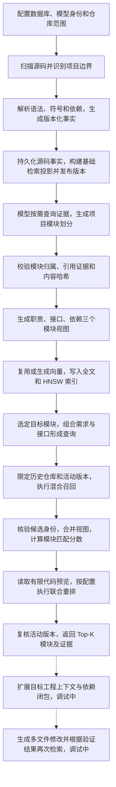

# 多语言工程建库与模块检索技术报告

编写日期：2026-09-06。代码核对基线：`main` 分支 `4d7cc24`，其中索引重置实现对应 `3d8e0ff`。本文以当前代码智能主链路为依据，覆盖首次建库、工程解析、模块理解、表示构建、检索排序、结果交付及后续更新。

## 总览

系统把本地工程转换成可以追溯到具体代码版本的模块知识库。使用时，开发者在目标工程中选定一个功能模块，补充需要实现的功能或适配要求，系统到已登记的历史工程中寻找相关实现，返回候选模块及其文件、接口、依赖、代码预览和证据。检索的基本单位是模块，模块可以包含多个文件、多个类和多个函数。

从建库到检索，数据依次经历三个层次。第一层是源码事实，记录工程边界、文件内容、符号定义和可解析的依赖关系；第二层是模块理解，模型根据事实证据组织功能模块、描述职责并解释文件归属；第三层是检索表示，把模块的职责、接口和依赖分别整理为检索文档，再建立全文索引和向量索引。检索时先找到相关文档，再回到模块产物核对身份和版本，合并同一模块的多个视图，计算匹配分数，并按配置进行联合重排。

全文中的“（调试中）”表示纳入适配方案的能力，包括待实现、待接通或尚未完成验证的内容。为便于阅读，这些内容采用设计完成态描述，但该标记不表示已有可运行代码，也不构成验收通过。未加此标记的实现仍可能需要显式配置才能启用，具体条件在对应步骤说明。本文不把模型接入、小样本命中或接口名称匹配解释为企业级效果认证。



整个流程的技术重点集中在数据如何可靠地向前流动。多语言代码先进入统一的事实协议，语言差异通过解析器和语义适配器表达；事实和模块说明绑定同一个分析版本，防止新代码配上旧结论；模块采用多视图表示和全文、向量混合召回，兼顾自然语言需求与精确接口标识；增量解析和内容寻址缓存减少重复计算；查询通过候选数量、读取字节、并发和时间预算控制成本。面向更大工程的语义影响传播、跨语言桥接及任务上下文闭环沿用这些已有基础扩展（调试中）。

需要区分“目标工程”和“历史工程”两种用途。目标工程也要建库，才能知道开发者选中的模块是什么、有哪些接口和本地约束；当前模块检索的候选来源则限定为历史工程。把任务转换为目标工程中的修改位置，再按需寻找历史实现，是在此基础上扩展的任务检索流程（调试中）。因此，建库覆盖两类工程，当前实现搜索的方向是“目标模块及需求 → 历史模块”。

默认无模型配置时，向量由确定性的特征哈希算法生成，作用是提供离线可运行基线。真实多语言 embedding 和交叉编码重排已经接入，分别通过环境变量启用；它们不是默认常驻服务。此前丢弃旧索引后的数据库按 hash、384 维配置初始化，因此切换真实模型时仍需按模型身份规则重建检索数据。

## 技术细节

**01．先确定运行方式、配置和建库边界。**

VS Code Extension Host 负责读取本地工程、管理仓库身份、启动分析和控制用户工作流。`createCodeIntelligenceRuntime` 组装存储、仓库注册器、扫描器、分析协调器、检索投影、语义查询和模块搜索服务。运行时允许注入 `IndexStore`，也允许使用 SeekDB 配置创建持久存储，但两者不能同时提供，避免出现数据究竟写到哪里的不确定性。

未配置数据库时，允许开发环境使用内存存储；生产 Host 要求配置持久数据库。内存模式适合测试协议和界面，进程退出后数据不保留，不能承担工程知识库。运行时负责关闭自己创建的存储；由外部注入的存储由调用方管理。初始化失败会释放已创建的资源，Host 的初始化 Promise 也允许失败后重新尝试。

数据库与检索模型的关键配置如下。表中默认值描述代码行为，不表示本机对应服务正在运行。

| 配置项 | 默认值或规则 | 对流程的影响 |
| --- | --- | --- |
| `CODE_INTELLIGENCE_SEEKDB_DATABASE` | 生产模式必填，合法 SQL 标识符 | 决定持久化数据库 |
| `CODE_INTELLIGENCE_SEEKDB_HOST` | `127.0.0.1` | 数据库地址 |
| `CODE_INTELLIGENCE_SEEKDB_PORT` | `2881` | 数据库端口，校验 TCP 端口范围 |
| `CODE_INTELLIGENCE_SEEKDB_USER` | `root` | 数据库用户 |
| `CODE_INTELLIGENCE_SEEKDB_PASSWORD` | 空字符串 | 数据库认证信息 |
| `CODE_INTELLIGENCE_SEEKDB_VECTOR_DIMENSION` | `384`，必须为正整数 | 表中向量列和模型输出的共同维度 |
| `CODE_INTELLIGENCE_EMBEDDING_URL`、`CODE_INTELLIGENCE_EMBEDDING_MODEL` | 必须同时设置，或同时不设置 | 启用真实 embedding；不设置则使用 hash 基线 |
| `CODE_INTELLIGENCE_EMBEDDING_API_KEY` | 空字符串 | OpenAI 兼容 embedding 接口认证 |
| `CODE_INTELLIGENCE_EMBEDDING_SUPPORTS_DIMENSIONS` | 除显式 `false` 外按支持处理 | 是否向接口发送维度参数 |
| `CODE_INTELLIGENCE_EMBEDDING_QUERY_PREFIX` | 空字符串 | 查询编码前缀 |
| `CODE_INTELLIGENCE_EMBEDDING_DOCUMENT_PREFIX` | 空字符串 | 文档编码前缀 |
| `CODE_INTELLIGENCE_RERANK_URL`、`CODE_INTELLIGENCE_RERANK_MODEL` | 必须同时设置，或同时不设置 | 启用候选联合重排 |
| `CODE_INTELLIGENCE_RERANK_TIMEOUT_MS` | `4000`，允许 `1..8000` | 重排子阶段时间预算 |

模块理解使用的生成模型通过扩展已有的 adaptation 服务配置接入。它承担“看证据、划分模块、写说明”的工作；embedding 模型只负责把查询和文档变成向量；reranker 只负责判断查询与候选的相关程度。三种模型职责不同，不会因为开启 embedding 就自动开启模块理解或重排。

实现依据：[运行时装配](../services/code-intelligence-service/src/index.ts)、[Host 配置与工作流](../apps/vscode-extension/src/code-intelligence-host.ts)。

**02．创建数据库，并把模型身份绑定到向量空间。**

持久存储使用 SeekDB 的 MySQL 兼容协议，客户端为 `mysql2`。连接池上限为 8，启用连接保活和数值转换。数据库名经过 `^[A-Za-z_][A-Za-z0-9_]*$` 校验后用于限定表名，普通数据值使用 SQL 参数传递。

建库时先读取数据库版本，再按需创建数据库和专用表。当前事实数据与搜索数据使用独立表，不沿用早期检索服务的 `code_symbols` 作为统一事实表。主要实体的主键都包含仓库和分析版本，因此两个工程中的同名文件、同名类，以及同一工程不同版本中的同名符号可以同时存在。

| 表名 | 关键字段与类型 | 本阶段建立的约束和用途 |
| --- | --- | --- |
| `repositories` | `repository_id` 主键；`display_name`、`local_path`、`role`、`analysis_status`、`active_revision`、创建和更新时间 | 保存仓库登记和当前可用版本；本地路径属于 Host 管理信息 |
| `analysis_revisions` | 仓库与 revision 联合主键；`status`、`analysis_hash CHAR(64)`、`source_revision`、`indexer_version`、创建、完成、激活时间及失败原因 | 记录每次结构分析的状态和来源；另按仓库、创建时间建索引 |
| `projects` | 仓库、revision、project 联合主键；`kind`、名称、相对路径；清单路径、源码根、测试根、语言列表为 JSON | 保存构建工程边界 |
| `files` | 仓库、revision、file 联合主键；路径、语言、角色、`sha256`、字节数、解析状态、所属 project；`source_text LONGTEXT` | 保存文件事实和该版本的源码副本；按仓库、版本和路径前缀建索引 |
| `symbols` | 仓库、revision、symbol 联合主键；`symbol_key`、`ast_declaration_id`、名称、限定名、种类、语言、路径、JSON 范围、签名、容器、project、导出标记和证据字段 | `symbol_key` 在仓库和 revision 内唯一 |
| `dependency_edges` | 仓库、revision、edge 联合主键；关系种类、源和目标符号键、源和目标路径、原始目标引用、是否内部、解析状态、证据范围和来源 | 保留已解析、歧义和未解析依赖 |
| `index_diagnostics` | 仓库、revision、diagnostic 联合主键；严重程度、消息、代码、路径、范围及证据字段 | 保存部分解析失败、未知关系等诊断 |
| `module_artifacts` | 仓库、revision、artifact 联合主键；`kind`、`status`、`analysis_hash`、`plan_hash`、`content_hash`、时间、`payload JSON` | 保存项目分析任务和已发布模块说明 |
| `search_documents` | 仓库、revision、document 联合主键；文档种类、路径、符号键或模块产物 ID、内容哈希、标题、`document_text LONGTEXT`、`search_text STRING`、`embedding VECTOR(d)` | 保存可重建的检索投影，同时具有全文和向量索引 |
| `search_embedding_configuration` | `slot` 主键、`config_hash CHAR(64)` | 通过固定 `slot=1` 绑定整库的向量配置身份 |
| `search_embedding_cache` | `content_hash CHAR(64)` 主键、`embedding JSON` | 真实模型配置下按需创建，用于跨版本和跨进程复用文档向量 |

这些表使用 `ORGANIZATION = HEAP`。跨表的版本、文件归属和产物发布条件由存储层校验与事务控制，不能仅凭某一行存在就认定它可以参与检索。

向量空间身份至少包含维度、provider 类型、模型名称或固定版本、服务端点、查询前缀、文档前缀和是否支持维度参数。对这些配置计算 SHA-256，并与数据库已保存的配置哈希比较。即使两个模型都输出 384 维，也不能据此认为它们的向量可以互相比较。配置不一致时初始化直接失败，要求在新库中重建，或在确认可丢弃索引后清空原库重建。

已有非空向量却没有模型身份记录时，不能直接将其认定为真实模型的输出。自定义持久 embedding provider 也必须提供稳定身份，并保证自身声明的维度与数据库维度一致。配置对象会复制并冻结，防止服务运行中修改配置却继续复用旧缓存。

实现依据：[SeekDB 表结构、模型身份和存储](../services/code-intelligence-service/src/seekdb-index-store.ts)。

**03．处理旧索引后，再登记需要分析的工程。**

此前刷新失败的根因是数据库的向量索引采用异步更新，而代码在写入完成后立即发布 `ready`。此时源码和向量行已经提交，但近似向量索引还未必能查到新行，形成“数据显示就绪、搜索暂时为空”的冲突。当前建库在识别到支持该模式的 SeekDB 版本时，显式使用立即更新的向量索引，并核验已有索引的实际定义。

用户已明确不保留旧分析数据，因此恢复方式是重建原数据库名下的空索引，再扫描选定工程。“新库”在这里表示重新初始化后的数据和索引结构，不要求改成另一个数据库名字，也不需要长期运行一个旧库作为前置依赖。源码仍在工程目录中，重新分析即可再生事实和检索投影。

`reset-code-intelligence-index.ts` 默认只预览，需要 `--apply` 才执行删除和重建。工具限定本地数据库，拒绝系统库和共享默认库，检查库内是否只有本系统拥有的表，并在删除前校验配置；这些检查让重建对象可确定。操作不删除工程源码、扩展设置或其他数据库。本文只描述重置机制，本次编写报告没有再次执行重置。

登记工程时，Host 对用户选择的目录执行绝对路径解析、`realpath` 和目录校验。Windows 路径比较考虑大小写；对相同规范化路径保持身份一致。仓库身份是稳定 ID，不把磁盘绝对路径作为对外标识。注册器校验路径和 ID 冲突，记录 `history` 或 `target` 角色，初始 `activeRevision` 为空。

目标工程来自明确选择的目录或当前工作区中的对应目录。历史工程来自配置中的历史仓库集合。Host 维护当前可见仓库集合，并支持仅扫描新仓库、按角色扫描、按指定仓库扫描和强制全量扫描。同一路径同时出现在配置中时先做归并和角色优先级处理，避免重复建立两份仓库身份。

在实际同步中，Host 将同步请求串行化，逐个执行本轮需要扫描的仓库；单个仓库的分析协调器也禁止进程内同时启动两次分析。这是当前进程内调度机制，不是跨机器的分布式任务锁。分布式租约、断点续跑和跨进程去重沿用仓库与 revision 身份进行调度（调试中）。

实现依据：[重置说明](seekdb-index-reset.zh-CN.md)、[重置脚本](../scripts/reset-code-intelligence-index.ts)、[仓库注册器](../services/code-intelligence-service/src/repository-registry.ts)。

**04．扫描目录，固定本轮实际读取的源码内容。**

生产扫描入口是 `RepositoryStructuralScanner`，实际文件收集委托给 code-indexer 的 `scanRepositoryStructuralIndex`。扫描对目录项和最终文件列表排序，保证输入顺序稳定；不跟随符号链接，防止越过已登记根目录或把相同内容重复纳入。

默认跳过的目录名是 `.git`、`.forexplore`、`.gradle`、`.idea`、`.next`、`.svn`、`.vscode`、`__pycache__`、`bin`、`build`、`dist`、`node_modules`、`obj`、`out`、`target`。这里采用固定目录过滤规则，当前不等同于完整执行 `.gitignore`。如果业务源码恰好位于这些名称的目录中，也会受到该规则影响。

扫描读取语言注册表支持的源码、工程清单以及部分待支持语言的文本文件。额外可读取的扩展名包括 `.c`、`.h`、`.cpp`、`.hpp`、`.cc`、`.swift`、`.kt`、`.kts`、`.rb`、`.php`、`.scala`、`.lua`、`.ex`、`.exs`、`.sh`、`.sql`；“能读取文件”并不意味着对应语言已经具备符号解析和语义分析。普通 JSON、YAML、XML 文件也不会因为是文本就全部纳入，目前主要按已知工程清单识别配置。

单文件上限默认 4 MiB，可由扫描器参数调整，且必须为正整数。收集器先查询文件大小，超过上限就跳过；读取后检查 NUL 字节，包含 NUL 的内容不作为源码入库；其余内容按 UTF-8 解码。不能枚举目录或读取已选文件时，抛出明确错误，错误中尽量只包含仓库相对路径。

本轮读取的内容保存在相对路径到源码文本的映射中，之后的解析、持久化和投影都使用这份内容，不再从可能已发生变化的工作目录重新读取。这样可避免“符号来自旧文本、预览来自新文本”。但文件读取仍逐个发生，不是操作系统提供的全工程原子快照；扫描期间如果用户持续改动文件，不能把它解释为一个严格原子的 Git 提交快照。

扫描结束后记录可获得的 Git `HEAD` 作为 `sourceRevision`，同时用实际读取内容的 SHA-256 识别文件版本。未提交修改仍进入本轮内容哈希，Git 提交号只作来源信息。严格构建快照通过固定 worktree、扫描前后变化检测或文件系统快照形成，并在发现变化时重试（调试中）。

当前扫描会将所选文件内容收集到内存后交给结构构建器。大工程路径采用有界文件队列、解析 worker、分批落盘和可恢复清单，使内存占用由队列大小而非全仓源码体积控制（调试中）。该路径的验收要测扫描吞吐、峰值内存、超大文件处理和取消延迟，不能只看检索耗时。

实现依据：[文件收集与扫描](../services/code-indexer/src/repository-scan.ts)、[Host 扫描适配](../services/code-intelligence-service/src/repository-scanner.ts)。

**05．根据构建清单识别项目，给每个文件确定归属。**

仓库不必只有一个构建项目。系统先识别 Maven 的 `pom.xml`、Gradle 的构建及 settings 文件、.NET 的 `.csproj/.sln`、Node 的 `package.json`、Python 的 `pyproject.toml`、Go 的 `go.mod` 和 Rust 的 `Cargo.toml`。项目记录保留类型、名称、相对根路径、清单路径、语言集合、源码根和测试根。

项目 ID 根据项目种类、根路径和清单列表生成内容哈希标识，区别于每次分析都变化的 revision。文件归属结合路径与语言选择项目边界，嵌套项目需要按更具体的范围处理。没有标准构建清单时仍可使用发现逻辑生成的回退项目承载源码。项目是构建和文件归属边界，模块则是后续模型识别出的功能职责边界，两者不能直接等同。

源码和测试根包含约定规则。例如 Maven、Gradle 识别 `src/main/java`、`src`，并记录 `src/test/java`、`test`、`tests`；其他工程常使用 `src`、项目根以及 `test/tests`。这些是结构层的发现规则，不表示已完整执行各构建系统来获得所有 source sets。

项目间显式引用会转换为依赖候选，例如 `.csproj` 的 `ProjectReference`、Maven 的 `<module>`、Gradle 的部分 `include/project` 声明，以及 Node 的 `file:`、部分 `workspace:` 依赖。`package.json` 使用 JSON 解析；部分 XML 和构建脚本引用使用有限语法匹配，因此不能将当前清单分析描述为完整的 Maven、Gradle 或 MSBuild 求值器。

文件角色依次区分 `configuration`、`generated`、`test`、`source` 和 `other`。测试识别包括测试目录、`.test.ts`、`.spec.ts`、`_test.go`、Python 测试命名及 Java/C# 常见测试后缀；生成代码识别包括生成目录和 `.g.cs`、`.generated.cs`、`.designer.cs` 等命名。角色为后续检索约束和上下文选择提供依据，但当前模块召回并未自动把所有测试与配置打包返回。

通过构建工具适配器导入真实编译命令、source sets、平台条件和外部依赖版本，并将这些信息绑定至分析版本，完成更精确的项目边界识别（调试中）。

实现依据：[项目发现](../services/code-indexer/src/project-discovery.ts)、[文件角色与归属](../services/code-indexer/src/structural-index.ts)。

**06．用语言注册表选择语法，抽取统一符号事实。**

统一入口使用 Tree-sitter，注册表负责“扩展名 → 语言 ID → grammar”。默认支持 Java、C#、TypeScript、JavaScript、Python、Go、Rust。TypeScript 的 `.tsx` 使用专门 grammar，但语言 ID 保持 `typescript`；`.ts/.mts/.cts` 使用 TypeScript grammar。JavaScript 对应 `.js/.mjs/.cjs/.jsx`。注册器拒绝重复语言 ID 和重复扩展名，原生 grammar 对象留在本地，不进入持久化或模型请求。

解析器遍历语法树，提取语言中可识别的类、接口、记录、结构体、函数、方法、构造函数及其他声明。每条符号记录包含简单名称、限定名称、种类、语言、相对路径、起止行列、签名、所属容器、所属项目、导出标记、AST 声明标识和统一符号键。具体声明种类与导出规则受语言语法和提取规则影响，不承诺各语言具有完全相同的事实颗粒度。

例如，`UploadService.java` 中的 `UploadService` 和 `upload(...)` 会分别成为声明事实。查询方可以知道方法在哪个文件、哪个范围、属于哪个类、签名是什么；至于某个调用具体绑定到哪个重载，则要看后续是否存在相应语义证据，不能仅凭 AST 的方法名判断。

`symbolKey` 根据语言、限定名、声明种类、签名和 AST 声明身份构造；AST 身份根据相对路径、语法节点类型和签名计算，不依赖 Tree-sitter 运行时节点 ID、行号或字节偏移，因此仅在文件前插入空行不会直接改变该身份。revision 内的 `symbolId` 则由仓库、revision 和符号键派生。文件、符号和诊断等部分 ID 使用 SHA-256 的截断结果，检索文档和候选 ID 使用各自定义的哈希输入。内容相同不代表所有 ID 跨 revision 保持不变，更不能把 `symbolKey` 当作任意移动、重命名后永久稳定的全局标识。

语言支持之外的已读取文件记录为 `unsupported`。Tree-sitter 返回可用结构但伴有诊断时，文件可标为 `partial`；解析器抛错时标为 `failed` 并生成诊断，而不是凭空补出符号。普通 Tree-sitter 符号采用 `provider=tree-sitter`、`evidenceLevel=structural` 和当前规则值 `confidence=0.75`。该值表示系统预设的证据等级，不是经过标注集校准的 75% 正确率。

ArkTS、C/C++、Kotlin/KMP 等语言以相同注册和事实协议接入语法层，并通过各自构建环境接入语义层（调试中）。扩展时同步调整语言契约、文件发现、grammar、声明抽取、依赖解析、测试和 UI 展示，不仅增加文件后缀。

实现依据：[语言注册表](../services/code-indexer/src/language-registry.ts)、[Tree-sitter 提取](../services/code-indexer/src/tree-sitter-indexer.ts)。

**07．把导入、导出和工程引用连接成依赖事实。**

结构主链路将语法层提取的 import、export、re-export 和项目引用送入依赖解析器。解析器结合相对路径、候选文件、语言命名规则及当前符号表寻找目标。普通结构刷新主要提供这些依赖，不等于对所有语言建立了完整调用图、类型图或数据流图。

每条依赖保存关系种类、来源路径、来源符号键、目标路径、目标符号键、源码中原始的目标引用、是否为仓库内部关系、解析状态及证据范围。找不到目标时仍保存原始引用，便于查询方知道代码依赖某个未被当前索引解释的对象。

解析状态有三个重要分支：目标可唯一确定时为 `resolved`；存在多个候选路径时为 `ambiguous`；无法确定时为 `unresolved`。当前规则给这些分支分别设置 `0.85/0.4/0.2` 的置信值，并配以 `syntactic/ambiguous/unresolved` 证据等级。这些是规则等级，不是模型输出概率。唯一文件候选也不自动证明文件内某个具体重载已经被语义绑定。

例如 `UploadService.java` 引用 `StorageClient`，索引能在现有规则支持范围内保留引用文本、出现位置和候选定义。如果工程缺少依赖包，或有多个同名候选，就保留歧义或未解析状态，不把第一个同名符号硬连成确定依赖。外部 SDK、反射、运行时注册和条件编译同样需要额外证据。

跨语言关系使用显式桥接记录表达源语言符号、目标语言符号、桥接机制、注册位置和证据，例如 JNI 注册、Node-API 导出、ArkTS 与 Native 的绑定以及 KMP 的 `expect/actual` 对应（调试中）。桥接记录继续使用版本、来源和证据等级约束，只有从注册表、编译元数据或可核验代码中获得的关系才升级为确定连接（调试中）。自然语言含义相近的两个模块可以被召回，但这种相似性不作为跨语言调用边。

实现依据：[语法依赖解析](../services/code-indexer/src/syntactic-dependency-resolver.ts)。

**08．比较前一版本，复用未变化文件的解析结果。**

首次分析执行全量构建；已有活动版本时，Host 通常请求增量构建。协调器先比较前一 revision 的 `indexerVersion`，如果解析器版本变化，就强制全量解析，并且不把旧索引传入复用路径。这样可以防止旧算法生成的事实被贴上新版本标签。

结构构建器对当前扫描文件逐个计算 UTF-8 内容 SHA-256，与上一版本的同路径文件比较；新文件、内容改变的文件、已删除文件以及调用方明确提供的 `changedPaths` 都进入变化集合。`changedPaths` 只是补充信息，系统不会只相信文件监听事件而跳过内容比较。重复路径、越界路径和来自不同仓库的前一索引会被拒绝。

内容哈希未变且不在变化集合中的文件复用 Tree-sitter 符号和诊断，重新绑定当前 revision 的 ID 与项目归属。项目发现仍重新执行，因此新增嵌套项目边界时，未改源码的文件也能获得新的 project 归属。复用范围限定为可识别的结构 provider 事实，不把旧语义 provider 的临时结果直接当作新版本语义证据。

依赖复用还检查端点。来源或已知目标文件变化时重建相关边；潜在目标路径变化时重新解析受影响的 import/export；Java/C# 的命名式导入遇到同语言文件变化时采用更保守的重绑定规则。来源文件已改变时，只使用新语法提取出的依赖，防止删除的 import 被旧边再次带回新索引。

构建结果记录变化文件数、重新解析文件数、复用文件数、重建边数和复用边数。当前已经验证的方法体修改、公共签名修改、新增文件、删除依赖端点、重命名依赖端点、package 配置变化和新增嵌套项目边界，均要求增量结果与全量结果等价。

当前增量节省的是解析和部分依赖重建成本，仍然扫描文件、读取当前源码、加载前一完整结构索引并生成新的完整结构结果。它不是已经做到“只读一个改动文件、只写一行数据库”。基于接口摘要区分方法体变化和公开契约变化，再沿依赖反向传播重分析范围，并对语义适配器和跨语言边统一失效，是进一步的增量路径（调试中）。

实现依据：[增量结构构建](../services/code-indexer/src/structural-index.ts)、[版本与解析器失效控制](../services/code-intelligence-service/src/analysis-coordinator.ts)、[增量等价测试](../services/code-intelligence-service/src/incremental-equivalence.test.ts)。

**09．计算整体内容身份，持久化事实并发布结构版本。**

每轮分析分配形如 `analysis-<UUID>` 的 revision，并校验其格式和唯一性。`analysisHash` 则是整个结构结果的内容身份：从文件、项目、符号、依赖和诊断中去掉仓库范围及 revision 局部 ID，稳定排序，再做规范化 JSON 和 SHA-256。文件内容哈希也在输入中，因此方法体变化即使没有改变函数签名，也会改变整体分析身份。

这里需要区分四个概念：`sourceRevision` 是 Git 来源信息，`analysisRevision` 是数据库中的分析批次，`analysisHash` 是结构内容身份，`planHash` 是后续模块理解产物的内容身份。它们分别解决“代码来自哪里”“这是哪次分析”“事实是否变化”“模型产物是否被改动”，不能互相替代。

如果新结果与前一结果的 `analysisHash` 相同，并且索引器版本相同，协调器恢复仓库就绪状态，继续使用前一活动 revision，不新增重复事实，也不让模块说明无故失效。否则先写入 `building` revision，再按该范围写入项目、文件及源码、符号、依赖和诊断。

结构写入使用事务：在限定仓库与 revision 的范围内校验和替换数据，批量插入成功后提交，失败则回滚。批处理同时参考行数和估算 SQL 大小，通常最多 250 行或约 512 KiB 即拆批；单条大源码记录仍完整保留，因此 512 KiB 不是所有 SQL 语句都绝不超过的硬上限。

随后构建符号和源码片段的基础检索投影。本文第 13 至 16 步统一说明投影、编码和索引写入算法；这里先调用同一套机制处理结构文档。只有结构持久化和基础检索投影都成功，revision 才写成 `ready`，再通过事务激活为仓库的 `activeRevision`。模块说明在之后独立分析和发布，所以“结构 ready”与“所有项目模块说明已就绪”是不同状态。

激活事务锁定目标 revision 和仓库记录，要求分析确已完成且没有失败原因；旧活动 revision 变为 `superseded`，其当前模块产物变为 `stale`，旧模块 summary 检索文档删除。新扫描或写入失败时保留原活动版本，持久化本轮失败记录，不将半成品设置为可用。文件诊断的最高严重程度还会影响仓库展示的 `ready/degraded`，不能只看 revision 是否存在。

结构表和检索表不是一个贯穿全流程的超大事务；流程靠状态发布顺序隔离半成品。立即更新的 HNSW 保证写入后的索引可见性条件，revision 指针保证查询只进入已发布范围。这两种保证分别解决索引延迟和业务版本一致性问题。

实现依据：[分析协调器](../services/code-intelligence-service/src/analysis-coordinator.ts)、[事务与版本激活](../services/code-intelligence-service/src/seekdb-index-store.ts)。

**10．向模块分析者提供只读、带版本的证据查询。**

结构版本发布后，查询方通过 `SemanticQueryPort` 访问事实。除仓库列表外，工程查询携带 `repositoryId + analysisRevision`，路径必须是仓库相对路径。查询接口不接收任意磁盘根目录，也不能自行启动扫描、注册工程或改写索引。

可查询仓库概况、项目列表、文件结构、符号搜索、单个符号、定义位置、引用位置、依赖、诊断和源码片段。结果采用证据封装，携带 evidence ID、provider、confidence、evidence level、路径和范围等信息。模型拿到的不只是“有一个 upload 方法”，还包括能够回查它的版本和位置。

普通分页默认 50 条，单次上限 200 条；游标采用包含 offset 的 Base64URL 编码，校验非负整数。源码片段最多 32,000 字符，按照索引版本中保存的 `source_text` 和指定范围截取，返回截断标记。该接口上限与后续模块候选预览的每文件 4,000 字符是两套不同限制。

HTTP 传输只开放 11 个只读操作，路径形如 `POST /v1/semantic-query/getDependencies`，请求体上限 256 KiB，传入 60 秒查询信号；可配置 Bearer Token，认证比较使用固定时间比较。Host 管理监听和权限，Agent 不获得数据库凭据。MCP 或 adaptation 服务通过此查询边界消费索引，而不是自己维护一份不受版本控制的源码副本。

当前部分通用语义查询仍会加载完整结构索引，再在内存中过滤和分页。因此“返回 200 条”只约束输出数量，不足以证明数据库读取有界。模块搜索已经使用按 ID 的窄查询；同样的条件下推、按路径索引、边邻接查询和稳定游标逐步覆盖通用语义查询（调试中）。HTTP 层的 60 秒信号也不等于所有底层分析任务都已经可以及时中断。

在需要更精确关系时，语义查询可以使用 Host 已绑定的 LSP 会话或专用编译器结果。LSP 会话由 Host 管理语言能力和 revision 绑定，查询请求不任意启动语言服务器。Java 专用探针使用 JDK Compiler API 的 `JavacTask` 解析和分析，当前参数包含 `-proc:none`、`-implicit:none`，不会自动获得完整 Maven/Gradle classpath。C# 探针使用 Roslyn 和 `MSBuildWorkspace` 解析项目和绑定符号，需要相应 .NET SDK、程序集和可解析的工程环境。

已有 Java/C# 适配器承接独立分析链产生的编译器确认结果，校验其与结构版本的分析身份，并将确认关系映射为 `findDefinition/findReferences` 证据。绑定保存在内存中，以仓库和 revision 为范围；专用分析也需要来源与源码一致性验证。它只提升已被编译器确认的关系，不把 Tree-sitter 事实整体升级为语义事实。当前符号映射还有同文件限定名匹配及简单名称回退，复杂重载的精确映射仍受限制。

这条通道表示“Java 适配器”和“C# 适配器”，不是 Java 与 C# 互译，也不是两种语言之间的调用桥。普通刷新也不会自动把所有工程都经过这两个编译器。统一语义适配层按语言和工程配置选择编译器或语言服务，持久化语义边、构建上下文及其失效条件，再供相同查询协议消费（调试中）。

实现依据：[语义查询](../services/code-intelligence-service/src/semantic-query-service.ts)、[只读 HTTP](../services/code-intelligence-service/src/semantic-query-http-server.ts)、[LSP 会话](../services/code-intelligence-service/src/lsp-session-manager.ts)、[专用语义适配](../services/code-intelligence-service/src/java-csharp-specialized-provider.ts)、[编译器探针](../services/code-indexer/src/semantic-compiler-probe.ts)。

**11．按项目调度模型分析，用实际查询过的证据组织模块。**

结构同步完成后，Host 为历史仓库中的项目安排模块分析；目标仓库通常为唯一项目或用户选中的项目安排分析。调度键包含仓库、revision 和 project，同一分析键重复请求共享正在执行的任务，同仓库项目任务串行运行，避免相互覆盖模块投影。

分析配置名为 `code-understanding/v1`，固定目标是解释项目的功能模块、用途、核心 API 和依赖，给出项目 summary，并对没有归属模块的文件逐一说明原因。虽然复用了已有 module-plan 客户端和 Architect 工具调用框架，这一步的任务是代码理解，不自动生成迁移写回方案。

模型开始前先取得固定 revision 的工程信息、项目文件、依赖和部分符号。依赖每页最多 200 条，初始收集最多约 2,000 条后保留继续查询的游标；初始符号查询取 100 条。初始证据会经过压缩和字符预算裁剪，只有实际进入模型上下文的事实才进入已见证据集合。

模型随后可调用 `get_repository_overview`、`list_projects`、`get_file_structure`、`search_symbols`、`get_symbol`、`find_definition`、`find_references`、`get_dependencies`、`get_diagnostics` 和 `read_source_excerpt`。运行时校验参数、固定仓库和 revision，缓存相同查询，并检查返回证据的嵌套范围，防止混用其他版本。

默认最多 24 次工具调用；默认工具结果配置预算为 48,000 字符，后续单次可见结果另受最多 8,000 字符、单轮约 24,000 字符和剩余总预算限制；整个会话的证据预算为 96,000 字符。多个工具调用同轮返回时分配每次可见预算，必要时保留截断和续查信息。这里使用字符估算，不等同于 tokenizer 精确计算的 token 上限，也不是对所有提示词和生成输出的统一上限。

达到工具次数或证据预算后，运行时关闭工具，要求模型用已有证据返回最终 JSON，将证据不足的文件放入 `unassignedFiles`，并说明不确定关系。模型若仍要求调用工具则失败。模型没有获取任何可验证证据时也不能直接发布提案。

输出包含项目摘要和 `modules`。每个模块保存 ID、名称、种类、描述、用途、领域、语言、`sourceFiles`、`symbolKeys`、`coreApis`、`dependsOn`、`evidenceIds` 等字段；可同时提供模块间依赖证据和风险。模块划分不是简单按目录分组，也不是默认采用图聚类：当前由模型结合项目边界和查询证据生成，目录、接口、调用关系和配置是它的输入。

提案格式或引用校验失败时，工具运行时最多允许 2 次修复；过长的无效输出不继续修复。修复提示给出实际可用证据 ID，要求保持范围、哈希和目标，并可要求清空可选 `symbolKeys`，保留可验证的文件级模块划分。这使文件级模块理解可以成立，但不能把所有模块都描述为已经精确覆盖内部每个符号。

面向超大项目，先按构建边界和依赖局部性形成可控分析分区，再生成局部模块摘要并汇总跨分区关系，最终仍通过同一文件覆盖校验发布（调试中）。该路径控制模型证据规模，同时保留未解释文件，避免一次预算用尽后丢失整个工程的可追踪性。

实现依据：[项目分析协调](../services/code-intelligence-service/src/project-analysis.ts)、[工具调用分析运行时](../services/adaptation-service/src/tool-calling-architect-runtime.ts)、[扩展模块计划客户端](../apps/vscode-extension/src/module-plan-client.ts)。

**12．独立校验模型产物，并分开记录分析状态和投影状态。**

模型生成 JSON 后，工具运行时先验证输出及证据回执，Host 再依据本地结构索引做独立校验。校验要求 proposal 和 evidence 的仓库、revision、`analysisHash` 一致，项目属于该索引，分析目标匹配固定 profile，summary 非空。

提案的 `planHash` 由规范化 JSON 计算：对象键稳定排序，忽略值为 undefined 的字段，数组保持顺序，结果做 SHA-256，并加 `sha256:` 前缀。Host 重新计算后与证据回执比较。哈希证明内容身份，不能单独证明模块说明真实；真实性还要依赖后续证据校验和功能验证。

证据校验要求模块和依赖所引用的 ID 同时属于两类集合：结构索引中真实存在的事实集合，以及运行时确认模型实际看过的证据集合。已知事实包含 revision、project、file、symbol、dependency 和 diagnostic ID。引用一个确实存在但从未提供给模型的 ID，也不能通过这一步。

文件覆盖校验遍历选定项目中的全部文件：模块 ID 必须唯一，名称和描述有效；每个文件最多归属一个模块；文件不能越过项目边界；符号键必须存在且属于模块声明的文件。没有归属模块的文件必须出现在 `unassignedFiles`，并附非空原因。最终“已归属文件数 + 有解释的未归属文件数”必须覆盖项目文件全集。

模块依赖只能指向提案内真实存在的其他模块，不能直接自依赖；显式依赖记录还要与模块的 `dependsOn` 一致并引用合法证据。当前校验没有据此证明整个模块图无环，也没有证明某条功能描述在所有输入和异常路径上都正确。

校验通过后记录 `coverage.total`、`coverage.assigned` 和未归属明细。这里的 coverage 是文件归属解释覆盖，不能作为需求功能覆盖率。一个项目所有文件都被解释，也可能有某个业务行为没有实现。

任务记录和发布结果使用不同 artifact：任务为 `kind=other`，ID 形如 `project-job:<projectId>:code-understanding/v1`；模块说明为 `kind=module-summary`，ID 形如 `project-summary:<projectId>:code-understanding/v1`。两者都绑定仓库和 revision。分析状态为 `missing/queued/analyzing/validating/ready/failed/stale`，检索投影另有 `pending/ready/failed`。

发布前再次检查活动版本，存储层在发布锁下核验其仍然可用。summary 可以已经生成成功，但后续 embedding 或索引写入失败，此时保留分析结果并把投影标为失败。重试这种任务时只重做检索投影，不再次调用生成模型。强制重新分析失败时，仍可以保留此前有效说明供查看；进程重启后残留的进行中任务会呈现为中断失败，可重试。

实现依据：[产物校验、状态机与重试](../services/code-intelligence-service/src/project-analysis.ts)。

**13．把事实和模块说明转换成可以重建的检索文档。**

`SeekDbProjection` 负责投影转换。权威数据是结构事实和通过校验的模块产物，检索文档是为召回构造的派生数据。修改投影方式或切换模型时，可以依据事实重新生成搜索数据，不需要把向量数据库当作唯一源码来源。

基础投影有两类。每个符号生成一份 `kind=symbol` 文档，内容包含限定名称或简单名称、签名、符号种类、语言、路径和导出标记；每个保留源码文本的文件生成一份 `kind=source-fragment` 文档，当前只取文件前 12,000 字符。后一种是文件头部截断投影，并非已经实现覆盖全文件的 AST 分块或滑动窗口，长文件后半段仍可通过源码查询读取，却未必进入该片段向量。

模块产物投影前要求 `kind=module-summary`、`status=current`、存在 payload 和 `planHash`、`analysisHash` 与结构版本匹配，且该 revision 是活动版本。符合当前项目提案格式时，每个模块生成三份 `kind=summary` 文档。

| 生成顺序 | 文档内容 | 主要检索作用 |
| --- | --- | --- |
| 职责视图 | `projectId`、`moduleId`、名称、种类、描述、用途、领域、语言、核心 API、模块依赖 | 让自然语言功能要求与模块职责发生匹配 |
| 接口视图 | 项目与模块 ID、`view=interface`、名称、语言、核心 API、用途 | 提高接口、能力名称和调用契约的可见性 |
| 依赖视图 | 项目与模块 ID、`view=dependency`、名称、语言、源码文件、模块依赖、领域 | 提供文件组成和依赖环境相关线索 |

这三个视图是同一模块的三个检索入口，不是三个候选模块。依赖视图当前编码的是模块提案中的 `dependsOn`、文件清单和领域，并没有自动展开完整依赖图，也没有运行专门的图神经网络或图嵌入模型。

模块视图的 `document_text` 保存 JSON，便于检索返回后用结构化解析器恢复 `projectId/moduleId`。`search_document_id` 由仓库、revision、文档种类和实体身份哈希生成；同一模块的不同视图在身份输入中增加视图区分。`content_hash` 根据标题和正文生成，用于内容一致性与复用分析。一个 ID 表示“这份文档属于谁”，另一个哈希表示“文档内容是什么”。

搜索用的文本按“标题、可选相对路径、正文”拼接，全文索引和 embedding 使用这一投影内容。兼容投影器可保存旧式 summary，但真正模块检索仍要求从当前项目产物中解析并核验模块身份，因此不是任意一段摘要 JSON 都能作为模块返回。

源码片段按 AST 声明边界和最大 token 预算切分，保留完整文件范围映射，再形成符号、模块和项目的分层摘要（调试中）。长模块表示采用多片段召回后归并，减少文件头部截断和单段模型长度限制带来的信息损失（调试中）。

实现依据：[检索文档投影](../services/code-intelligence-service/src/seekdb-projection.ts)。

**14．为投影文本生成向量，并保持查询与文档编码一致。**

编码接口为 `SearchEmbeddingProvider`，声明向量维度，提供批量 `embed`，并可提供专门的 `embedQuery`。检索优先调用 `embedQuery`，没有该方法时才使用普通批量编码。这个区别允许采用查询和文档具有不同提示前缀的模型。

无真实模型配置时使用 `HashSearchEmbeddingProvider`。它先对文本做 NFKC 规范化和小写转换，提取 Unicode 字母、数字及下划线组成的词，再生成整词特征和字符三元组。特征经 FNV-1a 哈希映射到固定维度桶，根据哈希位增加正负计数，最后做 L2 归一化。默认向量为 384 维。

该方法没有训练过程，也不会因为输出向量就获得自然语言语义能力。它可复现、无需下载模型，能够利用相同标识符和相近词形，但对“中文功能需求 → 英文实现说明”的跨语言语义匹配能力有限。采用该基线时，数据库的 HNSW 仍然可工作，只是其距离衡量的是哈希特征相似性。

真实模型通过复用 retrieval-service 的 OpenAI 兼容 embedding 客户端接入。请求包含模型名称、文本数组和按配置决定是否发送的 dimensions；配置可提供认证信息。当前模型适配器超时 8 秒，重试次数为 0，接受 http/https 地址，并验证响应数量、向量维度和数值有效性；模型适配器还拒绝全零向量。网络失败或格式错误向上返回，不静默替换为 hash 向量污染同一模型空间。

可复现的本地模型配置是 `Xenova/multilingual-e5-small@761b726dd34fb83930e26aab4e9ac3899aa1fa78`，输出 384 维，q8 CPU 推理，mean pooling，并进行归一化。查询前加 `query: `，文档前加 `passage: `，其中末尾空格属于前缀内容。使用时必须与建库配置完全一致。

本地服务由 `serve-local-embeddings.mjs` 提供，监听 `127.0.0.1:4021`，开放 `/health` 和 `/v1/embeddings`。参考运行时是 `@huggingface/transformers@3.8.1`，模型权重和可选运行时独立于扩展安装包。模型下载可以使用配置的镜像，但推理位置由实际 embedding URL 决定；通用客户端并未将所有 URL 限制为本地地址。

参考服务对输入设置请求体、文本数和文本长度限制，单批最多 16 段文本、单段最多 32,000 字符，请求体最多 1,000,000 字节，在途请求计数达到 8 时拒绝新请求，推理通过串行队列执行。HTTP 服务的请求接收超时配置为 30 秒，与客户端 8 秒调用预算分别生效。模型内部还受 tokenizer 和模型最大序列长度约束，所以“请求允许 32,000 字符”不表示这些字符全部参与向量计算。长文档分段表示与分层聚合解决这一信息截断问题（调试中）。

实现依据：[向量 provider](../services/code-intelligence-service/src/search-embedding.ts)、[本地 embedding 服务](../scripts/serve-local-embeddings.mjs)。

**15．先查内容寻址缓存，再批量编码真正变化的文本。**

真实模型 provider 内部维护最多 4,096 项的内存 LRU 缓存。键为已加查询或文档前缀的完整输入文本 SHA-256，provider 实例固定模型配置，因此同一实例中的键不会跨模型空间混用。命中时更新最近使用顺序；返回向量会复制，避免调用方修改缓存内容。

同一批次内的重复文本先合并，缺失项最多每 16 段送入模型，再把返回向量分配到原输入位置。缓存按精确文本命中，不执行“语义差不多就复用”；哪怕只改变了一个参与编码的 API 字符串，也会形成不同输入。查询和文档前缀不同，也不会误命中同一项。

数据库层在真实模型配置下另外启用持久缓存。缓存键是 `SHA256(数据库模型身份 + NUL + 搜索输入文本)`；模型身份已经包含前缀和预处理相关配置。一次最多查询 128 个不同内容键，对缺失项再按最多 16 段编码，并使用 `INSERT IGNORE` 保存 JSON 向量。读出的缓存仍要验证维度与数值，不能因为来自本地表就跳过检查。

持久缓存不绑定某一个 repository 或 revision，因此同一模型下不同版本、不同进程甚至不同仓库中的相同投影文本能够共享结果。检索文档 ID 可以因 revision 改变，向量缓存仍可命中，这正是将“文档归属”和“模型输入内容”分开的收益。自定义 provider 当前虽然必须提供身份，但不自动启用这条由真实模型配置开启的持久缓存路径。

这不是跨进程推理请求合并。并发请求同时查到缺失项时，仍可能重复编码，再由持久缓存插入去重；查询向量主要依赖进程内缓存，没有独立的持久查询缓存。进一步通过进行中请求合并和批处理队列减少重复推理（调试中）。

已有验证中，重新打开存储后重投影 27 份未变文档，持久命中 27 次，新文档编码请求为 0；另一次单文件修改产生的 8 份投影中，7 份复用、1 份重新编码。这证明精确输入复用机制成立，不意味着整个工程更新的全部成本都已消失。

实现依据：[内存编码缓存](../services/code-intelligence-service/src/search-embedding.ts)、[持久向量缓存](../services/code-intelligence-service/src/seekdb-index-store.ts)。

**16．写入全文与 HNSW 索引，完成本轮可检索发布。**

拿到向量后，投影写入 `search_documents`。替换操作始终限定仓库和 revision；项目模块重新投影时进一步限定对应 artifact，避免一个项目刷新清掉其他项目或其他仓库的文档。文档元数据、正文、搜索文本和向量共同写入，维度不一致或缺失向量时拒绝写入。

全文索引建立在 `search_text`，配置为 `FULLTEXT ... WITH PARSER ik`；查询使用数据库的自然语言全文检索及其返回分数。应用没有另行实现 BM25，也没有把全文原始分数定义为跨查询可比较的概率。

向量索引配置为 `DISTANCE=cosine, TYPE=hnsw, LIB=vsag`。HNSW 使用分层近邻图，在查询时沿图寻找相近向量，以近似搜索降低大集合中的距离计算量。当前应用没有显式设置图连接度或搜索宽度等参数，而是使用数据库相关默认配置；不能据此承诺任意数据规模下的固定召回率。

代码从版本字符串识别 SeekDB 1.3 及以后支持的配置，并显式追加 `SYNC_MODE=immediate`；初始化时读取 `SHOW CREATE TABLE` 核验实际索引定义。已有不兼容的异步索引会阻止初始化，并提示按已授权的数据保留策略重建。该检查不会自动删除数据。

立即更新模式使“投影写入完成后发布可用”的时序成立，但增加写入时的索引维护成本。应用此前在异步模式中遇到过精确距离查询有结果、ANN 结果却为空的情况，因此这里不是单纯为了换一条 SQL，而是在修复发布协议与索引可见性的冲突。

若采用异步索引承接更高写入吞吐，则由提交水位、索引构建水位和发布屏障共同决定 revision 何时可检索（调试中）。屏障要求索引确认覆盖本次提交，而不是固定等待若干秒后猜测同步完成（调试中）。

当前完整结构投影仍在内存中组装待写文档，模块 artifact 的 JSON 也可能较大。流式投影、文档字节上限、按项目分批发布及索引容量监测用于降低建库峰值资源消耗（调试中）。

实现依据：[投影替换](../services/code-intelligence-service/src/seekdb-projection.ts)、[索引 DDL 与持久写入](../services/code-intelligence-service/src/seekdb-index-store.ts)。

**17．接收目标模块和需求，冻结本次检索的输入范围。**

用户在目标工程的模块视图中选择模块并提交需求后，Webview 发出 `START_SEARCH`。Host 先确认当前运行的目标未改变，再等待已调度项目分析任务结束，然后读取当前可见的历史仓库集合并调用模块实现搜索。检索结果会替换当前候选，清空旧候选选择和旧适配结果，避免把新搜索结果与上一次生成状态混合。

模块请求的核心结构如下，示例中的名称和路径为说明性数据：

```text
target.kind = "module"
target.name = "UploadModule"
target.signature = "upload(file); cancel(taskId)"
target.documentation = "目标工程中的文件上传模块"
target.module.coreApis = ["upload(file)", "cancel(taskId)"]
requirement = "查找支持分片上传和失败重试的实现"
topK = 5
repositoryIds = [已登记且当前可见的历史仓库 ID]
```

查询文本按目标名称、签名、文档说明、用户需求、核心 API 的顺序过滤空值并用换行连接。它不是只把一个模块 ID 发给数据库，也不是直接把目标模块全部源码放进 embedding。目标的源文件组成等信息可用于后续扩展，但当前主查询没有单独计算目标依赖图与候选依赖图的结构距离。

Top-K 必须为 `1..10`；历史仓库 ID 去重后必须为 `1..32`；组合查询非空且最多 32,000 字符。候选仓库必须是 `history`，具有活动 revision，且该 revision 的状态为 `ready`。未知仓库、无活动版本或角色不符的条目不进入候选集合。

模块搜索强制要求存储实现提供有界的 `searchSearchDocuments`、`getModuleArtifacts`、`getProject` 和 `getSourcePreview`；缺少这些接口直接报错，不以加载整个结构索引作为兜底。空召回返回空结果，也不会遍历全库重新猜候选。

服务内从进入 `searchModules` 开始建立 10 秒总预算，并合并调用方取消信号。但 Host 在此之前的 `waitForProjects()` 不计入这 10 秒，所以现阶段不能把内部超时上限当作用户点击到结果返回的完整 SLA。将建库后台化、明确展示当前可检索版本，并对整次交互统一计时和取消，是产品层的完整预算机制（调试中）。

实现依据：[搜索触发](../apps/vscode-extension/src/extension.ts)、[模块请求与边界](../services/code-intelligence-service/src/module-matching.ts)。

**18．在每个活动版本中并行执行全文和向量召回。**

历史仓库最多以 4 个并发处理。对每个仓库先读取当前活动 revision 并保存为本轮范围，然后只在该范围的 `kind=summary` 文档中召回。符号和源码片段虽然也在数据库中，当前模块主链路不会把它们直接当作模块候选。

设最终请求为 K，每个仓库要求数据库返回的融合文档数为：

```text
L = min(120, max(24, 12 × K))
每条召回通道的候选上限 C = min(800, max(24, 4 × L))
```

底层搜索接口自身把 L 限制在 200 以内；模块入口的 L 最大为 120，所以这条主链路每个仓库每条通道最多取 480 份文档。K=5 时，L=60，全文和向量各最多取 240 份文档。这些都是视图文档数量，合并为模块后数量可能减少。

数据库调用前，查询文本去除首尾空白并生成查询向量，验证其与索引维度一致。随后并行发出两条 SQL：全文使用 `MATCH(search_text) AGAINST (? IN NATURAL LANGUAGE MODE)`，按 `text_score` 降序；向量使用 `cosine_distance`，按距离升序并带 `APPROXIMATE`，交给 HNSW 近似检索。两条查询都显式限制 `repository_id`、`analysis_revision` 和 `kind`。

向量通道同时返回原始相关性：

```text
semantic_score = max(0, 1 - cosine_distance(queryVector, documentVector))
```

数据库完成有过滤条件的 ANN 执行，应用不先把全库向量读回内存。过滤条件与 ANN 的实际执行计划、过滤选择性和索引参数会影响效果及延迟，因此大工程验收仍需测真实执行计划与 ANN 对精确距离搜索的召回损失。

随后用等权 RRF 融合两条通道。对文档 d，若它在某通道的一基排名为 r，则该通道贡献 `1/(60+r)`；没有出现在该通道中则贡献 0：

```text
RRF(d) = Σ 1 / (60 + rank_channel(d))
```

系统按 `searchDocumentId` 去重，累加 RRF 分数，保留向量原始相关性、全文原始分数和融合分数，排序后截取 L 份文档。例如某文档全文第 2、向量第 5，其融合贡献是 `1/62 + 1/65`。RRF 不要求全文分数和向量分数处于同一尺度，适合在候选召回阶段融合两种信号。

RRF 在这里决定每个仓库哪些文档进入后续模块判断，并不直接作为跨仓库最终模块分数。一个仓库里的第 1 名可能仍与需求无关，因此后续保留原始相关性进行比较，而不是把所有仓库的局部第一名视为同样优质。

实现依据：[混合召回 SQL 与 RRF](../services/code-intelligence-service/src/seekdb-index-store.ts)。

**19．通过产物身份核验，把命中的视图恢复为真实模块。**

拿到文档后，系统收集其中的模块 artifact ID，去重后按 ID 批量读取对应产物；再根据有效产物涉及的 project ID 读取项目记录，项目读取并发上限为 4。主链路不加载整个仓库的 `StructuralIndex`，也不读取全部模块说明。

产物必须为当前 `module-summary`，仓库和 revision 必须与本轮范围一致，`analysisHash` 必须等于 revision 记录，payload 中的项目分析状态必须为 `ready`，proposal 的范围和结构哈希也必须匹配。系统重新计算 proposal 的规范化哈希，要求等于 artifact 的 `planHash`，防止改过的 JSON 继续沿用旧证据身份。

文档正文通过 JSON 解析恢复 `projectId/moduleId`，要求项目 ID 与产物一致，module ID 确实存在于提案，项目记录存在，模块文件清单非空。格式错误、过期、范围不一致或哈希不匹配的条目不会作为正常模块候选。

同一仓库中，职责、接口和依赖视图按 `projectId + moduleId` 合并；仓库范围在外层隔离。模块最终候选 ID 由 `repositoryId + analysisRevision + projectId + moduleId` 的 SHA-256 构造。同名模块可以来自不同工程，不会仅因为名称一致而合并。

一个项目目前将多个模块存于同一 JSON artifact。因此“按召回 ID 读取”限制了产物数量，但不保证单个产物字节数很小；命中某项目的一个模块仍可能读取该项目整个提案。模块产物拆分为独立记录、给 payload 设置字节预算并按字段查询，以进一步稳定大项目读取成本（调试中）。

实现依据：[候选身份与产物校验](../services/code-intelligence-service/src/module-matching.ts)。

**20．计算模块匹配分数，合并多视图并做全局初排。**

接口匹配先规范化 API 字符串：去掉左括号及其后的参数部分，按空白、点号和冒号切分后取末段，删除下划线并转小写。例如 `Storage.upload_file(file)` 与 `uploadFile(file)` 可归为相同名称。该过程只做名称兼容，不比较完整参数类型、返回值、异常、线程语义或业务状态机。

目标核心 API 先按原字符串去重；候选 API 规范化为名称集合。接口分数是目标 API 中规范化后可以在候选集合找到的比例；没有目标 API 时为 0：

```text
apiScore = matchedRequiredApis / requiredApis
```

每份召回视图先获得 relevance。优先使用有限的向量原始分数并限制到 `[0,1]`；没有向量分数时，若全文分数 x>0，使用 `x/(x+10)`；两者均缺失时使用 `61/(61+rank)`，这里 rank 从 0 开始。最后一种是兼容性回退，不应解释为真实语义相似度。

模块视图初始分数为：

```text
viewScore = 0.8 × relevance + 0.2 × apiScore
moduleScore = max(该模块命中的各个 viewScore)
```

三个视图取最大值，不是求平均，也不是把命中次数直接加分。所有历史仓库的模块候选汇总后，按该分数排序，分数相同时按仓库、项目和模块身份稳定排序。不会因为目标语言是 Java 就排除 TypeScript 的相关模块，这允许跨语言实现参考。

举例，目标要求 4 个 API，候选名称匹配 3 个，某命中视图的向量分数为 0.78，则 `apiScore=0.75`，初排分数为 `0.8×0.78+0.2×0.75=0.774`。这个数只服务排序，不能读成“需求有 77.4% 已实现”。没有目标 API 的候选在相同 relevance 下得分会更低，这是当前固定权重的直接结果。

当前算法属于可解释启发式融合：RRF 控制召回集合，原始相关性和 API 比例控制模块初排，可选交叉编码器再做联合排序。它没有对历史行为数据训练学习排序器，也没有校准一个可跨任务使用的“功能满足概率”。全文专有候选与向量候选的分数转换仍含人工常数，弱相关输入也可能产生 Top-K，因为目前没有统一的最低相关性拒绝阈值。

逐项需求分解后，将返回类型、异常行为、依赖约束、平台能力和测试证据转化为独立匹配特征，再用标注数据校准排序和拒绝阈值（调试中）。其中未经证明的要求保留为 `unknown`，不会仅由模型给出“已覆盖”结论（调试中）。

实现依据：[接口规范化和模块评分](../services/code-intelligence-service/src/module-matching.ts)。

**21．读取少量代码证据，并按配置执行联合重排。**

不开启 reranker 时，初排直接保留最多 K 个模块；开启时，进入重排的候选上限为 `min(20, max(8, 2×K))`，实际数量还受召回结果数量限制。例如 K=5 时最多重排 10 个模块，K=10 时最多重排 20 个。

系统对每个候选去重文件清单，按清单顺序取前 3 个文件作为预览，每个文件在数据库端最多截取 4,000 字符，并返回是否截断。候选读取并发最多 4，每个候选内部预览文件并发最多 3，实际 SQL 执行仍受连接池 8 个连接约束。完整文件清单保留在结果里，预览只代表有限样本。

预览读取使用候选所属 revision 的源码副本。某个声明属于模块的预览文件在该版本中找不到源码时，搜索报错，避免把缺证据的候选表现为正常完整结果。预览文本包含文件路径分隔信息，不要求调用方再打开本地 checkout。

重排文本由候选标题、模块说明、API 签名、依赖列表和代码预览拼接。交叉编码器同时读取 query 和候选文本，判断它们是否相关，与独立编码两侧向量后计算距离不同。它能利用更细的词语关系和局部证据，但每个候选都需要额外推理，所以放在有限候选集合之后。

参考本地服务为 `Xenova/bge-reranker-base@280bcc27a84e0b898c251e06fddb25171bd9b101`，q8 CPU 推理，监听 `127.0.0.1:4022/v1/rerank`。每个 query/document 对最多 512 tokens，超过长度由 tokenizer 截断；服务限制最多 20 个候选，候选文本最多 8,000 字符，查询最多 32,000 字符，请求体最多 256,000 字节。在途请求计数达到 4 时拒绝新请求，已接收请求串行使用模型资源；这 4 个名额包含正在执行的请求，不是额外允许 4 个等待请求。

模型输出 logit 后通过 sigmoid 转换为 `[0,1]` 分数。该分数表达当前模型的相关性排序，不是经过业务标注校准的功能正确率。重排不能找回第一阶段完全漏掉的模块，也不能从未进入预览的文件中验证行为。

应用侧 `LocalModuleReranker` 只接受回环 IP 地址，禁止 URL 中嵌入凭据，禁止 HTTP 重定向；默认 4 秒超时，同时受上层 10 秒总预算约束。返回结果必须覆盖所有候选，数量一致、下标合法且不重复，分数有限且位于 `[0,1]`。请求失败、429 过载或响应非法均显式失败，不静默忽略用户已启用的重排。

重排成功后按模型返回排序替换 `score.overall`，原初排相关性和接口匹配信息仍保留，并在 `moduleMatch.reranker` 记录模型身份与分数。当前重排默认关闭；已有小样本负载显示高并发会因有界队列返回 429，因此批量联合推理、请求合并、容量扩展和队列等待预算仍是上线所需适配（调试中）。

实现依据：[本地重排客户端](../services/code-intelligence-service/src/module-reranker.ts)、[重排推理服务](../scripts/serve-local-reranker.mjs)、[预览与重排编排](../services/code-intelligence-service/src/module-matching.ts)。

**22．复核版本，返回可追踪的模块候选并处理取消。**

候选组装或重排结束后，系统再次读取涉及仓库的活动 revision。只要候选绑定的版本已被替换，本次搜索就失败并要求按当前快照重试，防止旧模块说明与新工程状态混用。这个末尾复核减少并发更新冲突，但整次搜索不是单个数据库长事务；复核之后仍可能发生新更新，所以结果始终保留明确版本身份。

正常返回的 `SearchCandidate` 以 `kind=module` 标识。主要字段及实际语义如下：

| 字段 | 返回内容与含义 |
| --- | --- |
| `id` | 包含仓库、revision、project、module 身份的哈希 ID |
| `title`、`repository`、`language` | 模块名称、来源仓库展示名和来源语言 |
| `path` | 文件清单中的第一个文件，用于代表位置，不表示模块只有一个文件 |
| `signature`、`summary` | 核心 API 拼接文本和模块描述 |
| `score` | 最终分数、初排相关性、接口匹配等；模块路径的 `symbol` 分数为 0 |
| `preview` | 至多 3 个文件、每文件至多 4,000 字符的版本化源码预览 |
| `dependencies` | 模块提案中的 `dependsOn`，不是已展开的完整包依赖清单 |
| `sourceModule` | 仓库 ID、revision、project ID、module ID、项目路径、用途、完整文件清单、API、模块依赖和 evidence ID |
| `moduleMatch` | 目标 API、匹配 API、缺失 API、预览文件、截断状态和可选重排信息 |
| `moduleMatch.verification` | 当前为 `interface-only`，说明仍是接口层匹配 |
| `license`、`risks` | 许可证为 `Unknown`，明确保留行为及许可证未验证的信息 |

来源语言优先从模块元数据确定，再从文件扩展名识别，无法识别时明确失败，不使用目标语言冒充来源语言。由于旧检索契约的语言枚举限制，JavaScript 当前映射为 TypeScript 展示；统一多语言契约扩展后独立表示 JavaScript、ArkTS、Kotlin 等语言和混合语言模块（调试中）。

取消机制贯穿模块搜索的仓库读取、查询编码、SQL、产物读取、项目读取、源码预览和重排。`AbortSignal.any` 合并总预算、调用方取消与本轮结束信号；函数退出时主动终止尚未完成的并行分支。

可取消 SQL 封装先等待连接池。如果等待期间被取消，调用方立即收到取消结果，之后才拿到的连接直接释放；如果 SQL 已执行，则销毁该连接，避免把仍在执行的连接返回池中。SQL 自身另设 10 秒超时，成功或普通失败后移除监听并释放连接。这个约束只适用于经过该封装并传入信号的查询，不能推及所有写入、文件扫描和编译器分析步骤。

用户选择候选是单独状态变更，不因候选排第一就自动选择或写回。当前模块候选可查看和选择，完整模块到多文件生成尚未接通：界面禁用相关入口，Host 同时拒绝把模块请求送入原有单文件适配流程。接通后的模块包包含完整文件与依赖证据，并交给后续生成和验证步骤处理（调试中）。

实现依据：[模块返回与版本复核](../services/code-intelligence-service/src/module-matching.ts)、[SQL 取消](../services/code-intelligence-service/src/abortable-query.ts)、[选择和适配入口](../apps/vscode-extension/src/extension.ts)。

**23．在候选交付后扩展任务上下文，并保持旧入口的边界。**

为了支持企业提出的“新增功能、修改现有实现或平台迁移”，系统在当前模块检索之上形成任务上下文包（调试中）。任务首先解析为待满足的行为、目标工程约束和可验证条件，在目标工程中定位接口、调用方、实现文件、配置与测试，再以必要能力作为查询到历史工程寻找参考模块（调试中）。目标工程负责告诉模型“应该在哪里改、受什么约束”，历史工程负责提供“有哪些可参考实现”。

候选模块通过前述召回后，按任务需要沿事实依赖向内外扩展，读取入口定义、关键调用方、被调用接口、数据类型、构建配置和相关测试，形成有限依赖闭包（调试中）。扩展按关系类型、方向、跳数、证据等级、文件数和 token 预算约束；对循环依赖按实体身份去重，超出预算时保留未展开的边和原因（调试中）。依赖图在这里决定该补什么上下文，不取代文本与向量的第一阶段召回。

上下文包为每段内容保留仓库、revision、路径、范围、内容哈希、证据 ID 和选择原因，并区分必须修改的目标文件、用于约束的接口和测试、仅供参考的历史实现（调试中）。打包时使用模型 tokenizer 计量，优先保留接口、必要依赖和验证条件，合并重复片段，对低优先级代码保留摘要和按需读取引用（调试中）。

生成步骤据此产生多文件修改方案和补丁包，在隔离工作目录中编译、运行测试及冻结的 Spec 用例；编译错误、缺失符号、测试失败和未满足行为转换为下一轮查询，补充上下文后再次生成（调试中）。当前已有独立模块迁移和补丁包工作流可复用部分产物、验证与批准机制，但它们尚未与本报告的模块搜索结果自动贯通，不能合并描述为已完成端到端检索生成闭环。

仓库中还保留 `target.kind=class/function` 的旧入口。`ModuleImplementationSearchService` 对真正模块目标直接转入本报告所述 `searchModules`；对类或函数目标，旧分支先定位模块，再在所属符号中产生候选。因此同名服务中存在两种输出粒度，阅读代码时需要先看 `target.kind`。

旧分支会读取完整结构索引，搜索投影为空时还会遍历该范围的 summary。模块粗分数为 `0.5×局部召回排名分 + 0.3×文本词项重叠 + 0.2×接口词项重叠`，随后符号分数为 `0.45×模块分 + 0.4×符号文本匹配 + 0.15×种类匹配`，并进行每模块候选数量分散。它使用的完整索引读取、词项重叠和回退策略不能套到新的模块主链路上，也不具备同样的读取上限和检索预算保证。

统一入口将目标粒度显式纳入请求协议，类、函数和模块均复用版本化证据与有界召回，再按相应粒度组装上下文（调试中）。本文重点仍是模块到模块匹配，不将早期通用向量检索服务或单文件适配输出混称为模块检索完成结果。

实现依据：[模块与旧符号分支路由](../services/code-intelligence-service/src/module-implementation-search.ts)、[模块迁移执行设计](module-translation-execution-plan.zh-CN.md)、[企业工作流差距分析](huawei-requirements-workflow-gap-analysis.zh-CN.md)。

**24．在工程变化后重复流水线，并治理历史数据。**

工程发生变化后，下一轮扫描按照第 04 至 09 步构建新结构版本。内容未变化且索引器版本一致时继续使用原 revision；内容改变时发布新 revision，旧模块说明变为 stale，新的模块说明按项目重新分析。当前不会因为某个项目大部分文件没变就自动跨 revision 复用整个模型提案，因为提案引用的证据身份属于原版本。

表示层的精确内容缓存可以跨 revision 复用，但结构事实仍保存新版本快照，旧版本的文件、符号、依赖和源码投影并不会因激活新版本全部自动删除。当前激活操作主要清理旧模块 summary 投影，并标记旧产物过期。失败分析也可能留下受 revision 隔离的记录，用于诊断和追溯。

这解释了此前旧库数据量较大的原因：曾登记过范围很宽的工程根目录，纳入多个子工程，又保存了多轮成功或失败分析的事实。旧库中多数行是符号、文件和检索投影，不是模型生成了同等数量的功能模块。一次重置清除了这些旧数据，但没有同时实现长期自动保留策略。

保留策略按活动版本、被运行任务引用的版本、最近若干成功版本及失败诊断保留期决定可删除范围，并分批删除旧事实和派生投影（调试中）。向量缓存通过最近使用时间、引用关系或容量预算回收，避免相同模型使用时间越长，JSON 缓存越无界增长（调试中）。删除前确保没有正在使用该版本的任务，必要时采用版本租约保护（调试中）。

模块摘要增量复用依据项目文件集合、公共接口摘要、依赖摘要、分析 profile 和生成模型身份建立复用键；复用时重新绑定当前可验证证据，不能直接复制旧 evidence ID（调试中）。这样才能将结构解析复用、embedding 复用和模型理解复用连成完整的增量链。

容量估算需同时考虑事实和投影。一个 revision 的基础投影数量大致为“符号数 + 保留源码文本的文件数”，模块提案发布后再增加“3 × 模块数”；实际数量受无效产物和其他兼容记录影响。多版本保留会进一步放大文件、符号、边、源码文本、索引和缓存的占用，因此不能只用 384 维向量的裸字节数估算整个库的磁盘容量。

实现依据：[旧版本处理](../services/code-intelligence-service/src/seekdb-index-store.ts)、[项目重新分析](../services/code-intelligence-service/src/project-analysis.ts)、[已执行的索引重置](seekdb-index-reset.zh-CN.md)。

**25．按完整数据流观测耗时、召回质量和失败，而不是只看一次排名。**

当前日志已经记录 `source-snapshot`、`structural-parse`、`scan`、`structural-write`、`search-projection`、`agent-analysis` 和 `summary-projection` 等阶段，附带耗时、文件数、符号数、边数或复用文件数。持久向量缓存另有命中次数和新编码文档数。不同指标对应不同成本：解析复用率高不等于 embedding 命中率高，SQL 很快也不等于用户等待时间短。

验收将数据流分为首次建库、无变化刷新、单文件更新、公共接口更新、删除或重命名、模型切换、并发检索、取消和版本切换等场景。相同内容下增量结构结果应与全量一致；过期产物和篡改哈希不能返回；空召回不能触发全库遍历；取消必须覆盖连接等待和执行中的 SQL；真实模型不能与旧 hash 向量混用。

已有真实集成使用隔离 SeekDB、本地 E5 模型、真实结构索引和 CodeIntelligenceHost，数据为 3 个模块、9 个合成文件，三条中文需求对应英文模块说明，目标语言 Java，来源 TypeScript，均 Top-1 命中。模块划分提案是测试脚本明确提供的合成夹具，因此这组结果验证建库与检索接通，不能据此证明生成模型能够正确理解真实企业项目。

已有一次热缓存小样本负载中，基础召回在并发 1、4、8、16 下的平均耗时分别约 92、104、125、236 毫秒，失败为 0；对应请求量只有 2、8、16、32 次。联合重排在并发 8 和 16 时分别出现 7/16、21/32 次失败，主要来自本地推理有界队列过载。不能因为快速失败拉低了平均耗时就认为高并发性能改善。

这些历史验证运行在 Intel i7-14650HX、环境可用内存约 16.6 GB、SeekDB `1.3.0.0` 上。它们说明关键接口、索引可见性和复用机制有实测依据，不代表已完成十万、百万或千万行工程压测，也不代表已达到企业提出的准确率与功能完整度要求。本次报告整理没有重新运行这些历史实验。

企业效果评估使用冻结的独立任务集，分别度量候选召回 `Recall@K`、首个相关结果位置、排序质量、错误拒绝、依赖与文件证据完整度，以及基于相同 Spec 的生成结果通过率（调试中）。ANN 召回还与同向量的精确距离结果对照，用于区分“向量表示没表达好”和“近似索引漏掉邻居”两类问题（调试中）。

时延测量拆出查询编码、连接池等待、全文、ANN、产物读取、预览、重排和 Host 前置等待，并同时报告冷启动、热缓存、p50/p95/p99、吞吐和失败率（调试中）。模型版本、前缀、维度、语料版本、标注版本、硬件、索引参数和缓存条件一并固定，避免换了实验条件却直接比较数字（调试中）。

关键技术的先进性体现在可扩展的组合机制：多语言事实协议与证据等级降低语言适配对上层的侵入；内容寻址和版本发布约束重复计算与陈旧结果；模块多视图混合召回加联合编码重排改善候选组织；有界图扩展与验证反馈进一步面向任务完成（调试中）。E5、BGE、Tree-sitter、HNSW 和 RRF 是当前选用的可复现技术基线，其名称本身不构成 SOTA 证明，替换模型也必须保留数据身份和验收协议。

实现与证据入口：[实施记录和历史实测](module-intelligence-implementation.zh-CN.md)、[验收标准](module-intelligence-acceptance.zh-CN.md)、[真实模块检索验证脚本](../scripts/verify-module-matching.ts)、[索引性能验证脚本](../scripts/verify-indexing-performance.ts)。

**26．按相同配置复现从空库到一次模块搜索。**

复现时先准备持久数据库和需要的生成服务；如使用真实语义检索，先启动 embedding 服务并确认模型健康状态，再以相同维度、模型、前缀配置初始化专用数据库。下面给出经过既有脚本使用的 E5 配置格式，数据库名用于隔离模型空间：

```dotenv
CODE_INTELLIGENCE_SEEKDB_DATABASE=forexplore_module_e5_v1
CODE_INTELLIGENCE_SEEKDB_HOST=127.0.0.1
CODE_INTELLIGENCE_SEEKDB_PORT=2881
CODE_INTELLIGENCE_SEEKDB_USER=root
CODE_INTELLIGENCE_SEEKDB_PASSWORD=
CODE_INTELLIGENCE_SEEKDB_VECTOR_DIMENSION=384
CODE_INTELLIGENCE_EMBEDDING_URL=http://127.0.0.1:4021/v1/embeddings
CODE_INTELLIGENCE_EMBEDDING_MODEL=Xenova/multilingual-e5-small@761b726dd34fb83930e26aab4e9ac3899aa1fa78
CODE_INTELLIGENCE_EMBEDDING_API_KEY=
CODE_INTELLIGENCE_EMBEDDING_SUPPORTS_DIMENSIONS=false
CODE_INTELLIGENCE_EMBEDDING_QUERY_PREFIX="query: "
CODE_INTELLIGENCE_EMBEDDING_DOCUMENT_PREFIX="passage: "
```

这里的引号是 dotenv 表示形式，直接设置操作系统环境变量时保留值末尾空格，不把引号本身写进值。环境变量需要进入启动扩展的父进程。此前工具安装在临时目录，跨机器或清理临时目录后应重新安装，不能假设本机旧路径始终存在。

参考本地模型启动命令为：

```bash
npm install --prefix /tmp/forexplore-embedding-tools --ignore-scripts @huggingface/transformers@3.8.1
FOREXPLORE_EMBEDDING_TOOLS=/tmp/forexplore-embedding-tools FOREXPLORE_EMBEDDING_PORT=4021 node scripts/serve-local-embeddings.mjs
```

确认 `/health` 就绪后，在扩展中登记范围明确的目标工程和历史工程，执行结构分析，等待项目模块分析及 summary 投影完成。选择目标模块，输入需求和 Top-K，提交搜索，检查返回的仓库、revision、模块文件清单、接口匹配和预览截断标记。若结果为空，先检查历史仓库角色、活动版本、项目分析和投影状态，再检查语料相关性，不通过放宽版本条件或混用旧产物来填充结果。

开启重排时另启动 `scripts/serve-local-reranker.mjs`，并同时设置重排 URL、固定模型版本和超时。验证完整流水线可运行 `tsx scripts/verify-module-matching.ts --report logs/module-matching-acceptance.json`；加入 `--rerank` 覆盖重排和过载场景。该脚本使用隔离数据库与合成模块提案，完整真实项目的模型理解效果仍需采用实际生成服务和独立标注任务验证。

以“为目标上传模块寻找带失败重试的历史实现”为例，实际数据流是：固定工程内容并提取文件、符号和依赖，模型据此识别上传模块并引用事实 ID，校验后生成三种检索视图，向量编码完成并发布搜索投影；用户提交目标 API 与重试需求，历史工程中的 summary 同时接受全文和向量召回，命中视图恢复为同版本模块，按相关性与接口匹配初排，可选重排后返回完整文件清单和有限预览。继续验证重试次数、幂等性、取消语义和测试行为，并把候选接入多文件修改闭环，则沿第 23 步完成（调试中）。
