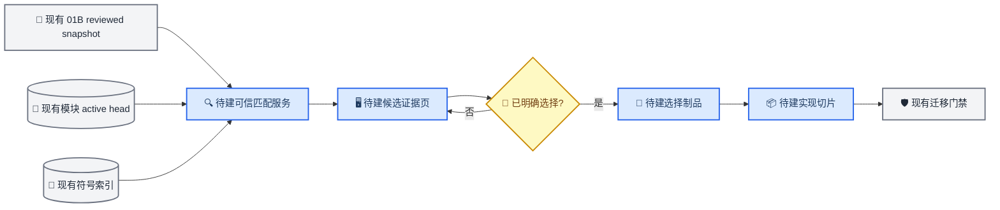

# ForeXplore 前端、目标模块划分与模块检索 Handoff

_基于 2026-09-02 当前工作树（HEAD `031dd84`，分支 `codex/module-migration-plan`）；供前端、目标模块和检索团队接手联调。_

本文审计的是当前未提交工作树中的实际实现，说明本次会话完成了什么、哪些接口已经变化、下游必须适配什么，以及哪些能力仍未实现。

---

## 🎯 交接结论

本次会话已经打通两条上游链：①“存量代码仓快照 → 开放式静态分析 → Module Discovery Agent → 模块边界人审 → EvidenceBundle → Summary Agent → 模块叙述人审 → 本地 SQLite publication registry → 独立 SeekDB 模块 active head → 可撤销模块检索”；②“01B 目标工作区 → 同一静态分析/统一 IR/Module Discovery → Gate 1 → 五态实现状态目录 → module/file/type/callable Webview → 精确 callable 进入既有符号检索和翻译”。

尚未打通的是“目标模块 → 存量模块匹配 → 模块内符号召回 → 实现切片 → 迁移计划”的下游链路。当前 React 前端和 VS Code 翻译 Webview 仍只消费旧的符号级 `SearchCandidate`；新模块知识虽然已经可由检索服务查询，但没有前端查询客户端、Host 协议、目标模块匹配制品或符号/模块融合器。

| 范围 | 当前结论 | 接手时的准确口径 |
| --- | --- | --- |
| 存量仓模块处理 | 已形成带补偿的原型主链 | 两道人审完成且双端 active head 一致后，Host/manifest 才闭合为 `ready`；远端 active CAS 已先产生检索可见性 |
| 模块知识检索 | 已有独立 API 和 SeekDB 表 | 只查询单仓、单 channel 的 active generation |
| 原符号检索 | 保留且未被替换 | 仍由 `POST /v1/search` 返回 `SearchCandidate[]` |
| 前端入库控制面 | 只有命令、只读预览和 modal | 尚无 React 生命周期、双审、发布历史或撤销页面 |
| 01B 目标模块划分 | 已接入可信 Host 和 VS Code Webview | 内容寻址、Gate 1、五态状态和 stale/rebase 已实现；尚未绑定来源模块候选或 active publication |
| 模块与符号融合 | 未实现 | 必须由下一层建立显式匹配与证据制品 |
| 自动迁移能力 | 仍是 Java → C# MVP | 入库语言开放不等于迁移语言开放 |

> 当前改动包含大量未跟踪文件和未提交修改；本文不是 commit release note。合并前应先确定提交边界，再按本文的验证矩阵重跑。

本文工作包中的 P0/P1 只表示本 handoff 内的依赖顺序，不覆盖仓库 `AGENTS.md` 记录的全局工程优先级。

这里的“两道人审”是两个不同阶段的决策，不等于 four-eyes：当前没有强制 Gate 1 与 Gate 2 由不同人员完成，reviewer/actor 也只是 Host 记录的自报字符串，不是已认证身份。

## 📚 范围与术语

代码中同时存在三种不同含义的“模块”，接手时不能互相替换：

| 概念 | 当前类型 | 责任 | 禁止的类型混用 |
| --- | --- | --- | --- |
| 目标符号 | `ModuleNode`、`ModuleTarget` | 精确定位目标工程中的 class/function 和文件位置 | 不能把 folder 或 functional module 塞进 `ModuleTarget.kind` |
| 任务特定迁移执行模块 | `FunctionalModule`、`ModuleMigrationPlan` | 为一个已分析 workspace 定义写集、依赖、SCC、资源锁和执行 wave；当前 contract 未显式区分 source/target 角色 | 不能由存量模块摘要直接替代，也不能在缺少目标上下文时默认称为目标模块 |
| 存量仓知识模块 | `RepositoryDiscoveredModule`、`RepositoryModuleCatalog`、`RepositoryModuleBundle` | 描述已存在仓库的任务无关职责、边界、API 和证据 | 不能直接作为迁移计划或补丁执行单元 |

两种 SeekDB 投影也必须继续物理和语义分离：

| 投影 | 表/接口 | 检索单位 | 回答的问题 |
| --- | --- | --- | --- |
| 符号索引 | 默认 `code_symbols` / `POST /v1/search` | class、method、function | 哪个具体实现或 API 与目标符号相似？ |
| 模块索引 | 默认 `module_knowledge` / `POST /v1/module-knowledge/search` | reviewed functional module | 哪个业务或技术模块整体覆盖目标职责？ |

`RepositoryModuleBundle` 的契约明确它是任务无关 inventory，不是 `SourceImplementationBundle`。模块命中只能提供召回和判断证据，不能直接作为翻译源码。

## 🏗️ 联调目标

下图是下一层应实现的目标形态，不表示蓝色节点已经完成。现有索引和迁移计划继续保留；新增匹配层负责消费两个投影、记录人工选择，并把稳定来源引用交给实现切片层。



联调边界应保持为：

1. 前端只提交意图并展示证据，不持有 writer token，不直接操作 SQLite 或 SeekDB generation。
2. 目标模块层提供内容寻址的目标上下文，不负责检索打分或数据库生命周期。
3. 检索层提供只读召回、跨仓 fan-out、融合证据和 active-head 一致性，不自动代表人工选择。
4. 实现切片层在人工选定来源模块后，才组装 `SourceImplementationBundle`。
5. 原 plan approval、wave approval 和独立验证门禁继续生效，不能被存量仓两道人审替代。

## 📦 本次会话改动

### 共享契约与工作流

| 改动 | 说明 | 主要入口 |
| --- | --- | --- |
| 开放入库语言标识 | 新增 `LanguageId = string`，将分析语言注册与迁移能力拆开 | [`language-id.ts`](../../packages/contracts/src/language-id.ts) |
| 入库与统一 IR 契约 | 新增 profile、shard、IR、coverage、module proposal/catalog/bundle、manifest 和事件账本 | [`repository-ingestion.ts`](../../packages/contracts/src/repository-ingestion.ts) |
| Evidence、Wiki、双审和 publication 契约 | 新增 EvidenceBundle、WikiProposal、KnowledgeReview、publication/head/receipt、批次和模块搜索 DTO | [`repository-knowledge.ts`](../../packages/contracts/src/repository-knowledge.ts) |
| 生命周期和内容校验 | 新增状态转换、当前 Summary 轮次选择、哈希复验、knowledge materialization 与 publication CAS 结构 | [`repository-ingestion.ts`](../../packages/workflow-core/src/repository-ingestion.ts)、[`repository-knowledge-lifecycle.ts`](../../packages/workflow-core/src/repository-knowledge-lifecycle.ts)、[`repository-knowledge.ts`](../../packages/workflow-core/src/repository-knowledge.ts) |
| 保留旧目标计划 | `FunctionalModule`、`ModuleMigrationPlan`、SCC/wave 和审批没有被新 inventory 替换 | [`module-migration.ts`](../../packages/contracts/src/module-migration.ts) |
| 01B 实现状态契约 | 新增五态 assessment、class/file/module/workspace rollup、排除项、structure hash 和 snapshot freshness | [`target-workspace.ts`](../../packages/contracts/src/target-workspace.ts)、[`target-workspace.ts`](../../packages/workflow-core/src/target-workspace.ts) |

### 静态分析和 Agent

| 改动 | 说明 | 主要入口 |
| --- | --- | --- |
| 运行时语言 registry | Java/C# 使用深分析；TypeScript/Python/Rust/Go 使用通用 adapter；第三方 adapter 可注册 | [`repository-analysis.ts`](../../services/code-indexer/src/repository-analysis.ts) |
| 旧快照桥接统一 IR | 把静态快照投影为 `RepositoryProfile + AnalysisShard[] + UnifiedRepositoryIR` | [`repository-ingestion-bridge.ts`](../../services/code-indexer/src/repository-ingestion-bridge.ts) |
| Module Discovery Agent | 只产生不可信模块边界提案，不审批、不发布、不写源码 | [`module-discovery-agent.ts`](../../services/adaptation-service/src/module-discovery-agent.ts) |
| Summary Agent | 只根据有界 EvidenceBundle 生成证据绑定 WikiProposal；修订带完整 lineage | [`module-summary-agent.ts`](../../services/adaptation-service/src/module-summary-agent.ts) |
| 新 Agent HTTP 边界 | 新增 `/v1/module-discovery` 和 `/v1/module-summary` | [`http-server.ts`](../../services/adaptation-service/src/http-server.ts) |

### VS Code Host、存储和双道人审

| 改动 | 说明 | 主要入口 |
| --- | --- | --- |
| 索引后自动初始化 | 静态快照持久化后自动进入动态模块初始化；证据不足时停 `partial`，不调用 Agent | [`module-migration-host.ts`](../../apps/vscode-extension/src/module-migration-host.ts)、[`repository-ingestion-coordinator.ts`](../../apps/vscode-extension/src/repository-ingestion-coordinator.ts) |
| 第一道人工门禁 | 审阅模块边界；accept 才生成 active catalog、ModuleBundle 和 EvidenceBundle | [`repository-module-publication.ts`](../../apps/vscode-extension/src/repository-module-publication.ts) |
| 第二道人审 | 逐模块 accept/revise/reject；已接受项跨修订轮保留 | [`repository-module-summary.ts`](../../apps/vscode-extension/src/repository-module-summary.ts)、[`repository-module-knowledge-publication.ts`](../../apps/vscode-extension/src/repository-module-knowledge-publication.ts) |
| 本地不可变制品与 SQLite registry | publication store 写入不可变 bytes 并物化 `current` projection；SQLite 只保存 generation/head/CAS/event 和 projection dirty 状态 | [`repository-knowledge-publication-store.ts`](../../apps/vscode-extension/src/repository-knowledge-publication-store.ts)、[`repository-knowledge-publication-registry.ts`](../../apps/vscode-extension/src/repository-knowledge-publication-registry.ts) |
| 发布补偿和显式撤销 | 发布失败执行 saga 补偿；用户撤销采用 remote-first 并恢复前代 | [`repository-module-knowledge-publication.ts`](../../apps/vscode-extension/src/repository-module-knowledge-publication.ts)、[`repository-module-knowledge-withdrawal.ts`](../../apps/vscode-extension/src/repository-module-knowledge-withdrawal.ts) |
| 新 HTTP 客户端 | 新增 discovery、summary 和模块索引 writer 客户端 | [`module-discovery-client.ts`](../../apps/vscode-extension/src/module-discovery-client.ts)、[`module-summary-client.ts`](../../apps/vscode-extension/src/module-summary-client.ts)、[`module-knowledge-index-client.ts`](../../apps/vscode-extension/src/module-knowledge-index-client.ts) |
| 01B 可信 Host | 复用 01A 分析/发现，执行独立 Gate 1、状态目录、刷新、显式 body-only rebase 和快照绑定上下文解析 | [`target-workspace-host.ts`](../../apps/vscode-extension/src/target-workspace-host.ts) |
| 01B 实现状态检测 | Java/C# 做可审计静态检测；未注册 detector 的语言逐 callable 记录 `unknown` | [`implementation-assessment.ts`](../../services/code-indexer/src/implementation-assessment.ts)、[`target-workspace-implementation-inventory.ts`](../../apps/vscode-extension/src/target-workspace-implementation-inventory.ts) |

### 独立模块索引

| 改动 | 说明 | 主要入口 |
| --- | --- | --- |
| 独立模块文档投影 | `documentKind: 'functional-module'`，携带 publication、双审状态、ACL、API、依赖和风险 | [`module-knowledge-indexer.ts`](../../services/retrieval-service/src/module-knowledge-indexer.ts) |
| 三表生命周期 | `<base>` documents、`<base>_generations`、`<base>_heads` | [`seekdb-module-knowledge-store.ts`](../../services/retrieval-service/src/seekdb-module-knowledge-store.ts) |
| 混合模块检索 | 向量、全文和 hybrid 排序；查询前后复验 active head | [`module-knowledge-search.ts`](../../services/retrieval-service/src/module-knowledge-search.ts) |
| 新读写 HTTP API | 新增 module search 及 stage/validate/head/activate/withdraw/tombstone | [`http-server.ts`](../../services/retrieval-service/src/http-server.ts) |
| 双索引 runtime | 同时实例化原 `SeekDbStore` 与新 `SeekDbModuleKnowledgeStore` | [`runtime.ts`](../../services/retrieval-service/src/runtime.ts) |

### 前端实际影响

本次在实际 VS Code React Webview 中增加了 01B 页面，但 01A 入库控制面仍是命令、只读预览和 modal：

- 实际扩展 Webview 现支持 reviewed 01B module → file → type → callable 树、搜索、五态筛选、统计、证据和失效提示，并保留 `target → requirement → candidates → adaptation → patch` 兼容流程，见 [`apps/vscode-extension/webview/src/App.tsx`](../../apps/vscode-extension/webview/src/App.tsx)。
- Host/Webview 新增 `TARGET_WORKSPACE_SNAPSHOT/REFRESHING/INVALIDATED`、`TARGET_ENTITY_SELECTED` 和对应刷新/选择/显式开始 intent。Webview 不提交路径，Host 按 snapshot/hash/node/entity 重解目标，见 [`protocol/messages.ts`](../../apps/vscode-extension/src/protocol/messages.ts)。
- 独立 Web 原型仍使用 `WorkflowPorts.search: CodeSearchPort`，见 [`web/src/App.tsx`](../../web/src/App.tsx) 和 [`ports/index.ts`](../../packages/workflow-core/src/ports/index.ts)。
- 本次仍没有新增来源模块搜索前端 adapter，也没有修改 `SearchCandidate` 以承载模块文档。

### 设计制品

本次还生成了两张可缩放的 Archify 图：

- [存量代码仓模块处理 Architecture 图](../architecture/forexplore-repository-module-architecture.html)
- [存量代码仓模块处理 Lifecycle 图](../architecture/forexplore-repository-module-lifecycle.html)

## 🔌 已变更接口

### 共享类型边界

| 类型/接口 | 状态 | 下游影响 |
| --- | --- | --- |
| `LanguageId = string` | 已新增 | 入库与模块索引使用开放语言 ID；不得由此推断迁移支持 |
| `RepositoryProfile`、`AnalysisShard`、`UnifiedRepositoryIR` | 已新增 | 模块发现和目标快照投影可复用这些分析事实 |
| `ModuleDiscoveryProposal`、`RepositoryModuleReview`、`RepositoryModuleCatalog` | 已新增 | 前端 Gate 1 需要结构化展示并绑定 proposal/hash |
| `RepositoryModuleEvidenceBundle`、`RepositoryModuleWikiProposal`、`RepositoryModuleKnowledgeReview` | 已新增 | 前端 Gate 2 需要逐模块展示 evidence binding 和 revision lineage |
| `RepositoryKnowledgePublication`、`RepositoryModuleIndexReceipt`、`RepositoryKnowledgePublicationHead` | 已新增 | 其中 head 是本地 publication head；发布页若展示 remote head，必须使用后文建议的新共享 DTO，不能复用此类型 |
| `IndexedModuleKnowledgeDocument` | 已新增 | 必须保持 `functional-module` 独立文档类型，不能强转 `SearchCandidate` |
| `RepositoryModuleKnowledgeSearchRequest/Result` | 已新增 | 下一层要新增只读 search port、fan-out 和缓存/stale 规则 |
| `EntityImplementationAssessment`、`TargetImplementationRollup`、`TargetWorkspaceModuleSnapshot` | 已新增 | 01B 的五态事实、确定性聚合、排除项和来源 lineage；静态 `implemented` 不是业务正确性 |
| `TargetWorkspaceSnapshot`、`TargetWorkspaceTreeNode`、`TargetWorkspaceSelectionIdentity` | 已新增（Extension view model） | 前端只能提交当前 snapshot/hash/node/entity；路径只用于 Host → UI 展示 |
| `ModuleTarget`、`SearchRequest`、`SearchCandidate`、`CodeSearchPort` | 未改为模块检索 | 现有前端和符号召回兼容，但不能表示功能模块命中 |
| `FunctionalModule`、`ModuleMigrationPlan` | 保留 | 仍负责目标写集和执行安全，后续只增加来源选择绑定 |

### HTTP API

| 方法与路径 | 请求 | 成功响应 | 调用者与权限 |
| --- | --- | --- | --- |
| `POST /v1/module-discovery` | `{ snapshotId, constraints? }` | `ModuleDiscoveryProposal` | VS Code Host；结果仍是不可信提案 |
| `POST /v1/module-summary` | `RepositoryModuleBundle + EvidenceBundle + optional revision context` | `RepositoryModuleWikiProposal` | VS Code Host；请求和响应都复验 |
| `POST /v1/search` | 旧 `SearchRequest` | `{ candidates: SearchCandidate[] }` | 现有符号前端/adapter；接口保持不变 |
| `POST /v1/module-knowledge/search` | `RepositoryModuleKnowledgeSearchRequest` | 直接返回 `RepositoryModuleKnowledgeSearchResult` | 只读匹配层；受 deployment repository allow-list 限制 |
| `POST /v1/module-knowledge/generations/stage` | staged publication、ACL、documents | `{ receipt }`，正常完成到 `validated` | 仅可信 writer；Bearer token |
| `POST .../validate` | publication key | `{ receipt }` | 仅可信 writer；Bearer token |
| `POST .../head` | `{ repositoryId, channel }` | `{ head | null }`；`head` 当前是 retrieval-service 私有 `ModuleKnowledgeHead` | 仅可信 writer；Bearer token；不能把共享的本地 `RepositoryKnowledgePublicationHead` 当作远端 DTO |
| `POST .../activate` | publication key + expected generation | `{ head }` | 仅可信 writer；CAS，冲突为 409 |
| `POST .../withdraw` | publication key + expected active generation | `{ head }` | 仅可信 writer；逻辑撤销并恢复前代 |
| `POST .../tombstone` | publication key | `{ status: 'tombstoned' }` | 服务管理接口；当前未包装为用户撤销命令 |

模块搜索最小请求如下；一次只查询一个 repository/channel：

```json
{
  "repositoryId": "acme/orders",
  "channel": "branch:main",
  "repositoryScopes": ["acme/orders"],
  "query": "订单创建、状态流转和幂等处理",
  "topK": 5,
  "languageIds": ["java"],
  "capabilities": ["order-lifecycle"]
}
```

响应不是 `{ "candidates": [...] }` 包装，而是直接返回：

```json
{
  "scope": {
    "repositoryId": "acme/orders",
    "channel": "branch:main"
  },
  "activePublicationId": "publication:...",
  "activePublicationPayloadHash": "...",
  "activeGeneration": 3,
  "hits": []
}
```

### VS Code 命令和设置

| 用户入口 | 本次行为 |
| --- | --- |
| `forexplore.indexModuleMigrationRepository` | 原索引命令扩展为“静态快照持久化后自动启动动态模块初始化” |
| `forexplore.reviewRepositoryModuleBoundaries` | 新增 Gate 1；整轮 accept/revise/reject，只审批边界 |
| `forexplore.generateRepositoryModuleSummaries` | 新增可重试 Summary Agent 阶段，始终停在 Gate 2 |
| `forexplore.reviewRepositoryModuleKnowledge` | 新增逐模块 Gate 2，并在全 accept 后执行发布或恢复 |
| `forexplore.withdrawRepositoryModuleKnowledge` | 新增显式逻辑撤销；只允许 `ready` ingestion |
| `forexplore.initializeTargetWorkspace` | 分析 01B 目标骨架并生成绑定当前 IR 的模块提案；不会进入 Summary/registry/SeekDB |
| `forexplore.reviewTargetWorkspaceModules` | 01B 唯一模块边界人审；accept 后才构建实现状态目录 |
| `forexplore.openTargetWorkspace` | 打开 reviewed 01B 树；只有 current 且 eligible 的 callable 可进入翻译 |
| `forexplore.rebaseTargetWorkspaceBodyOnly` | 方法体变化但声明结构未变时，把旧边界意图映射到新 IR；必须再次 Gate 1，旧 assessment 不复用 |
| `forexplore.retryTargetWorkspaceInventory` | Gate 1 已接受但 detector 失败时，在快照仍相同的前提下重建状态目录 |

新增配置/环境边界：

| 名称 | 所属进程 | 用途 |
| --- | --- | --- |
| `forexplore.repositoryKnowledgeChannel` | VS Code 用户配置 | 默认 `branch:main`，发布前仍需人工确认 |
| `FOREXPLORE_MODULE_INDEX_WRITER_TOKEN` | VS Code 扩展进程环境 | 调用模块索引 writer；禁止从 workspace setting 读取 |
| `RETRIEVAL_MODULE_INDEX_TOKEN` | retrieval service 环境 | 校验 writer Bearer token；为空时 mutation API 失败关闭 |
| `SEEKDB_MODULE_KNOWLEDGE_TABLE` | retrieval service 环境 | 默认 `module_knowledge`；不得与 `SEEKDB_TABLE` 相同 |
| `RETRIEVAL_MODULE_INDEX_MAX_BODY_BYTES` | retrieval service 环境 | stage body 默认上限 16 MiB |

### 尚未变化但必须适配的接口

- [`WorkflowPorts`](../../packages/workflow-core/src/ports/index.ts) 仍只有 `search`、`adaptation`、`backfill`，没有 `ModuleKnowledgeSearchPort` 或 matching port。
- [`CodeSearchPort`](../../packages/workflow-core/src/ports/code-search.port.ts) 只返回 `SearchCandidate[]`。
- [`HostToWebviewMessage`](../../apps/vscode-extension/src/protocol/messages.ts) 和 `WebviewToHostMessage` 已有 01B snapshot/refresh/invalidation/selection DTO，但仍没有 01A ingestion、双审、publication 或来源 module-match DTO。
- [`WorkflowState`](../../packages/workflow-core/src/workflow.ts) 没有 ingestionId、targetModuleId、active publication、module candidates、match receipt 或 stale 状态。
- 现有 `ModuleTarget.language` 和 `SearchRequest.candidateLanguages` 仍使用封闭 `Language`，与入库侧开放 `LanguageId` 存在明确断层。
- 共享 contracts 只有本地 `RepositoryKnowledgePublicationHead`；远端 `/generations/head` 使用 retrieval-service 私有 `ModuleKnowledgeHead`，其字段可为空且另有 `revision`。前端联调前应新增共享的远端 active-head/readiness DTO，不能让两种 head 共用一个类型。

## 🖥️ 前端交接

### 当前界面事实

当前有两个前端表面：

1. 打包在 VS Code 扩展中的 Webview 是实际 01B 目标树与翻译面板：先展示 reviewed 目标目录，再由用户显式启动一个 callable，之后仍处理符号候选和补丁。
2. 根目录 [`web`](../../web) 是独立工作流原型，仍从静态 C# workspace adapter 加载树，并通过 `CodeSearchPort` 检索符号。

新的存量仓模块处理目前由 VS Code Command Palette、只读 JSON preview、`showWarningMessage` 和 `showInputBox` 驱动。它是可信 Host 控制面骨架，不是完成的产品 UI。

### 必做工作包

| ID | 优先级 | 工作 | 完成判据 |
| --- | --- | --- | --- |
| FE-01 | P0 | 新建独立“仓库模块入库”视图，不硬塞进旧翻译 StepRail | 能展示 ingestion lifecycle、snapshot/hash、adapter coverage、partial/blocker 和当前事件 |
| FE-02 | P0 | 实现 Gate 1 结构化审阅 | 展示模块树、文件归属、API、依赖、overlap/unassigned、风险；提交绑定 proposal ID/hash |
| FE-03 | P0 | 实现 Gate 2 逐模块审阅 | 展示 EvidenceBundle、claim binding、revision diff、accept carry-forward 和待审数量 |
| FE-04 | P0 | 实现发布、恢复和撤销视图 | 区分 staged/publishing/ready；用不同 DTO 展示 `(repositoryId, channel)`、ACL、generation、local head、remote active head 和 payload hash |
| FE-05 | P0 | 扩展 Host/Webview 协议 | Webview 只发 intent；Host 重读 immutable artifact、绑定 actor/当前 hash 并执行最终 modal |
| FE-06 | P1 | 实现 target-module/source-module 候选页 | 展示模块和符号两类证据、active publication、双审状态、风险和分项排序 |
| FE-07 | P1 | 增加 ingestion/publication 历史选择器 | 能查看不同 revision、generation、撤销原因和恢复前代；不得把历史代标为 active |

### 前端协议原则

- Host → Webview 只发送经过清洗的只读 view model，不发送 writer token、SQLite 路径或可直接执行的文件写入参数。
- Webview → Host 只发送用户意图、当前可见 artifact ID/hash、decision 和 comment；Host 必须重新读取当前 manifest 并复验。
- repository scopes 由可信 Host/BFF 根据身份和部署 allow-list 注入，不能信任浏览器或 indexed document 自报授权。
- `publishing-knowledge` 的操作名称应是“恢复/复验”，不能显示成“重新发布”。
- 只有 manifest `ready` 才能显示“Host 发布流程已闭合”；但当前远端搜索可见性从 SeekDB active-head CAS 开始，它早于 manifest `ready`。UI 必须区分“远端已 active”与“流程已 ready”，并显式暴露/恢复两者之间的异常窗口。
- 候选排序后保持 `selectedCandidateId = null`；Top-1 不能自动等同于人工选择。
- [`CandidatesStage.tsx`](../../apps/vscode-extension/webview/src/components/CandidatesStage.tsx) 当前硬编码“任意候选语言 → Java”，应改为显示真实目标语言和 migration capability matrix。

### UI 仍需可信 Host 完成的动作

以下动作不得下放到浏览器：

- 收集并绑定 reviewer/withdraw actor；
- 读取当前 immutable manifest 和 artifact；
- 注入 ACL scopes；
- 读取 process-owned writer token；
- 执行 stage/activate/withdraw CAS；
- 判断 active head 是否漂移；
- 使旧 match/plan 失效；
- 打开源码证据或执行写回。

## 🗂️ 目标模块划分交接

### 当前状态

01B 已经提供独立的 `TargetWorkspaceModuleSnapshot`：复用 01A `RepositoryStaticAnalysis → UnifiedRepositoryIR → ModuleDiscoveryProposal → RepositoryModuleCatalog`，经 Gate 1 后对 callable 做五态 assessment，并聚合到 class/file/module/workspace。VS Code Host 只按内容寻址快照和 canonical entity 解析目标；写回后旧快照立即失效。仅方法体变化可显式 rebase 边界到新 IR，但仍要再次 Gate 1 和重新检测状态；结构变化 fail-closed 为 stale。

01B 当前 record 已持久化，并以进程内串行化加跨窗口文件锁/CAS 防止并发审批或刷新相互覆盖；它仍不是 append-only 历史账本。新 Gate 接受后，更早轮次的 module snapshot 没有独立 history selector，后续应由 `MigrationRunManifest`/审计存储保存引用与保留策略。

原任务特定模块迁移计划链也完整保留：`ModuleMigrationProposal`、`FunctionalModule`、SCC/wave 和 Git transaction 是执行 overlay，不等同于 01B 的任务输入目录。不得用执行 wave 覆盖 reviewed target catalog，也不得把目标骨架发布到 01A 的 SQLite/SeekDB 生命周期。

新存量仓模块知识链与它目前是两条并行链：

- `reviewPlan()` 不要求 source module publication 为 `ready`；
- `ModulePlanRequest` 不包含模块搜索候选或人工选择；
- `ModuleMigrationPlan` 不记录 source publication/module/artifact provenance；
- active head 变化或显式撤销不会自动使目标计划 stale；
- 新模块索引没有进入 adaptation input 或 `MigrationRunManifest`。

为避免 hash 循环，交接后要区分两个身份：pre-match 的 `targetDecompositionPlanId/Hash` 只描述目标模块边界和查询上下文；post-match 的迁移计划或独立 decision artifact 再引用 `TargetModuleMatchRecord`。来源选择不得反写前者的 hash，否则“选择进入 plan hash”会立即让基于旧 hash 产生的 match 自己失效。当前只有一个 `ModuleMigrationPlan` 类型；在正式拆型前，推荐保留其 immutable predecessor hash，并用独立匹配制品连接后续 run manifest。

### 必做工作包

| ID | 优先级 | 工作 | 完成判据 |
| --- | --- | --- | --- |
| TM-01 | 已完成 | 01B 真实目标快照/IR provider 接入 Host 与 Webview | node/entity 绑定内容寻址 snapshot；分析语言通过 registry 开放 |
| TM-02 | 已完成 | 建立 reviewed target catalog、实现状态目录和精确 callable context | snapshot/catalog/entity/file/body lineage 由 Host 复验；UI 路径不可回传作为授权 |
| TM-03 | 已完成 | 保留模块与符号双锚点 | `RepositoryModuleCatalog` 表达目标功能边界；`ModuleTarget` 继续作为现有符号检索/翻译输入 |
| TM-04 | 已完成（边界明确） | 目标分析/视图使用开放 `LanguageId`，迁移能力保持独立 | 无 detector 的语言记录 `unknown`；不能因此声称可迁移 |
| TM-05 | P1 待做 | 将人工选择的来源模块和检索快照绑定后续迁移 | 记录 publication/generation/module/artifact hashes、head token 和 retrieval receipt；用独立 decision artifact 或 post-match plan 引用，不反写 target snapshot hash |
| TM-06 | P1 部分完成 | 完成目标侧 stale 传播；继续实现来源 head 传播 | 当前目标写回/refresh 会阻断旧快照；未来任意来源 head 变更、ABA 恢复或显式撤销还需使旧 match 和未执行 plan 确定性失效 |

`TargetWorkspaceModuleSnapshot`、`TargetWorkspaceEntityContext` 和 `TargetWorkspaceSnapshot` 已覆盖 pre-match 目标上下文。下列旧草案不应另起一套平行 scanner；若 matching 层需要执行 overlay 字段，应从现有快照派生、并保持 predecessor hash：

```ts
interface TargetModuleContextSnapshot {
  schemaVersion: 'forexplore-target-module-context/v1';
  repositoryId: string;
  snapshotId: string;
  analysisHash: string;
  targetDecompositionPlanId: string;
  targetDecompositionPlanHash: string;
  targetModule: Pick<
    FunctionalModule,
    'id' | 'name' | 'sourceFiles' | 'symbolIds' | 'dependsOn' | 'writeSet' | 'resourceLocks'
  >;
  selectedSymbol?: ModuleTarget;
  targetFileHashes: Record<string, string>;
  collector: { id: string; version: string };
  truncated: boolean;
  contentHash: string;
}
```

来源选择至少需要保存以下内容寻址引用：

```ts
interface SelectedSourceModuleRef {
  repositoryId: string;
  channel: string;
  publicationId: string;
  publicationPayloadHash: string;
  publicationGeneration: number;
  activeHeadToken: string;
  moduleId: string;
  artifactId: string;
  artifactHash: string;
  retrievalReceiptHash: string;
  selectedBy: string;
  selectedAt: string;
  note?: string;
}
```

双投影融合还必须生成可重放的检索回执。以下同样是待新增契约，不是现有接口：

```ts
interface MatchRetrievalReceipt {
  schemaVersion: 'forexplore-match-retrieval-receipt/v1';
  targetContextHash: string;
  queryHash: string;
  aclScopeHash: string;
  moduleIndex: {
    activeHeadToken: string;
    receiptId: string;
    receiptContentHash: string;
    storeId: string;
    indexArtifactHash: string;
  };
  symbolIndex: {
    corpusRevision: string;
    storeId: string;
    indexArtifactHash: string;
  };
  rankingPipeline: {
    moduleSearchVersion: string;
    symbolSearchVersion: string;
    embeddingVersion: string;
    rerankerVersion: string;
    fusionVersion: string;
  };
  candidateRankingHash: string;
  contentHash: string;
}

interface TargetModuleMatchRecord {
  schemaVersion: 'forexplore-target-module-match/v1';
  id: string;
  targetContextHash: string;
  queryHash: string;
  candidateRankingHash: string;
  retrievalReceiptHash: string;
  selectedSource: SelectedSourceModuleRef;
  status: 'selected' | 'stale';
  staleReason?: 'target-decomposition-changed' | 'module-head-changed' | 'index-changed';
  contentHash: string;
}
```

`RepositoryModuleIndexReceipt` 已有 `storeId`、`indexArtifactHash` 和 receipt `contentHash`，但模块 search response 当前没有返回它们；符号检索还没有等价的 corpus/index receipt。下一层只有先补齐这些版本锚点，才可以声称候选排名可重放。

`SelectedSourceModuleRef` 必须来自用户明确选择，并与完整候选排名、查询、目标上下文 hash、`MatchRetrievalReceipt` 一起形成 `TargetModuleMatchRecord`。只保存 title、summary、score 或 `{ publicationId, payloadHash, generation }` 不足以追溯：后者只能识别 active 内容变成不同 tuple，无法检测 head 改走后又恢复到同一 tuple 的 ABA。

### 不应由目标模块层实现

- 不直接访问 SQLite registry 或 SeekDB 表；
- 不决定模块分和符号分的融合权重；
- 不把 `RepositoryDiscoveredModule` 转成 `FunctionalModule`；
- 不让存量仓两道人审跳过目标 plan/wave 审批；
- 不从模块摘要直接构造补丁；
- 不把“支持分析某语言”转述为“支持迁移该语言”。

## 🔍 模块检索交接

### 当前存储和可见性

模块索引拥有独立 documents、generations、heads 表。正式查询通过 SQL join active head 和 active generation，不靠查询后过滤旧文档。staged、withdrawn、tombstoned 或未通过双审的 generation 均不可检索。

当前正常发布顺序是“本地 head CAS → 远端 SeekDB head CAS → manifest `ready`”。因此远端 CAS 成功后，文档已经能被 `/v1/module-knowledge/search` 召回，即使 Host 还处于 `publishing-knowledge`，或在写入 `ready` 前崩溃。`ready` 是 Host/manifest/UI 的流程闭合状态，不是当前检索服务的可见性谓词。若产品要求严格的 ready-only 可见性，下一阶段必须增加可由检索端校验的 readiness attestation/commit marker、后台 reconciler，或修改激活协议；只改 UI 文案不能建立这个保证。

本地 SQLite 和远端 SeekDB 的职责不同：

| 组件 | 权威范围 |
| --- | --- |
| SQLite registry | 本地 publication revision、generation 分配、head CAS、事件和 `currentProjectionDirty` 同步状态；不提供 projection 内容 |
| Publication store / immutable bytes | publication 内容与 `.forexplore/modules/current/...` projection 的物化和重建 |
| SeekDB active head | 正式模块搜索的远端可见性 |
| Ingestion manifest / artifacts | `ready` 流程闭合、端到端追溯和重放事实 |

### 必做工作包

| ID | 优先级 | 工作 | 完成判据 |
| --- | --- | --- | --- |
| RT-01 | P0 | 固化共享的 remote-head、search envelope 和 `MatchRetrievalReceipt` | retrieval service 在同一 head 稳定循环内返回 head token 和完整 active module index receipt；符号索引获得 corpus receipt |
| RT-02 | P0 | 新增只读 `ModuleKnowledgeSearchPort` | 包装稳定 search envelope，不暴露 generation mutation；不得在查询后另读 head 来补数据，也不得伪造 token/receipt |
| RT-03 | P0 | 新增可信跨仓 fan-out/BFF | 只对授权仓 fan-out/转发各服务返回的稳定 envelope 与错误；浏览器不能扩大 scopes，BFF 不做事后 head/receipt 拼接 |
| RT-04 | P0 | 新增 artifact/review/ownership resolver | 按 ID/hash 授权读取知识页、review closure、evidence 和 `RepositoryModuleBundle` 中的文件/实体归属闭包 |
| RT-05 | P0 | 新增 scoped symbol search contract/endpoint | 支持 publication/module/path/file/entity/symbol 范围并服务端强制过滤；旧 `/v1/search` 保持兼容 |
| RT-06 | P0 | 实现模块 → 符号二阶段召回 | 模块命中经 resolver 得到归属闭包，再调用 scoped symbol search；无法解析闭包时失败关闭 |
| RT-07 | P0 | 建立显式 fusion/rerank | 模块相关度、符号相关度、证据覆盖和风险分开记录；不直接相加原始 score |
| RT-08 | P1 | 实现 active-head 缓存和 stale 规则 | 缓存键绑定 target context、head token、两类 index receipt、query/filter/ACL 和 pipeline 版本；ABA 后旧项失效 |
| RT-09 | P1 | 组装选择后的实现切片 | 只在人工选择后输出 `SourceImplementationBundle`；模块检索服务本身不负责 |

当前 `RepositoryModuleKnowledgeSearchResult` 只返回 `{ activePublicationId, activePublicationPayloadHash, activeGeneration }`，不返回 SeekDB head `revision` 或 `RepositoryModuleIndexReceipt`。建议在共享 contracts 新增以下 DTO，并由 retrieval service 在现有“查询前读取 head → 召回 → 查询后复验同一 head”的稳定循环内一次性生成 envelope；BFF 只能 fan-out/转发，不能在 search 返回后再读 head/receipt 拼接，否则会把旧 hits 绑定到新 generation，形成 TOCTOU。

```ts
interface RemoteModuleActiveHeadSnapshot {
  schemaVersion: 'forexplore-remote-module-head/v1';
  scope: RepositoryKnowledgePublicationScope;
  publicationId: string | null;
  publicationPayloadHash: string | null;
  generation: number | null;
  activeHeadToken: string;
}

type ActiveRepositoryModuleIndexReceipt = Omit<
  RepositoryModuleIndexReceipt,
  'status'
> & { status: 'active' };

interface ModuleKnowledgeSearchEnvelope {
  result: RepositoryModuleKnowledgeSearchResult;
  activeHead: RemoteModuleActiveHeadSnapshot;
  moduleIndexReceipt: ActiveRepositoryModuleIndexReceipt;
}

interface ModuleKnowledgeSearchPort {
  search(
    request: RepositoryModuleKnowledgeSearchRequest,
    signal?: AbortSignal,
  ): Promise<ModuleKnowledgeSearchEnvelope>;
}
```

`activeHeadToken` 必须是每次 head mutation 都变化的单调 revision 或不可复用 opaque token。当前 SeekDB 内部虽有 `revision`，但 `activeHead()` 在空 head 时直接返回 `null`，撤销到空头后的 revision 会丢失；因此不能仅把现有 `/generations/head` 原样暴露出来。实现时要么保留空 head 的 revision 读语义，要么生成独立 head epoch/token。

服务端返回前必须断言 receipt 的 `scope`、`publicationId`、`publicationPayloadHash` 和 `generation` 与 active head 完全相等，且 `status === 'active'`。完整 receipt 不能裁剪成几个并列 hash；否则消费者无法证明命中、head 和索引制品来自同一快照。

匹配层也不能借用当前 writer-protected 的 `/generations/head`。应优先扩展 search response，或新增受 repository ACL 约束的只读 head-snapshot endpoint；writer Bearer token 仍只留在发布控制面。

模块和符号证据应使用判别联合保留类型边界：

```ts
type RetrievalEvidence =
  | { kind: 'module'; hit: RepositoryModuleKnowledgeSearchHit }
  | { kind: 'symbol'; candidate: SearchCandidate };
```

不要把 `RepositoryModuleKnowledgeSearchHit` 适配成假的 `SearchCandidate`。两类 score 的语料、投影、召回和 rerank 过程不同，只有经过明确评估的融合器才能形成新的 match score。

旧 `SearchRequest` 只有 target、requirement、repository scope、language 和 rerank 等字段，没有 `moduleId`、`pathPrefixes`、`fileIds`、`entityIds` 或 `symbolIds` 范围。模块的真实文件/实体归属在 `RepositoryModuleBundle`，而模块 search hit 只有摘要、API 等知识投影。因此 RT-04 和 RT-05 是 RT-06 的硬前置；把 `moduleId` 或 `publicApiSignatures` 拼进全文 query 只能影响相关度，不能构成服务端范围约束。

### 推荐召回顺序

1. 从 `TargetModuleContextSnapshot` 构造任务查询，默认不因语言硬过滤丢失跨语言候选。
2. 可信 BFF 对授权 repository/channel fan-out 模块搜索。
3. 保留每个结果的 active-head token、publication tuple、module index receipt、模块风险和 pipeline 版本。
4. 通过受信 resolver 从命中 publication/module 解析 `RepositoryModuleBundle` 的文件、实体和符号归属闭包。
5. 使用新的 scoped symbol search 在该闭包内召回符号，并记录 symbol corpus/index receipt；不能用全文 query hint 代替硬范围。
6. 融合模块相关度、符号相关度、证据覆盖、许可证/风险和 migration capability。
7. 前端展示证据和两类索引快照，用户明确选择一个来源模块/实现切片。
8. 生成 `MatchRetrievalReceipt` 和 `TargetModuleMatchRecord` 后，才组装 `SourceImplementationBundle`。

### 查询错误语义

| 状态 | 含义 | 前端/匹配层处理 |
| --- | --- | --- |
| 400 | 请求、scope 或 filter 无效 | 视为客户端契约错误，不重试同一 payload |
| 401 | writer token 无效 | 只应出现在控制面；前端不应持有该 token |
| 403 | repository 超出 deployment allow-list | 记录授权拒绝，不泄露该仓内容 |
| 409 | generation CAS 冲突 | 只应出现在 writer 控制面；进入恢复/复验 |
| 413 | 请求体超限 | 缩小 stage payload 或 evidence；搜索通常不应触发 |
| 503 | 无 active head、服务关闭、head 漂移或存储失败 | 不得显示成“0 个结果”；标记 unavailable 并允许安全重试 |

### 候选页必须展示

- `moduleId`、title、summary；
- repository、channel、active publication/generation/head token；
- artifact ID/hash 和 payload hash；
- 模块 index receipt、符号 corpus receipt 及 embedding/rerank/fusion 版本；
- boundary、narrative、verification 三条状态；
- capabilities、public API、依赖、风险和分项排序；
- “reviewed 但仍 unverified”的明确标识；
- active head 变化后的 stale 标记和重新检索入口。

## 🔐 一致性、安全与失败处理

| 场景 | 当前实现 | 下游必须遵守 |
| --- | --- | --- |
| 正常发布 | 本地 immutable stage → 远端 stage/validate → 本地 head CAS → 远端 head CAS → manifest `ready` | 远端搜索可见性从远端 CAS 开始；只有 manifest `ready` 可称 Host 发布流程已闭合 |
| Remote-active / manifest-not-ready 窗口 | 远端 CAS 成功后、写 `ready` 前崩溃时，模块可被搜索但 Host 仍是 `publishing-knowledge` | UI 必须显示并触发恢复；若要求 ready-only 检索，须新增后端 attestation/commit marker 或改变激活协议 |
| 自动发布补偿 | 本地已激活但远端/manifest 失败时，远端 withdraw → 本地 withdraw → compensation ledger | 这是内部 saga，不是用户撤销；保留 `publishing-knowledge` 以便重放 |
| 显式撤销 | 仅 `ready`；remote-first，恢复前代或空 head，再更新本地和 manifest | 记录 actor/reason；旧 match/plan 必须 stale，但历史制品不删除 |
| 并发发布 | 本地和远端均使用 expected generation/head CAS | 冲突失败关闭，禁止 last-write-wins |
| 两道人审 | Gate 1 和 Gate 2 是不同阶段，但当前同一人可完成，actor/reviewer 也是自报字符串 | 不得表述为 four-eyes 或可信身份审批；如需职责分离，另加认证身份与 distinct-reviewer policy |
| ACL | publication、stage envelope、document scopes 必须完全一致，并受 deployment allow-list 缩小 | 当前是仓库级 allow-list，不是用户级 RBAC |
| Writer 权限 | token 只来自进程环境，缺失时 mutation 返回 503 | Webview 和普通 search adapter 永不接触 writer token |
| 查询稳定性 | 单次查询前后比较内部 head revision 和 publication tuple，漂移时有限重试；响应未返回 revision | 当前 tuple 只能检测 active 内容不同，不能检测 ABA；补齐包括空 head 在内的 `activeHeadToken` 后再承诺任意 head 变更使缓存 stale |
| 排名重放 | 模块 receipt 已含 store/artifact hash，但 search 不返回；符号检索没有等价 corpus receipt | 选择和计划必须绑定两类 index receipt 与 embedding/rerank/fusion 版本，不能只存 score |
| 当前 projection | SQLite 仅记录 `currentProjectionDirty`；publication store 从 immutable publication 物化和重建文件 | 页面不能从 registry 读取 projection 内容，也不能把 dirty projection 当作 active 一致性证明 |

发布补偿与显式撤销必须在 UI、审计和告警中使用不同名称。两者都不执行物理删除；保留期、法规删除和合规擦除尚未设计。

## ✅ 联调顺序与验收

### 推荐实施顺序

| 阶段 | 交付 | 前置 | 完成证明 |
| --- | --- | --- | --- |
| 1 | 固化目标/选择契约、共享 remote-head/search envelope、`MatchRetrievalReceipt`、scoped symbol request 和只读 ports | 当前 contracts | 内容哈希、空 head token、ABA、非法/stale 引用和 DTO contract tests |
| 2 | 实现 retrieval-service 原子 search envelope、可信 fan-out 和 artifact/ownership resolver | 阶段 1 | 单仓、多仓、ACL、无 head、head 漂移、search/envelope 间 activate 混代拒绝、remote-active/manifest-not-ready 和恢复集成测试 |
| 3（已完成前置） | 01B production snapshot tree、reviewed catalog、五态目录和 callable context | 无 | snapshot 变化使旧选择失效；Host 可由 callable 解析目标模块；分析 provider 可扩展语言 |
| 4 | 实现 scoped symbol endpoint，再实现模块 → 符号召回和 fusion | 阶段 1、2及既有 01B | 范围逃逸拒绝测试；holdout 分别报告模块、符号和融合 Recall@K/MRR/nDCG |
| 5 | 扩展 Host/Webview 协议和页面 | 阶段 1–4 | Webview 只发 intent；双审、发布、撤销、stale 和人工选择 E2E |
| 6 | 实现选择后的 `SourceImplementationBundle` | 阶段 4、5 | bundle 可追溯到 active publication、两类 index receipt、symbol、源码 hash 和测试 |
| 7 | 让 post-match 迁移计划和 run manifest 引用 immutable match decision | 阶段 6 | 不反写 pre-match decomposition hash；head 撤销或目标快照变化会阻断未执行计划并要求重新审批 |

### 必须通过的联合验收

1. Gate 1-only catalog、generated Wiki、staged generation 均不能出现在正式匹配候选中。
2. 只有 Gate 2 reviewed 且远端 active 的模块文档可被召回；`verificationStatus` 仍显示 `unverified`。manifest `ready` 当前只是流程闭合状态，不是搜索谓词。
3. 符号索引的旧 API、清空和召回不影响模块索引历史或 active head。
4. 多仓查询只 fan-out 到 Host/BFF 授权仓；浏览器不能扩大 scopes。
5. 模块 hit 与符号 candidate 保持不同类型和独立 score 分量。
6. 检索完成后默认无选择；必须由用户显式选择。
7. 选择制品包含目标 context hash、查询、候选排名、两类 index receipt、pipeline 版本和完整 publication/generation/artifact 引用。
8. active head 经过任意变更、恢复到旧 publication 的 ABA 或撤销为空后，旧候选、缓存和未执行 plan 都由 head token 确定性标记 stale。
9. 目标快照或 `targetDecompositionPlanHash` 改变后，旧匹配选择不能继续用于生成或回填；post-match plan 引用该选择时不会反向改写 decomposition hash。
10. 未注册 migration capability 的语言即使可分析、可召回，也不能进入自动 translate/compile/apply。
11. 存量仓 Gate 1、Gate 2、目标 plan approval、wave approval 仍是四类独立决定。
12. writer token、SQLite 路径和 generation mutation 不进入前端协议或浏览器日志。
13. 模拟远端 activate 成功、manifest 写 `ready` 前崩溃时，系统能显示 `publishing-knowledge`/remote-active 差异并补偿或恢复；不能误报为“不可检索”。
14. scoped symbol search 对越出 resolver 所给文件/实体/符号闭包的结果失败关闭，query hint 不能扩大范围。
15. 在模块 hits 生成后、envelope 返回前注入一次 activate，服务要整次重试或失败，不能返回“旧 hits + 新 head/receipt”；receipt 的 scope/publication/payload/generation/status 必须与返回 head 一致。

## ⚠️ 明确未实现

以下能力不能在后续说明中描述为“已完成”：

- React 入库生命周期、双审、publication、history、compensation、withdrawal 页面；
- Host/Webview 的来源模块查询、候选证据和人工来源选择协议；01B 目标树/刷新/选择协议已经实现；
- `ModuleKnowledgeSearchPort`、共享 remote-head/search envelope、跨仓 fan-out/BFF 和模块查询客户端；
- 面向匹配层的 post-01B `TargetModuleMatchContext`/检索回执；production snapshot-bound 01B 目标树、当前 callable context 和 containing target module 解析已经实现；
- `TargetModuleMatchRecord`、`MatchRetrievalReceipt`、符号 corpus receipt、人工来源选择与 plan/run manifest 绑定；
- artifact/ownership resolver、scoped symbol search、模块/符号两阶段召回、分数融合和独立 holdout 评估；
- 模块命中后的完整 Evidence resolver 和 `SourceImplementationBundle`；
- Gate 1 revise 后在同一快照上生成 successor proposal 的完整交互；
- Module Discovery constraints、Gate 1 局部归属编辑和 `acceptedRiskIds` 表单；当前 Host 只提供整轮 accept/revise/reject；
- 多仓 `RepositoryImportBatch` runner、批次导入/撤销 UI；
- 严格 ready-only 的检索可见性 attestation/commit marker；当前存在 remote active 后、manifest `ready` 前的可检索窗口；
- 可覆盖空 head 与 ABA 的共享 `activeHeadToken`；当前 search result 只有 active publication/payload/generation tuple；
- 后台 reconciler、持续告警和真实 SeekDB 故障演练；
- 超大仓 Summary 传输/分片；当前请求仍携完整 `RepositoryModuleBundle`，会受服务端 32 MiB 请求上限约束；
- 用户级身份认证、租户 RBAC、电子签名和完整审计留存策略；
- 强制 Gate 1 与 Gate 2 由不同已认证人员完成；当前 reviewer/actor 只是宿主记录的字符串；
- Gate 1、Gate 2、发布恢复和显式撤销的真实 VS Code UI E2E；现有覆盖主要在 Host seam 与 coordinator/store/client；
- 完整 secret/DLP、物理清理、保留期和合规擦除；
- 任意语言迁移、独立行为验证或业务语义正确性证明。

当前 `/health` 同时检查 symbol store 和 module store；模块存储不可用时整体 health 会失败，即使符号表仍可连接。部署和前端状态页需要显式决定是否拆分健康度，当前尚未讨论。

## 🧪 当前验证结果

以下命令于 2026-09-02 在当前工作树实际执行：

| 范围 | 命令 | 结果 |
| --- | --- | --- |
| workflow-core | `npm test --workspace @forexplore/workflow-core` | 7 个测试文件、68 项通过 |
| code-indexer | `npm test --workspace @forexplore/code-indexer` | 4 个测试文件、37 项通过 |
| code-indexer build | `npm run build --workspace @forexplore/code-indexer` | 通过 |
| adaptation-service | `npm test --workspace @forexplore/adaptation-service` | 20 个测试文件、180 项通过、1 项跳过 |
| adaptation-service build | `npm run build --workspace @forexplore/adaptation-service` | 通过 |
| retrieval-service | `npm test --workspace @forexplore/retrieval-service` | 13 个测试文件、81 项通过 |
| retrieval-service build | `npm run build --workspace @forexplore/retrieval-service` | 通过 |
| VS Code extension | `npm test --workspace forexplore-vscode` | 30 个测试文件、155 项通过 |
| VS Code typecheck | `npm run typecheck --workspace forexplore-vscode` | Host 与 Webview TypeScript 检查通过 |
| VS Code build | `npm run build --workspace forexplore-vscode` | Webview 与 extension bundle 构建通过 |
| workflow-web | `npm test --workspace @forexplore/workflow-web` | 2 个测试文件、4 项通过 |
| workflow-web build | `npm run build --workspace @forexplore/workflow-web` | 通过 |
| monorepo 全量 | `npm test` | 全部 workspace 通过；translation-verifier 547 项通过、9 项跳过，其余计数见上表/命令输出 |

`@forexplore/workflow-core` 当前没有独立 `build` script；本次用其测试及消费方 TypeScript 检查作为编译证据。上述测试证明的是契约、门禁和失败路径，不证明 Agent 在真实企业仓划分出的业务模块必然正确，也不替代真实 SeekDB 环境的性能和故障注入验证。

## 🔗 关键入口与附图

| 责任 | 入口 |
| --- | --- |
| 入库、模块、双审、publication、search contracts | [`packages/contracts/src`](../../packages/contracts/src) |
| 状态机、哈希与知识物化 | [`packages/workflow-core/src/repository-ingestion.ts`](../../packages/workflow-core/src/repository-ingestion.ts)、[`repository-knowledge-lifecycle.ts`](../../packages/workflow-core/src/repository-knowledge-lifecycle.ts)、[`repository-knowledge.ts`](../../packages/workflow-core/src/repository-knowledge.ts) |
| 语言 registry 与统一 IR | [`services/code-indexer/src/repository-analysis.ts`](../../services/code-indexer/src/repository-analysis.ts)、[`repository-ingestion-bridge.ts`](../../services/code-indexer/src/repository-ingestion-bridge.ts) |
| 01B 状态契约与聚合 | [`packages/contracts/src/target-workspace.ts`](../../packages/contracts/src/target-workspace.ts)、[`packages/workflow-core/src/target-workspace.ts`](../../packages/workflow-core/src/target-workspace.ts) |
| 01B Host、持久 current store 与 UI 投影 | [`target-workspace-host.ts`](../../apps/vscode-extension/src/target-workspace-host.ts)、[`target-workspace-store.ts`](../../apps/vscode-extension/src/target-workspace-store.ts)、[`target-workspace-projection.ts`](../../apps/vscode-extension/src/target-workspace-projection.ts) |
| 01B 实现状态 detector | [`implementation-assessment.ts`](../../services/code-indexer/src/implementation-assessment.ts) |
| Module Discovery / Summary Agent | [`services/adaptation-service/src/module-discovery-agent.ts`](../../services/adaptation-service/src/module-discovery-agent.ts)、[`module-summary-agent.ts`](../../services/adaptation-service/src/module-summary-agent.ts) |
| VS Code 双审、发布、撤销 | [`apps/vscode-extension/src/module-migration-host.ts`](../../apps/vscode-extension/src/module-migration-host.ts) |
| SQLite publication control plane | [`repository-knowledge-publication-registry.ts`](../../apps/vscode-extension/src/repository-knowledge-publication-registry.ts) |
| 独立模块索引与搜索 | [`services/retrieval-service/src/module-knowledge-search.ts`](../../services/retrieval-service/src/module-knowledge-search.ts)、[`seekdb-module-knowledge-store.ts`](../../services/retrieval-service/src/seekdb-module-knowledge-store.ts) |
| 现有 VS Code 翻译 Webview | [`apps/vscode-extension/webview/src`](../../apps/vscode-extension/webview/src) |
| 现有独立 Web 原型 | [`web/src`](../../web/src) |
| 本阶段工程边界 | [《存量代码仓模块划分与知识发布：工程边界》](../architecture/repository-module-processing-boundary.md) |
| Architecture 图 | [ForeXplore repository module architecture](../architecture/forexplore-repository-module-architecture.html) |
| Lifecycle 图 | [ForeXplore repository module lifecycle](../architecture/forexplore-repository-module-lifecycle.html) |

_最后更新：2026-09-02 · 维护边界：前端、目标模块与检索团队共同维护共享契约，数据库和发布控制权仍归可信 Host/服务端。_
