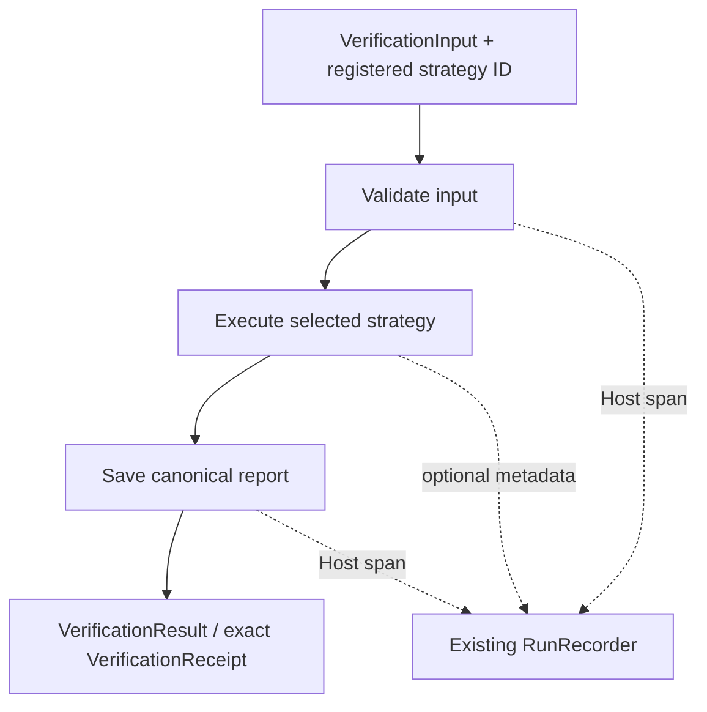
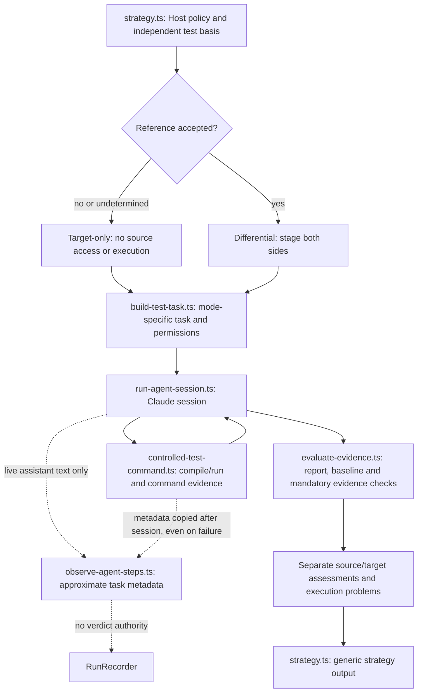

# Verification Flow

## External Phases

`src/workflow/run-verification.ts` owns the three outer phases, request recorder and cleanup. `validate-input.ts` checks the generic input envelope and selects the provider from `select-strategy.ts`. `run-strategy.ts` owns provider execution, deadline/cancellation handling and strategy output validation. `save-report.ts` binds and persists the canonical result through `run-output/verification-artifact-store.ts`. The pure output constructor and schema materialization live in `src/schemas/materialize-verification-result.ts`; schema validation shares that contract without importing workflow execution. Timing never determines a verdict or rewrites a receipt/hash.

`prepare-strategy-workspace.ts` stages target snapshots and the translation patch, and stages source files only when the Host explicitly accepts the reference. It does not create smoke baselines, runner layouts or an Agent task sequence. A provider supplies `descriptor` and `create()`, and its strategy exposes `verify(input, context, signal)`. A strategy may have zero Agent calls, arbitrary steps and repeated or nested steps. `context.measureStep()` wraps existing work only; the recorder is not a workflow state machine.

Register alternative providers in `VerificationStrategyFactory` and pass the same `VerificationInput` to each selected ID. Compare the same patch hash/round, snapshots, toolchain configuration and fixture. Do not force unrelated strategies to imitate smoke task names. See the [registration example](../README.md#register-and-compare-strategies).

## Private Smoke Execution

The Host controls the mode and test basis. Missing basis is an explicit preflight failure, not authorization for Agent-invented acceptance criteria. In target-only mode, source observations must remain absent and source assessment is `not_checked`; the command proxy denies source execution. Valid reports may distinguish source-only, target-only or common-mode bugs. Invalid reports/evidence cannot establish code findings. A timeout can preserve previously validated findings as `partial`; cancellation is distinct from an ordinary failure. The Host allows a bounded 250 ms report-finalization window after either signal, then returns even if a strategy does not cooperate. A slower recovery may be omitted. Missing or malformed reports do not suppress separate baseline and command diagnostics. Successfully retried runner compile errors remain in execution history but do not make the final report partial; unresolved compile errors, failed runs and timeouts remain problems. Command evidence is validated by `command-evidence.ts`; diagnostic metadata and command timing are separate best-effort observations and never satisfy evidence predicates.

The downstream adaptation receiver owns conversion from a validated verifier receipt to the workflow's generic `ValidationStatus` gate. The verifier itself does not recreate that status field. Generic workflow validation records continue to use `ValidationStatus`; this is separate from the versioned verifier output contract.

The diagram describes this strategy, not a required step list for every strategy. The Agent may explore, design cases, write runners, execute, compare and judge in its own order, including repeated tasks. The prompt requests a standalone `[VERIFIER_STEP] {"name":"explore","event":"start"}` line before a real task and `end` after it. `finalize-report` ends immediately after writing `report.json`; that final text marker is permitted before termination. There are no model timestamps. Insufficient evidence remains `unclear`, not a forced decisive answer.

`claude-session.ts` opts into `-p --output-format stream-json --verbose --include-partial-messages` only for an observed call. Unobserved clients retain text output and prior return behavior. `manage-test-process.ts` remains the authority for process-tree termination, cancellation identity, deadlines and bounded retained output. A narrow stdout callback observes all drained chunks independently of the retained-output cap; callback errors cannot change process results.

`observe-agent-steps.ts` uses `StringDecoder` and `JSON.parse`, retaining only bounded partial lines and identity metadata. It parses assistant text, not tool results, thinking or fenced snippets. Message/block identities deduplicate streamed text and full snapshots. Ambiguous observations are omitted rather than replayed as fresh timestamps. Stream/text limits and missing telemetry are reported as metadata diagnostics, not verification failures.

## Timing and Outputs

Host spans use the existing monotonic recorder. Agent intervals use Host receipt offsets with kind `agent-step-approximate`; buffering can make them inaccurate or zero-length. Missing starts/ends remain incomplete. Controlled-command durations and existing proxy subspans retain their own clock provenance, including when no valid report exists. Command timing metadata does not bypass the baseline or mandatory evidence checks, and Agent markers never establish that a command ran.

The smoke E2E wrapper uses the official service and retains complete Host reports plus fixed-field comparison results. Expected answers are never staged for the Agent. Timing sidecars remain diagnostic only; see [E2E documentation](../e2e/README.md) for current paths and output options. There is no new production diagnostic run-root system; `runRoot`, `debug`, `onRunRecorded` remain reserved options.

Generic result artifacts still live under the configured artifact root, by default `<os.tmpdir()>/forexplore-verification-artifacts/attempt-*/`; receipts identify exact bytes. Generic workspaces default to `<os.tmpdir()>/forexplore-verification-workspaces/` and follow `keepWorkspace`. Content logging is a separate, bounded/redacted `VERIFIER_LOG_CONTENT=1` opt-in under `logs/`. No automatic tool hook capture is installed.

Never sum inclusive or overlapping Host spans, Agent intervals and command timings. One E2E run is neither a performance comparison nor a business-correctness proof. This is local-process execution with Host checks, not a sandbox; hostile code requires an external isolation boundary.
