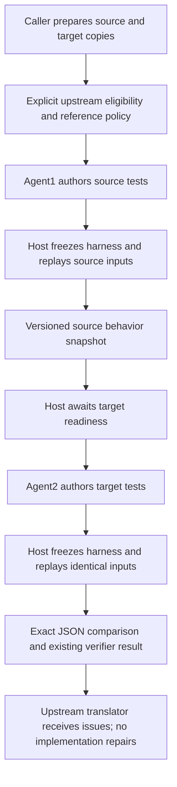

# FileUpload E2E

All E2E translation tasks use actual TODO methods in the repository's Apache Commons FileUpload Java skeleton. There is no package-local `e2e/fixtures` directory and no synthetic MimeUtility or arithmetic project.

## Dataset

Project roots, relative to the repository:

- Source: `fixtures/code-corpus/commons-fileupload-python`
- Target: `fixtures/target-system/commons-fileupload-java-skeleton`

`fileupload-benchmark-fixture.ts` exports the absolute project roots, six-task catalog, and `fileUploadInput(variant, task)`. The builder produces the same `VerificationInput` shape an upstream translation module would submit: source and target snapshots, selected symbols, analysis report, migration plan, translation patch/hash, and an explicit `verificationPolicy` when reference trust is known.

The executable request variants are finite and Host-labeled: `correct`, `count-plus-one`, `drop-output`, `source-count-plus-one`, `both-count-plus-one`, `target-only-correct`, `target-only-count-plus-one`, `missing-test-basis`, and `missing-policy`. Source mutations are applied only to the staged snapshot and recompute its content hash. The last two cases verify fail-closed policy handling. `fileupload-datasets.json` records the fixed expected report fields for these requests; `expected-findings.md` and the legacy `scenarios` array remain Host-only manual-review annotations.

Every expected result compares only `mode`, `referenceDecision`, `referenceReason`, `executionStatus`, `sourceAssessment`, `targetAssessment`, and sorted `problems[].code`. It does not score natural-language findings, timestamps, content hashes, case IDs, or Agent claims. A matched `fail`-like assessment only means the official report classified the target; the complete report remains for human review.

| Task ID | Python input method | Java output method |
| --- | --- | --- |
| `multipart-read-body` (default) | `MultipartStream.read_body_data` | `MultipartStream.readBodyData` |
| `multipart-skip-preamble` | `MultipartStream.skip_preamble` | `MultipartStream.skipPreamble` |
| `disk-get-input-stream` | `DiskFileItem.get_input_stream` | `DiskFileItem.getInputStream` |
| `disk-get` | `DiskFileItem.get` | `DiskFileItem.get` |
| `disk-write` | `DiskFileItem.write` | `DiskFileItem.write` |
| `disk-get-output-stream` | `DiskFileItem.get_output_stream` | `DiskFileItem.getOutputStream` |

Inputs contain the selected source symbol, source project text files, original target project text files, requirements and a hashed target patch. The builder excludes build/cache directories and includes `.java`, `.py`, `.xml`, `.md`, `.toml`, `.txt`, LICENSE and NOTICE files. This is a filtered text snapshot, not an unrestricted directory copy. `VerificationInput` continues to carry file snapshots, not local project root fields.

The `correct` output restores the selected class's TODO dependency closure: both MultipartStream methods or all four DiskFileItem methods. Other classes remain unchanged. These are controlled output samples derived from Apache Commons FileUpload 1.5, **not outputs from a live translator**. Target LICENSE/NOTICE are retained. Disk method provenance is recorded in `fileupload-disk-translation.ts`.

`count-plus-one` and `drop-output` are seeded target-defect outputs available only for `multipart-read-body`. Unsupported task/variant combinations fail explicitly. `correct` identifies the upstream target control, not a claim that the Python source is universally equivalent. Requirements distinguish source limitations, allowed differences and target defects.

`fileupload-datasets.json` keeps the old 14 Host-only manual scenarios for review and adds nine executable request cases. The six selectable method tasks do **not** activate all designed mutation scenarios. Never stage these annotations, oracle drivers or unselected control outputs in the Agent workspace.

## Execution (Default Strategy)

`npm run e2e` calls the official `VerificationService.verifyWithReceipt` entry point. The canonical output is verifier contract `2.0` (`differential-smoke@2.0.0` by default); legacy verifier `status` fields and old reports are rejected, not converted. It writes the complete framework result to `report.json` and a Host-only fixed-field comparison to `comparison.json` under `services/translation-verifier/test-results/verification-*/`. It does not call the private smoke driver directly and does not perform automatic LLM finding scoring.

Run from the repository root. Model-backed runs require `claude`, `npx`/`tsx`, Java/Maven, Python and `DEEPSEEK_API_KEY`. The `missing-policy` and `missing-test-basis` variants run the official preflight without credentials or a model call, unless an explicit policy override supplies a valid basis. The existing DeepSeek Anthropic-compatible configuration is used; `DEEPSEEK_MODEL` defaults to `deepseek-v4-flash`, and `JAVA_HOME` is forwarded when set. Builds may use local dependency caches or the network.

```bash
# Skip the Agent explicitly; not behavioral verification.
npm run e2e --workspace @forexplore/translation-verifier -- --offline-only

# Run the official fail-closed preflight without a model or API key.
npm run e2e --workspace @forexplore/translation-verifier -- --variant missing-policy --json

# Verify a real request through the official service entry point.
npm run e2e --workspace @forexplore/translation-verifier -- --task disk-write --variant correct --timeout-ms 600000

# Verify a seeded target defect; inspect report.json and comparison.json afterward.
npm run e2e --workspace @forexplore/translation-verifier -- --task multipart-read-body --variant count-plus-one --json

# Explicit target-only mode when the reference is rejected.
npm run e2e --workspace @forexplore/translation-verifier -- --variant target-only-correct --reference-decision rejected --reference-reason "Candidate version is not trusted" --test-basis "Independent task requirement"

# Same dataset through VerificationService with benchmark measurements.
npx tsx services/translation-verifier/e2e/run-fileupload-benchmark.ts --task disk-get --variant correct

# Local dataset/wrapper tests, including Maven control checks when installed; no model calls.
npm run test:e2e-data --workspace @forexplore/translation-verifier

# Explicitly skip model execution; this does NOT run an injected fixture runtime.
npx tsx services/translation-verifier/e2e/run-smoke-e2e.ts --strategy multi-agent-differential --variant correct --offline-only

# Opt in to the full-project controlled Claude runtime (sandbox off)
npx tsx services/translation-verifier/e2e/run-smoke-e2e.ts --strategy multi-agent-differential --live --variant correct --timeout-ms 600000
```

| Flag | Default | Meaning |
| --- | --- | --- |
| `--variant <id>` | `correct` | Executable request case; target defects remain restricted to body reading. |
| `--reference-decision <id>` | Input policy | Explicitly override the case policy with `accepted`, `rejected`, or `undetermined`; requires reason and test basis. |
| `--reference-reason <text>` | Input policy | Host-supplied trust decision reason. |
| `--test-basis <text>` | Input policy | Independent requirement/test basis for the explicit policy. |
| `--task <id>` | `multipart-read-body` | One of the six real TODO methods above. |
| `--api-key <key>` | `DEEPSEEK_API_KEY` | Optional override; environment configuration avoids shell-history exposure. |
| `--timeout-ms <ms>` | `300000` | Positive integer session timeout. |
| `--strategy <id>` | `differential-smoke` | `differential-smoke` keeps the existing default; `multi-agent-differential` dispatches to the bounded concurrent E2E harness. |
| `--verify-only` | Always enabled | Accepted compatibility flag. |
| `--offline-only` | Off | Skip the real session and exit zero. |
| `--json` | Off | Emit the complete service receipt plus the Host comparison; timing remains in files. |

## Workspaces and Results

The service stages inputs through the framework workspace builder, applies the selected patch with original-hash validation, and retains `services/translation-verifier/test-results/verification-*/` when the service's `keepWorkspace` option preserves it. The E2E wrapper always writes its official result and comparison manifest in the result directory. The private `runSmoke()` path is verify-only and accepts only a caller-prepared workspace layout; workspace creation, staging and cleanup remain outside that function.

The Agent workspace layout remains under the outer `resultsRoot`:

```text
resultsRoot/                 # test-results/verification-<wrapper-id>/
  report.json
  comparison.json
  timing.json
  timing.md
  artifacts/attempt-*/       # Durable strategy report and canonical result
  workspaces/verification-*/
    source/project/         # Source files staged only in differential mode
    source/.forexplore-tests/ # Source runner area (differential only)
    target/project/         # Target snapshot plus selected patch
    target/.forexplore-tests/ # Writable target runner area
    agent/                  # Agent cwd, report.json and commands.jsonl
    baseline.json
```

Differential verify-only runs require both source and target runners, while target-only runs stage and execute only the target runner; source execution and source findings remain prohibited.

Original repository projects are never patched. Runtime `source.root` and `target.root` point to the staged snapshots, not the original directories. The command proxy and baseline protections remain unchanged. This migration does not move Agent cwd into a project or broaden write permissions.

Differential verify-only requires zero repair rounds, empty `targetFiles`, nonempty cases, both runners and actual controlled compile/run evidence. Target-only verify-only requires zero repair rounds, empty `targetFiles`, nonempty cases, only the target runner and actual target controlled compile/run evidence. Insufficient evidence remains unverified. A generated report alone does not satisfy verification.

| Exit | Meaning |
| --- | --- |
| `0` | The official report was produced and its fixed fields matched the Host expectation. This is not proof that the natural-language finding is correct. |
| `1` | The official report was produced but fixed fields did not match. |
| `2` | Invalid arguments, missing key or an uncaught setup/service exception. |

Timing files are written best-effort in the outer `resultsRoot`, alongside `report.json` and `comparison.json`, not inside the Agent workspace. They include task/variant identity, dynamic Host spans, approximate Agent task occurrences and authoritative controlled-command durations. They exclude source, prompts, tool payloads and command output. Timing and diagnostic metadata are separate from command evidence and never make a report valid or establish a finding.

Agent `[VERIFIER_STEP]` intervals are approximate Host receipt times, not model clocks. Missing markers have no invented durations; transport buffering can collapse intervals to zero. Host spans, Agent observations and controlled-command intervals can overlap: **do not sum them**. Markers are not command-execution evidence.

The default `differential-smoke` strategy is local-process execution, not an OS sandbox. A successful run is neither proof of business correctness nor automatic mutant/control grading. The benchmark still requires independent replay before crediting a detected defect. Disk controls have local upstream JUnit and storage-observation checks; no automated six-task Agent scoring system is claimed.

## Multi-Agent Differential

`multi-agent-differential@2.0.0` is opt-in. Two independent Claude processes use the source and target project copies as their respective working directories. Both are full caller-owned COW project copies. Agents add tests in standard project test directories; `.forexplore-tests` holds metadata, observations and optional serialization/launch glue, not a replacement project. There is no model coordinator. Source collection starts before the E2E caller applies the prepared translation patch; the Host releases agent2 only after the readiness callback, target patch application and live-only project preparation complete. This models the future upstream integration, not a live translator or analyzer.



```bash
# Discover both strategies through the official CLI.
npm run verify --workspace @forexplore/translation-verifier -- --list-strategies

# Verify an already-translated request using the official service workspace.
npm run verify --workspace @forexplore/translation-verifier -- --strategy multi-agent-differential --input request.json --output result.json --keep-workspace

# Exercise caller-owned copies and a delayed target-ready barrier on real projects.
npm run e2e --workspace @forexplore/translation-verifier -- --strategy multi-agent-differential --live --effort low --timeout-ms 600000
```

The new E2E requires `--live` for actual model execution. A test runtime can only be explicitly injected by tests; there is no silent mock fallback. `--offline-only` skips execution, and cannot be combined with `--live`. JSON output includes `executionMode: live | injected-test`. Its exit code is 0 for a completed comparison (which may find divergences), 1 for incomplete verification, and 2 for invalid arguments/setup errors. Unlike the default benchmark, it does not grade results against the independent mutation catalog.

The new E2E defaults to a 600-second total deadline; each agent has at most 50 turns. In `--live` mode the caller applies the target patch and runs a bounded Host Maven preparation in the full target COW project before agent2 starts: `mvn -B -ntp -DskipTests test-compile`. Maven may restore real dependencies/plugins from local caches or the network. The preparation command runs through `runManagedProcess` with `sanitizedBuildEnvironment`; `PATH`, `JAVA_HOME` and `HOME` are preserved, model/service credentials are removed, and native OS sandboxing is off. Preparation stdout/stderr/exit/duration are persisted as `agent/target-preparation.json`; failure stops agent2 and is reported as environment-unverified. Injected test runtimes must provide an explicit preparation seam and never silently download dependencies. The official CLI retains its existing 300-second service deadline, so larger real-project runs should use the E2E's `--timeout-ms` option or set `timeoutMs` on `createDefaultVerificationService` through the programmatic API.

The caller must provide `analysisReport.migrationEligibility.decision = "eligible"`, an accepted `verificationPolicy.referenceDecision`, and a nonempty test basis. Missing/rejected eligibility starts no agents. The strategy neither decides eligibility nor copies projects. The E2E caller uses `fs.cp` with `COPYFILE_FICLONE` (reflink when available, physical copy otherwise; never hard links), overlays the declared snapshots, and applies all final patches after the barrier. The live preparation uses the patched target copy only; originals remain untouched. This is a command-policy boundary, not an OS isolation boundary: native sandboxing is disabled for the trusted Host preflight, and the command proxy/build policy must not be described as a standalone sandbox or as permission to invent shims/manual-copy algorithms. The standard service still materializes complete snapshots before invoking strategies. Production adaptation/workflow concurrency is intentionally not connected yet.

### Artifacts and States

Artifacts use generic `Behavior*` types, not `Smoke*` aliases. Agent1 emits a schema-validated collection manifest with explicit case IDs, inputs, test references, command specifications and notes. Host source execution creates the immutable behavior snapshot and hashes. Agent2 receives the inputs, recorded source outputs and collection notes as the language-neutral handoff. It cannot change the Host's frozen reference. Agent-authored harness code still requires review; output agreement does not prove harness correctness.

The retained output includes separate agent sessions, redacted incremental `source-agent-stream.jsonl` and `target-agent-stream.jsonl`, frozen test sources/manifests, source observations, command stdout/stderr/exit codes, target subject hash, and the final behavior report. No translation files are written back. `json-schema-faker` is not required; this version uses explicit source-derived inputs and existing Ajv validation.

Each side may receive one additional session when the Host rejects a manifest or observation JSON. Feedback includes the actual failure evidence; original files and already-frozen inputs remain unchanged. Target harness repair reuses the accepted source snapshot instead of rerunning source collection. Genuine behavioral differences, integrity violations and timeouts do not trigger this repair. `repairs` and separate `*-repair-1-session.json` artifacts record it; the original overall deadline still applies.

The existing status-free verifier envelope is preserved: `executionStatus` distinguishes completed/partial/failed/cancelled; assessments distinguish bug_found/no_bug_observed/suspected_bug/inconclusive/not_checked; `problems` retains execution failure codes. The strategy report additionally records per-case `caseStatus`, including equivalent observations, translation divergence, generation failure, invalid input, target not ready, timeout, command failure and workspace integrity failure. A source exception is not automatically a source defect. This version does not infer `source-defect` or `accepted-difference` without an independent rule. Source assessment remains `inconclusive` because source execution alone does not establish source correctness.

Actual outputs must cover every frozen case exactly once. Manifest schema `2.0` uses canonical project-relative `testFiles` paths, including `.forexplore-tests/` when a helper lives in the metadata directory. Duplicate paths, traversal and links are rejected. `resultFile` is an optional dedicated JSON output under `.forexplore-tests/`; normal build/test stdout is retained as evidence and is not required to be JSON. Comparisons preserve types, order, null values and exception data. Unsafe integers must be encoded as strings. Credentials in command stdout fail closed rather than being rewritten before comparison. Host hash checks detect and reject modifications to frozen manifests, harnesses, inputs and existing project files; they do not prevent writes or provide rollback. Build/cache outputs remain writable in normal project build locations.

### Runtime Boundary

Claude Code >= 2.1.236 is required. The managed runtime preserves installed tools on the host PATH and the host HOME/JAVA_HOME settings; real Maven/.NET dependency restoration may access caches and the network. Native sandboxing is explicitly disabled. The Claude launcher currently uses a POSIX shell for stdin redirection; macOS is verified, Windows operation is not claimed.

Claude sessions use a replacement system prompt, Read/Edit/Write/Glob/Grep plus controlled Bash, isolated settings/configuration, `--safe-mode`, and no plugins, hooks, skills or MCP servers. Complete prompts and permission settings are supplied through files instead of oversized argv values. Bash is allowed only through the fixed command proxy; the proxy validates tool names and cwd, uses argument-array spawning and sanitized build environments, and checks original/frozen file integrity before and after commands. CLI edit rules deny original files, frozen inputs and the other project. Normal test additions and regenerated build/cache output are allowed, including Maven submodules and .NET project bin/obj directories. The DeepSeek token-based provider cannot use the documented `--bare` API-key authentication mode, so automatic customization is disabled explicitly instead. No permission bypass flag is used. The runtime exposes full project `cwd` and logical `readRoots`/`writeRoots`; this E2E does not claim an OS filesystem namespace or native sandbox. Host replay and live Maven preparation use the managed command boundary and sanitized build environment, with native sandboxing disabled for the trusted preflight. No standalone shim or manual copy algorithm is substituted for the real project toolchain.

This is a command-policy boundary, not a hidden filesystem namespace: directory metadata, required OS/toolchain files and per-session runtime scratch remain available. Host hash checks detect and reject changes to existing implementation entries; they do not prevent writes or roll back a project. New test files and standard build outputs such as `target`, `bin` and `obj` are permitted. Original/nonempty user directories are never removed. Matching source/target observations do not prove business correctness and can miss common-mode defects.
